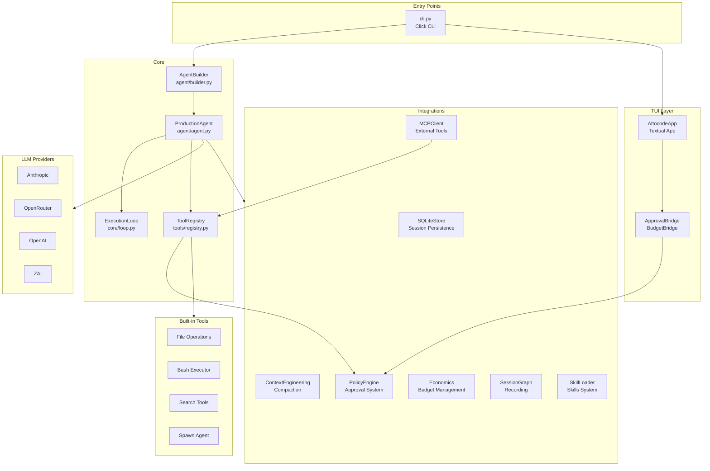
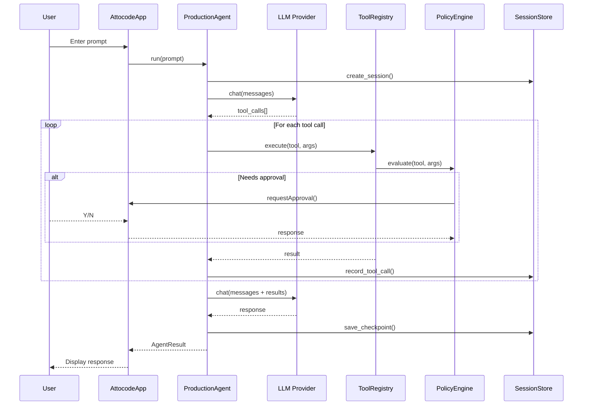

# Architecture

## Module Relationships

## Data Flow

## Directory Structure

| Directory | Purpose | Key Files |
|-----------|---------|-----------|
| `agent/` | Agent core orchestration | agent.py, builder.py, context.py |
| `core/` | Execution engine | loop.py, subagent_spawner.py |
| `tools/` | Tool implementations | 12 tool modules |
| `providers/` | LLM adapters | base.py, adapters/ |
| `integrations/` | Feature modules | 12 subdirectories |
| `tui/` | Terminal UI | app.py, 52+ widgets |
| `tracing/` | Execution traces | JSONL event recording |
| `tricks/` | Context engineering | Recitation, failure tracking |
| `types/` | Shared type definitions | agent.py, messages.py |

## Integration Domains

| Domain | Module Count | Lines | Purpose |
|--------|-------------|-------|---------|
| `budget/` | 6 | ~2,200 | Token economics, loop detection |
| `context/` | 8 | ~3,500 | Compaction, codebase analysis |
| `safety/` | 8 | ~2,000 | Sandboxes, policies, validators |
| `persistence/` | 1 | ~1,100 | SQLite session store |
| `agents/` | 5 | ~1,500 | Multi-agent coordination |
| `tasks/` | 6 | ~2,000 | Planning, decomposition |
| `skills/` | 4 | ~450 | Skill loading, deps, state |
| `mcp/` | 4 | ~800 | MCP client integration |
| `recording/` | 5 | ~1,400 | Session graph, playback |
| `swarm/` | 12 | ~10,300 | Multi-agent orchestration |
| `utilities/` | 27 | ~4,000 | Helper modules |
| `streaming/` | 1 | ~300 | PTY shell |
