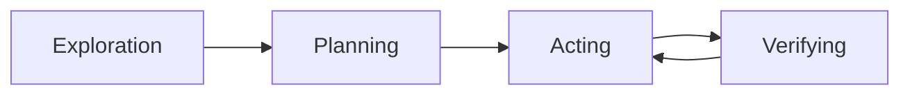

# Budget & Economics System

## Overview

The economics system in `src/attocode/integrations/budget/` manages token budgets, cost tracking, and execution health.

## Components

| Module | Purpose |
|--------|---------|
| `economics.py` | `ExecutionEconomicsManager` - main budget tracker |
| `loop_detector.py` | Doom loop detection (3+ identical tool calls) |
| `phase_tracker.py` | Phase tracking (exploration → planning → acting → verifying) |
| `dynamic_budget.py` | Dynamic budget allocation for subagents |
| `budget_pool.py` | Shared budget pool for parallel agents |

## Budget Configuration

```json
{
  "budget_max_tokens": 1000000,
  "budget_max_cost": 10.0,
  "budget_max_duration": 7200
}
```

Or via CLI:

```bash
attocode --max-iterations 50
```

## Budget Extension

When budget is nearly exhausted, the TUI shows a budget extension dialog:
- User can grant additional tokens/cost
- Wired via `BudgetExtensionDialog` in TUI

## Doom Loop Detection

The loop detector identifies when the agent is stuck:
- Same tool called 3+ times with identical arguments
- Triggers a nudge message instead of hard stop
- Configurable thresholds

## Phase Tracking

The agent progresses through phases:
1. **Exploration** - Reading files, searching code
2. **Planning** - Forming a plan of action
3. **Acting** - Making edits, running commands
4. **Verifying** - Running tests, checking results

Exploration saturation nudge activates after 10+ file reads without edits.

## Token Accounting

- Input tokens, output tokens, cache read/write tracked per LLM call
- Cumulative tracking across runs via `_total_tokens_all_runs`
- Baseline set after first LLM call for incremental accounting
- Usage logged to SQLite `usage_logs` table

## Economics Baseline

The baseline system prevents quadratic token growth that caused premature agent death in early versions.

### The Problem

Without a baseline, the agent counts every token cumulatively. After compaction (which reduces context), the old cumulative total still includes tokens from compacted messages. This means each new LLM call adds tokens on top of an already-inflated total, causing `usage_fraction` to grow quadratically and trigger `force_text_only` mode prematurely (sometimes after only 13 LLM calls).

### How It Works

**`set_baseline(tokens)`** is called at two points:

1. **Feature initialization** — Sets initial baseline from system prompt size
2. **After first LLM response** — Refined with actual token counts from the provider

The baseline records the token count at a known-good point. After that, `incremental_tokens` returns `total_tokens - baseline_tokens`, giving an accurate measure of tokens consumed since the baseline.

**`update_baseline(tokens_after)`** is called after compaction to reset the baseline to the post-compaction token count. This prevents compacted tokens from continuing to count against the budget.

### Incremental vs Cumulative

| Metric | Formula | Use Case |
|--------|---------|----------|
| `total_tokens` | Sum of all input + output tokens | Cost estimation |
| `incremental_tokens` | `total_tokens - baseline_tokens` | Budget enforcement |
| `usage_fraction` | `total_tokens / max_tokens` | Budget percentage |

## Enforcement Modes

The `BudgetEnforcementMode` controls how strictly limits are enforced:

| Mode | Iterations | Tokens | Duration | Description |
|------|-----------|--------|----------|-------------|
| **STRICT** | Hard stop | Hard stop at 100%, force text at 95% | Hard stop | Full enforcement |
| **ADVISORY** | Warning only | Warning only, allow continuation | Ignored | Guidance without stops |
| **SOFT** | Always continue | Always continue | Always continue | Tracking only |

### Graduated Enforcement

Instead of a cliff at the budget limit, enforcement graduates smoothly:

| Usage | Enforcement Level | Effect |
|-------|------------------|--------|
| < 70% | `NONE` | No restrictions |
| 70–90% | `WARN` | Inject budget nudge messages |
| 90–95% | `RESTRICTED` | Aggressive nudges, restrict tool calls |
| > 95% | `HARD` | `force_text_only` mode (no tool calls) |

Budget nudge messages vary by remaining budget:

- **< 5% remaining:** `"CRITICAL: Wrap up immediately. Complete current task and stop."`
- **< 15% remaining:** `"WARNING: Only X% budget remaining. Focus on completing the most important remaining work."`
- **Otherwise:** `"Budget at X%. Be efficient with remaining budget."`

## Phase Tracking

The `PhaseTracker` monitors which execution phase the agent is in:

### 4 Phases



### Phase Detection

Phase transitions are detected from tool usage:

| Tool | Phase Assigned |
|------|---------------|
| `read_file`, `glob`, `grep`, `list_files` | EXPLORATION (if no edits yet) |
| `write_file`, `edit_file` | ACTING |
| `bash` (after edits) | VERIFYING (probably running tests) |
| `bash` (before edits) | Stays in current phase |

### Nudges

| Nudge | Trigger | Message |
|-------|---------|---------|
| Exploration saturation | 10+ file reads, 0 edits | "You've read N files without making edits. Consider transitioning to the action phase." |
| Acting without plan | Edits without prior exploration | "You're making edits without a clear plan." |
| Stuck in loop | Detected by loop detector | "You appear to be repeating the same actions." |

The exploration saturation threshold is configurable (default 10 files).

## Loop Detection

The `LoopDetector` identifies doom loops where the agent calls the same tool with identical arguments repeatedly.

### Algorithm

1. **Signature:** Serialize `tool_name + JSON(args, sorted_keys)` as the call signature
2. **Sliding window:** Track the last 20 signatures in a `Counter`
3. **Detection:** When any signature count reaches the threshold (default 3), flag a doom loop
4. **Trimming:** When the window exceeds 20, pop the oldest signature and decrement its counter

```python
detector = LoopDetector(threshold=3)
result = detector.record("read_file", {"path": "src/app.py"})
if result.is_loop:
    print(result.message)
    # "Doom loop detected: 'read_file' called 3 times with identical arguments"
```

The `peek()` method checks without recording, useful for pre-flight checks.

## Budget Extension Flow

When the budget is nearly exhausted, the agent can request an extension:

### Extension Request

```python
request = economics.request_extension(
    additional_tokens=200_000,
    reason="Need to complete test suite",
)
# request["can_request"]  — True if allowed
# request["extensions_granted"]  — How many already granted
# request["max_extensions"]  — Maximum allowed (default 3)
```

Extensions are gated by:

- **Max extensions:** 3 per session (configurable via `EconomicsTuning.max_extensions`)
- **Cooldown:** 120 seconds between extensions (configurable via `extension_cooldown_seconds`)

### TUI Dialog

In TUI mode, the `BudgetExtensionDialog` shows when the budget is nearly exhausted:

- **Y** — Grant extension (adds tokens to budget via `record_extension()`)
- **N** — Deny extension (agent wraps up)

The dialog is wired via a promise-based bridge (same pattern as the approval dialog) with a 60-second timeout that defaults to denial.

### Task Continuation Gate

`allow_task_continuation()` is a more conservative check than `check_budget()`, used by the task gate to decide whether to start a new task:

| Usage | Behavior |
|-------|----------|
| < 70% | Always allow |
| 70–90% | Allow if ≥3 estimated remaining calls |
| > 90% | Only allow in SOFT/ADVISORY mode |

## Phase-Specific Budget Reserves

The economics system reserves portions of the budget for each phase:

| Phase | Reserve | Description |
|-------|---------|-------------|
| Exploration | 30% | Reading and understanding code |
| Planning | 10% | Forming a plan of action |
| Acting | ~45% | Making edits and running commands |
| Verifying | 15% | Running tests, checking results |
| Wrapup | 5% | Final summary and closure report |
