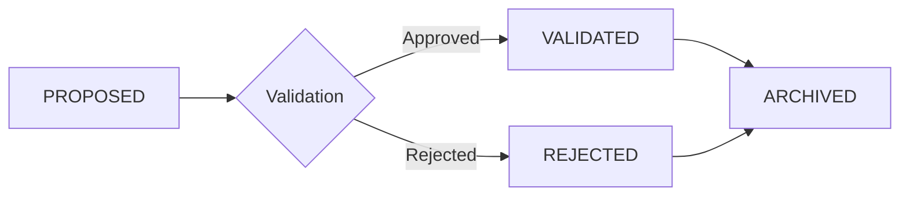

# Advanced Features

This guide covers Attocode's advanced capabilities: plan mode, task decomposition, conversation threading, subagent spawning, and permission modes.

## Plan Mode

Plan mode switches the agent to a read-only state where file writes are intercepted and queued as proposed changes for your review before execution.

### Entering Plan Mode

```
/plan                    # Switch to plan mode
/mode plan               # Same thing
```

### Plan Workflow

```mermaid
flowchart LR
    Draft[Draft Plan] --> Discuss[Discuss / Refine]
    Discuss --> Approve[/approve]
    Discuss --> Reject[/reject]
    Approve --> Execute[Execute Steps]
    Execute --> Complete[Done]
    Reject --> Draft
```

1. **Draft** — The agent generates a multi-step plan with dependency ordering
2. **Discuss** — You review and provide feedback; the agent refines the plan
3. **Approve** — Accept the plan with `/approve`
4. **Execute** — The agent executes steps in dependency order
5. **Checkpoint** — Progress is checkpointed between steps

### Plan Commands

| Command | Description |
|---------|-------------|
| `/plan` | Enter plan mode |
| `/show-plan` | Display the current plan |
| `/approve` | Approve the current plan |
| `/reject` | Reject the plan (with optional reason) |

### How Plans Work

Each plan step has:

- A description of what to do
- Dependencies on other steps (resolved automatically)
- Estimated token budget
- Status: pending → in_progress → completed/skipped/failed

Steps execute in dependency order — a step only starts when all its dependencies are completed or skipped.

### Proposed Changes in Plan Mode

While in plan mode, any file write or edit the agent attempts is intercepted and queued:

```
/show-plan              # See queued changes
```

Each proposed change shows the tool name, file path, and arguments. You can approve or reject individual changes or in bulk.

## Agent Modes

Attocode supports 4 operation modes that control what tools are available:

| Mode | Read | Write | Execute | Agents | Use Case |
|------|------|-------|---------|--------|----------|
| **BUILD** (default) | Yes | Yes | Yes | Yes | Full implementation |
| **PLAN** | Yes | Intercepted | No | No | Review changes before execution |
| **REVIEW** | Yes | No | No | No | Code review, read-only analysis |
| **DEBUG** | Yes | No | Tests only | No | Diagnosis with test execution |

### Switching Modes

```
/mode build     # Full access (default)
/mode plan      # Read-only with change proposals
/mode review    # Pure read-only
/mode debug     # Read + test commands
```

### DEBUG Mode Test Whitelist

In debug mode, only test-related commands are allowed:

```
pytest, python -m pytest, npm test, npx jest,
cargo test, go test, make test, mypy, ruff check,
tsc --noEmit, eslint
```

## Task Decomposition

Attocode can automatically break complex tasks into sub-tasks with dependency tracking.

### Complexity Classification

Tasks are classified into 4 tiers based on weighted heuristic scoring:

| Tier | Score Range | Description |
|------|-------------|-------------|
| SIMPLE | < 0.5 | Single-step, straightforward |
| MEDIUM | 0.5–1.5 | Multi-step, moderate complexity |
| COMPLEX | 1.5–2.5 | Significant planning needed |
| DEEP_RESEARCH | > 2.5 | Extensive exploration and multi-file changes |

Scoring signals include task length, presence of complex keywords (refactor, migrate, architect), dependency patterns ("first...then"), scope indicators (file paths), and whether it's a question vs. action.

### Automatic Decomposition

```
/auto "Build a REST API with authentication, tests, and documentation"
```

The decomposer:

1. Classifies complexity
2. Splits into subtasks with dependencies
3. Creates a `TaskManager` DAG
4. Executes tasks in dependency order

### Task Management

```
/goals               # List active goals
/goals add "..."     # Add a goal
/goals done 1        # Mark goal complete
```

Tasks track 6 states: `pending` → `blocked` → `in_progress` → `completed`/`failed`/`skipped`

Blocked tasks automatically unblock when their dependencies complete.

## Thread Forking

Create branching conversation threads to explore alternative approaches without losing your current work.

### Creating a Fork

```
/fork                              # Fork at current point
/fork "Alternative approach"       # Fork with label
```

A fork copies the conversation history up to the current point into a new thread. The original thread remains unchanged.

### Thread Management

| Command | Description |
|---------|-------------|
| `/fork [label]` | Create a new thread branch |
| `/threads` | List all threads |
| `/switch <thread-id>` | Switch to a different thread |
| `/rollback` | Roll back to the fork point |
| `/restore` | Restore from a previous state |

### Thread Tree

Threads form a hierarchy:

```
main
├── fork-a1b2c3d4 "Try React approach"
│   └── fork-e5f6g7h8 "With TypeScript"
└── fork-i9j0k1l2 "Try Vue approach"
```

You can switch between any thread at any time. Each thread maintains independent message history.

## Subagent Spawning

Delegate sub-tasks to independent agent instances that run with their own budget and context.

### Manual Spawning

```
/spawn "Analyze the test coverage in src/auth/"
/spawn researcher "Find all API endpoint handlers"
```

### How Subagents Work

1. **Budget allocation** — Subagent receives 15% of parent's remaining tokens (clamped to 50K–200K)
2. **Independent context** — Subagent starts fresh with its own message history
3. **Tool access** — Inherits parent's tool registry and permissions
4. **Timeout** — Hard timeout with a 30-second wrapup warning before termination
5. **Closure report** — Returns a structured summary of findings, files modified, and remaining work

### Budget Allocation

| Parameter | Default | Description |
|-----------|---------|-------------|
| `fraction` | 0.15 | 15% of parent's remaining tokens |
| `min_tokens` | 50,000 | Minimum allocation |
| `max_tokens` | 200,000 | Maximum allocation |
| `max_iterations` | 30 | Iteration limit |
| `max_duration_seconds` | 300 | 5-minute timeout |

### Graceful Shutdown

When a subagent approaches its timeout:

1. **Wrapup warning** fires 30 seconds before the hard timeout
2. Agent receives a signal to begin wrapping up
3. Agent produces a **closure report** with summary, files modified, decisions made, and remaining work
4. If the agent doesn't finish, it's terminated and results are collected

### Closure Report Format

```markdown
## Summary
What was accomplished

## Files Modified
- path/to/file1.py
- path/to/file2.py

## Key Decisions
- Chose approach X over Y because...

## Remaining Work
- Still need to implement Z

## Confidence: 0.85
```

## Permission Modes

Control how aggressively the agent can act without your approval.

### The 4 Modes

| Mode | Safe Tools | Moderate Tools | Dangerous Tools | Use Case |
|------|-----------|---------------|-----------------|----------|
| **strict** | Prompt | Prompt | Prompt | Maximum safety |
| **interactive** (default) | Auto-allow | Prompt | Prompt | Balanced |
| **auto-safe** | Auto-allow | Auto-allow | Deny | Unattended execution |
| **yolo** | Auto-allow | Auto-allow | Auto-allow | Full autonomy |

### Setting Permission Mode

```bash
# Via CLI flag
attocode --permission strict
attocode --permission interactive
attocode --permission auto-safe
attocode --yolo                    # Shorthand for --permission yolo

# Via config
# .attocode/config.json
{
  "permission_mode": "interactive"
}
```

### Tool Danger Classification

| Level | Tools | Description |
|-------|-------|-------------|
| SAFE | `read_file`, `glob`, `grep`, `list_files`, `codebase_overview` | Read-only operations |
| LOW | `write_file`, `edit_file`, `spawn_agent` | File modifications, delegation |
| MEDIUM | `bash` | Shell command execution |
| HIGH | Destructive operations | `rm`, `git push --force`, etc. |

### Session-Scoped Permissions

When prompted for approval, press `A` to "Always Allow" a tool for the rest of the session. These grants are stored in the `remembered_permissions` table with fnmatch pattern matching.

## Bash Danger Classification

Attocode classifies every bash command by risk level before execution, using the policy engine in `integrations/safety/bash_policy.py`.

### Risk Levels

| Risk | Behavior | Examples |
|------|----------|---------|
| **SAFE** | Auto-allowed in `interactive`+ modes | `ls`, `cat`, `grep`, `git log`, `pwd`, `echo` |
| **WARN** | Requires approval in `interactive`/`strict` | `rm`, `sudo`, `chmod`, `git push`, `npm publish` |
| **BLOCK** | Always blocked | `rm -rf /`, `mkfs.*`, `dd if=...of=/dev/`, `curl \| bash` |

### Classification Algorithm

Commands are checked in order (first match wins):

1. **Safe exact matches** — 26 read-only commands (`ls`, `cat`, `head`, `tail`, `wc`, `echo`, `pwd`, `which`, `git log`, etc.)
2. **Safe prefixes** — Read-only command prefixes (`ls `, `cat `, `grep `, `git log `, `git diff `, `python -c `, etc.)
3. **Blocked patterns** — 12 regex patterns for destructive commands:
    - `rm -rf /` (recursive delete from root)
    - `mkfs.` (format filesystem)
    - `dd if=.+of=/dev/` (write to raw device)
    - `:> /` (truncate system files)
    - `curl | bash`, `wget | bash` (remote code execution)
    - `sudo rm`, `sudo chmod` (privileged destructive ops)
4. **Warn patterns** — 9 regex patterns for potentially risky commands:
    - `\brm\b`, `\bsudo\b`, `\bchmod\b`
    - `\bgit\s+push`, `\bgit\s+reset`, `\bgit\s+checkout`, `\bgit\s+clean`
    - `\bnpm\s+publish`
5. **Default** — Unknown commands default to WARN (safe-by-default with review)

The permission mode then determines whether the classified risk level requires user approval:

| Permission Mode | SAFE | WARN | BLOCK |
|----------------|------|------|-------|
| `strict` | Prompt | Prompt | Denied |
| `interactive` | Auto-allow | Prompt | Denied |
| `auto-safe` | Auto-allow | Auto-allow | Denied |
| `yolo` | Auto-allow | Auto-allow | Auto-allow |

## Quality Gate System

The swarm's quality gate evaluates worker outputs through multiple stages before accepting them.

### Pre-Flight Checks (No LLM)

Four fast synchronous checks that catch obvious failures:

| Check | Trigger | Result |
|-------|---------|--------|
| **V4** | All target files empty or missing | Auto-fail, score=1 |
| **V7** | Task requires tool calls but got zero | Auto-fail, score=0, rejected |
| **V10** | No files modified + no tool calls + task implies creation | Auto-fail, score=1 |
| **V6** | Closure report is all budget excuses | Auto-fail, score=1 |

### Concrete Filesystem Checks

For each modified file:

- **Existence check** — File exists and is non-empty
- **JSON validation** — `json.load()` for `.json` files
- **Brace balance** — For `.ts`, `.tsx`, `.js`, `.jsx`, `.py` files (allows 3-char imbalance for template strings)

### AST Checks

If an AST service is available, modified files are re-parsed to verify that symbols still exist after modification.

### LLM Judge Evaluation

The final stage uses an LLM to score the output on a 1–5 scale:

| Score | Meaning |
|-------|---------|
| 1 | Failed — No useful output |
| 2 | Poor — Partial, significant issues |
| 3 | Acceptable — Works but has gaps |
| 4 | Good — Solid implementation |
| 5 | Excellent — Complete and well-tested |

The judge call uses `temperature=0.1` and `max_tokens=800`. On LLM error, the gate returns a neutral score of 3 with `gate_error=True`.

### Artifact Detection

The quality gate identifies output artifacts from three sources:

1. **Explicit targets** — `task.target_files`
2. **Modified files** — `task_result.files_modified`
3. **Text mining** — Regex extraction of file paths from output text (patterns like `./foo.ts`, `src/thing.py`, `/abs/path.js`)

## Learning & Self-Improvement

Attocode can learn from its mistakes and successes across sessions using the learning store and self-improvement protocol.

### Learning Types

| Type | Description |
|------|-------------|
| `PATTERN` | Recurring solution pattern |
| `WORKAROUND` | Known workaround for a specific issue |
| `ANTIPATTERN` | Approach that consistently fails |
| `BEST_PRACTICE` | Validated effective technique |
| `GOTCHA` | Subtle pitfall to watch for |

### Learning Lifecycle



Each learning goes through:

1. **Proposed** — Agent detects a pattern and proposes a learning
2. **Validated** — User approves via the TUI validation dialog (Y/N/S shortcuts)
3. **Applied** — Learning is injected into future prompts when relevant

Learnings with confidence ≥ 0.9 are auto-validated (configurable via `auto_validate_threshold`).

### Confidence Tracking

Each learning has a confidence score (0.0–1.0):

- **Initial:** Set by the proposer based on evidence strength
- **Boosted:** +0.05 each time the learning is marked as helpful (capped at 1.0)
- **Used for:** Eviction priority (low-confidence learnings evicted first), display ordering, auto-validation threshold

### Retrieval

Learnings are stored in SQLite with FTS5 (Full-Text Search) for fast retrieval:

```python
# Find relevant learnings for a task
context = learning_store.get_learning_context(
    query="authentication middleware",
    categories=["security"],
    max_learnings=5,
)
```

The retrieval pipeline:

1. FTS5 search on description, details, keywords, and actions
2. Fallback to LIKE queries if FTS returns nothing
3. Category and action filtering
4. Deduplicate by learning ID
5. Sort by confidence (descending)
6. Format as Markdown for LLM injection

### Self-Improvement Protocol

The `SelfImprovementProtocol` provides immediate feedback on tool failures:

- **Failure diagnosis** — Pattern-matches error messages against 8 known categories (FILE_NOT_FOUND, PERMISSION, TIMEOUT, SYNTAX_ERROR, etc.) and generates actionable fix suggestions
- **Success patterns** — Records working argument signatures (`{arg_name: type_name}`) for each tool
- **Repeat detection** — Warns after 3+ failures on the same tool: "This tool has failed 3 times. Consider a different approach."
- **Enhanced errors** — Appends diagnosis and fix suggestion to error messages before showing them to the agent

### Eviction Policy

The learning store is capped at 500 learnings (configurable). When the limit is exceeded:

1. First: Delete REJECTED and ARCHIVED learnings (oldest first)
2. Then: Delete VALIDATED learnings (lowest confidence first, then oldest)

## Related Pages

- [CLI Reference](cli-reference.md) — All flags and slash commands
- [Skills & Agents](skills-and-agents.md) — Custom agent definitions
- [Sessions & Persistence](sessions-guide.md) — How sessions and checkpoints work
- [Budget System](BUDGET.md) — Token budgets and economics
- [Internals](internals.md) — State machine, errors, undo, rules, LSP
- [Provider Resilience](provider-resilience.md) — Retry, circuit breaker, fallback chain
