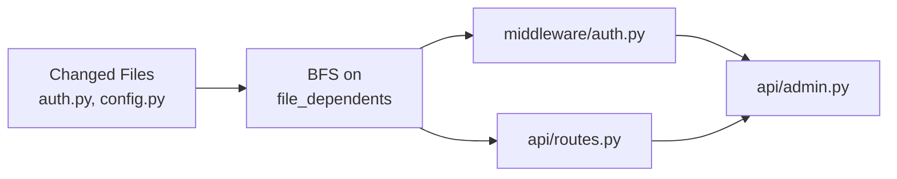

# AST & Code Intelligence

Attocode includes a built-in AST (Abstract Syntax Tree) analysis system that provides symbol indexing, cross-references, impact analysis, and conflict detection. This powers the `codebase_overview` and `codebase_ast_query` tools, the `/repomap` and `/context` slash commands, and the swarm's parallel task safety checks.

## Overview

The AST system provides:

- **Symbol indexing** --- Functions, classes, methods, imports, and variables across your codebase
- **Cross-references** --- Bidirectional mappings between definitions and their references
- **Impact analysis** --- BFS traversal of the dependency graph to find all files affected by a change
- **Conflict detection** --- Identifies overlapping file/symbol/dependency conflicts between parallel tasks
- **Incremental updates** --- Only re-parses files that have changed (mtime-based)

```mermaid
flowchart TB
    subgraph AST["AST System"]
        Parser[Regex Parsers<br/>Python, JS/TS]
        Service[ASTService<br/>Singleton per project]
        Index[CrossRefIndex<br/>Bidirectional index]
        Server[ASTServer<br/>Unix socket]
        Client[ASTClient<br/>Socket client]
    end

    subgraph Tools["Agent Tools"]
        Overview[codebase_overview]
        Query[codebase_ast_query]
    end

    subgraph Commands["Slash Commands"]
        Repomap[/repomap]
        Context[/context]
    end

    Parser --> Service
    Service --> Index
    Service --> Server
    Client --> Server
    Service --> Tools
    Tools --> Commands
```

## Supported Languages

| Language | Extensions | Support Level | Details |
|----------|-----------|--------------|---------|
| Python | `.py`, `.pyi` | Full | Params, decorators, visibility, generators, properties, abstract classes |
| JavaScript | `.js`, `.jsx` | Good | Functions, classes, methods, imports, decorators |
| TypeScript | `.ts`, `.tsx` | Good | Same as JS plus type annotations |
| Go | `.go` | Minimal | Line count, basic function detection |
| Rust | `.rs` | Minimal | Line count, basic function detection |
| Java | `.java` | Minimal | Line count, basic function detection |
| Ruby | `.rb` | Minimal | Line count, basic function detection |

Python gets the most detailed parsing: parameter types, default values, `*args`/`**kwargs`, visibility detection (`__private`, `_protected`, `public`), generator detection (`yield`), `@staticmethod`/`@classmethod`/`@property`, abstract classes, and class-level properties from `__init__`.

## The `codebase_overview` Tool

The agent uses `codebase_overview` for high-level codebase exploration. It has 3 modes:

| Mode | Token Budget | What It Shows |
|------|-------------|---------------|
| `summary` | ~4,000 | File tree with counts, entry points, languages |
| `symbols` (default) | ~12,000 | File tree + exported symbol names per file |
| `full` | Unlimited | Symbol details with params, return types, visibility |

### Parameters

| Parameter | Type | Default | Description |
|-----------|------|---------|-------------|
| `mode` | string | `"symbols"` | `summary`, `symbols`, or `full` |
| `directory` | string | `.` | Filter to a subtree |
| `symbol_type` | string | all | `function`, `class`, `interface`, `type`, `variable`, or `enum` |
| `max_tokens` | int | 10,000 | Cap output size |
| `force_refresh` | bool | false | Re-run file discovery |

### Example Usage

```
# Agent tool call
codebase_overview(mode="symbols", directory="src/auth/")
```

Output is token-aware --- files are dropped when the budget is exhausted, with a `... +N more files` suffix.

## The `codebase_ast_query` Tool

For deeper code intelligence queries, the agent uses `codebase_ast_query` with 8 actions:

| Action | Parameters | Description |
|--------|-----------|-------------|
| `symbols` | `file` | List all symbols in a file |
| `cross_refs` | `symbol` | Find all references/call sites for a symbol |
| `impact` | `files` (comma-separated) | Compute transitive impact set via BFS |
| `search` | `query` | Fuzzy symbol search across codebase |
| `file_tree` | --- | List all indexed files with symbol counts |
| `dependencies` | `file` | Files that a file imports from |
| `dependents` | `file` | Files that import a file |
| `conflicts` | `a_files`, `b_files` | Detect conflicts between two file sets |

### Example Queries

```
# Find all symbols in a file
codebase_ast_query(action="symbols", file="src/auth/login.py")
# Output: auth.login.LoginHandler class (src/auth/login.py:15-89)
#         auth.login.validate_token function (src/auth/login.py:92-110)

# Find all references to a function
codebase_ast_query(action="cross_refs", symbol="validate_token")
# Output: call in src/middleware/auth.py:34
#         import in src/api/routes.py:5

# Impact analysis: what files are affected by changing these?
codebase_ast_query(action="impact", files="src/auth/login.py,src/auth/config.py")
# Output: src/middleware/auth.py
#         src/api/routes.py
#         src/api/admin.py
```

## Cross-Reference Index

The `CrossRefIndex` maintains a bidirectional index with 5 maps:

```
definitions:       qualified_name → [SymbolLocation, ...]
references:        symbol_name → [SymbolRef, ...]
file_symbols:      file_path → {qualified_names...}
file_dependencies: file_path → {imported_files...}
file_dependents:   file_path → {files_that_import_it...}
```

Each `SymbolLocation` records the symbol's name, qualified name, kind (`function`/`class`/`method`), file path, and line range. Each `SymbolRef` records the reference kind (`call`/`import`/`attribute`), file path, and line number.

When a file is edited, `remove_file()` clears all its entries, then `_index_file()` re-adds the new definitions and references. This keeps the index consistent without a full rebuild.

## AST Service

The `ASTService` is a singleton per project (one instance per `root_dir`):

```python
service = ASTService.get_instance("/path/to/project")
```

### Lifecycle

1. **`initialize()`** --- Full scan: discover all files, parse ASTs, build cross-reference index
2. **`notify_file_changed(path)`** --- Incremental update for a single file (handles deletion too)
3. **`refresh()`** --- Detect changed files via mtime and update incrementally

### Key Methods

| Method | Returns | Description |
|--------|---------|-------------|
| `get_file_symbols(path)` | `list[SymbolLocation]` | All symbols in a file |
| `find_symbol(name)` | `list[SymbolLocation]` | Exact or suffix match |
| `get_callers(symbol)` | `list[SymbolRef]` | All call sites/references |
| `get_dependencies(path)` | `set[str]` | Files that `path` imports from |
| `get_dependents(path)` | `set[str]` | Files that import `path` |
| `get_impact(changed)` | `set[str]` | Transitive impact set via BFS |
| `detect_conflicts(a_files, b_files)` | `list[dict]` | Conflict detection for parallel tasks |
| `suggest_related_files(target)` | `list[str]` | Related files (1 hop on dependency graph) |

### Impact Analysis

Impact analysis uses BFS on the reverse dependency graph:



Starting from the changed files, it follows `file_dependents` edges transitively, returning every file that could be affected by the change.

## Client/Server Architecture

For swarm mode, the AST service runs as a Unix socket server so multiple worker agents can share a single index without re-parsing.

### Server

The `ASTServer` listens on `.agent/ast.sock` (or a custom path):

```python
server = ASTServer(ast_service, socket_path=".agent/ast.sock")
await server.start()  # Starts listening
# ... workers connect ...
await server.stop()   # Cleans up socket file
```

### Client

Workers connect via `ASTClient`:

```python
client = ASTClient(".agent/ast.sock", timeout=5.0)
symbols = await client.symbols("src/auth.py")
impact = await client.impact(["src/auth.py", "src/config.py"])
```

### Protocol

Newline-delimited JSON over Unix socket:

```json
// Request
{"method": "symbols", "params": {"file": "src/auth.py"}}

// Response (success)
{"ok": true, "result": [...]}

// Response (error)
{"ok": false, "error": "File not indexed"}
```

Supported methods: `symbols`, `cross_refs`, `impact`, `file_tree`, `search`, `dependencies`, `dependents`.

## Conflict Detection

The swarm uses `detect_conflicts()` to verify that parallel tasks won't step on each other:

```python
conflicts = ast_service.detect_conflicts(
    a_files=["src/auth.py", "src/config.py"],
    b_files=["src/api/routes.py", "src/auth.py"],
)
```

Three conflict kinds:

| Kind | Description | Example |
|------|-------------|---------|
| `direct` | Same file in both sets | Both tasks modify `src/auth.py` |
| `symbol` | Shared symbols across files | Task A modifies `validate_token` in `auth.py`, Task B calls it in `routes.py` |
| `dependency` | Import relationship between file sets | Task A modifies `config.py`, Task B imports from `config.py` |

## `/repomap` and `/context` Commands

### `/repomap`

```
/repomap             # Summary view (default)
/repomap symbols     # Show symbol index per file
/repomap deps        # Show dependency graph
/repomap analyze     # Full analysis with hub scoring
```

The `analyze` mode identifies central files based on incoming dependency edges (hub scoring), helping the agent understand which files are most connected.

### `/context`

```
/context             # Show current context blocks with priorities
```

Displays active context blocks (system prompt, goal recitation, failure evidence, file context) with their priority levels and estimated token counts.

## Related Pages

- [Context Engineering](context-engineering.md) --- How context blocks and code context work together
- [Architecture](ARCHITECTURE.md) --- Overall system design
- [Extending Attocode](extending.md) --- Adding custom tools
