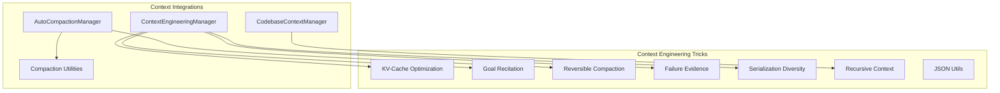
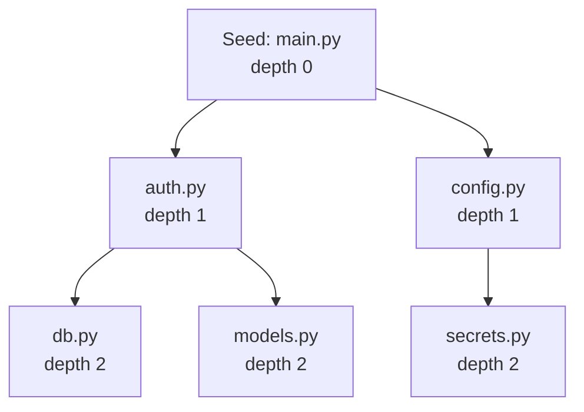

# Context Engineering

Long-running agent sessions face a fundamental challenge: the context window is finite, but conversations grow unbounded. Attocode uses a suite of context engineering techniques to manage this, keeping the agent effective across hundreds of iterations.

## Why Context Management Matters

Without context management, long sessions hit these problems:

1. **Context overflow** — Messages exceed the model's context window
2. **Goal drift** — The agent forgets what it was trying to accomplish
3. **Repeated mistakes** — The agent doesn't learn from earlier failures
4. **Cache inefficiency** — Poor message ordering wastes KV-cache tokens
5. **Stale context** — Old tool outputs consume space without providing value

## Architecture Overview



## The 7 Tricks

Attocode implements 7 context engineering techniques in `src/attocode/tricks/`:

### 1. KV-Cache Optimization (`kv_cache.py`)

Structures the system prompt for maximum KV-cache efficiency. Static content (instructions, rules) goes first and stays cacheable across turns. Dynamic content (session ID, timestamp, mode) goes at the end.

**Key idea:** KV-cache works as a prefix match — if the first N tokens are identical between turns, the cache can skip recomputing them. By placing stable content first, we maximize cache hits.

```python
# Builds a cache-optimized system prompt
context = CacheAwareContext()
context.add_static("You are a coding agent...")  # Cacheable
context.add_static(rules_text)                    # Cacheable
context.add_dynamic(session_id=sid, mode=mode)    # Varies per turn
prompt = context.build_cacheable_system_prompt()
```

Typical savings: 10–15% token reduction with 85%+ cache hit rate.

#### Cache Boundary Tracking

The `CacheAwareContext` uses named breakpoints to mark boundaries between cacheable sections:

```python
config = CacheAwareConfig(
    cache_breakpoints=["tools_end", "memory_end", "system_end"],
    enforce_append_only=True,
)
```

When building cacheable prompts, each section up to a breakpoint gets `cache_control={"type": "ephemeral"}`, telling the API to cache that prefix. The `build_multi_breakpoint_prompt()` function lets you define arbitrary sections:

```python
sections = [
    ("instructions", system_instructions, True),   # cacheable
    ("tools", tool_definitions, True),              # cacheable
    ("memory", session_memory, True),               # cacheable
    ("dynamic", current_state, False),              # NOT cacheable
]
blocks = build_multi_breakpoint_prompt(sections)
```

#### Append-Only Validation

When `enforce_append_only=True`, the context validates that existing messages are never mutated between turns using DJB2 hashing. Each message's hash is stored and checked on the next turn. Violations are logged as `cache.violation` events, since mutating messages invalidates the cache prefix.

#### Estimating Savings

```python
savings = estimate_cache_savings(
    system_prompt_tokens=5000,
    avg_messages_per_turn=3,
    turns=20,
    cache_hit_rate=0.9,
)
# savings["token_savings"]  — Total tokens saved
# savings["cost_savings"]   — Estimated USD saved
```

### 2. Goal Recitation (`recitation.py`)

Periodically reinjects the session goal and progress into the conversation. This prevents goal drift in long sessions where the original objective gets buried under hundreds of messages.

**Configuration:**

| Setting | Default | Description |
|---------|---------|-------------|
| Frequency | Every 5 iterations | How often to inject recitation |
| Sources | plan, todo, goal, memory | What to include |
| Max tokens | 500 | Maximum recitation size |

#### Recitation Content

Each injection includes sections based on configured sources:

- **Goal:** `"Goal: Build a REST API with tests"`
- **Plan:** `"Plan: 3/7 tasks complete"` + next 2 pending tasks
- **Todos:** `"Todos: 4 remaining"` + up to 3 pending items
- **Memories:** Up to 3 with `"Remember: ..."`
- **Recent errors:** Last 2 errors

The recitation is wrapped with a header: `[Current Status - Iteration 15]` and inserted before the last user message to avoid disrupting the conversation flow.

#### Adaptive Recitation Manager

The `AdaptiveRecitationManager` extends basic recitation with drift detection:

**Drift Detection Algorithm:**

1. Extract words (>3 chars) from the session goal
2. Extract words (>3 chars) from recent conversation content
3. Compute overlap: `overlap = goal_words ∩ content_words`
4. Relevance: `len(overlap) / len(goal_words)`
5. Drift score: `1.0 - relevance` (0.0 = on track, 1.0 = fully drifted)

**Frequency Adjustment:**

| Drift Score | Frequency Adjustment | Effect |
|------------|---------------------|--------|
| > 0.7 (high drift) | `max(2, base_freq // 2)` | Doubles injection rate |
| > 0.4 (moderate) | `max(3, base_freq - 2)` | Increases frequency |
| ≤ 0.4 (on track) | No change | Normal rate |

For example, with a base frequency of 5: high drift injects every 2 iterations, moderate drift every 3, and on-track stays at every 5.

#### Context-Adaptive Frequency

The `calculate_optimal_frequency()` utility adjusts frequency based on context window usage:

| Context Size | Optimal Frequency |
|-------------|-------------------|
| < 10K tokens | Every 10 iterations |
| 10–30K tokens | Every 7 iterations |
| 30–60K tokens | Every 5 iterations |
| > 60K tokens | Every 3 iterations |

Larger contexts are more likely to bury the original goal, so recitation frequency increases.

### 3. Reversible Compaction (`reversible_compaction.py`)

Compresses old messages into a summary while preserving extractable references. Unlike simple truncation, this preserves actionable links to files, URLs, functions, errors, and commands mentioned in the conversation.

**Reference types extracted:**

| Type | Example |
|------|---------|
| FILE | `src/main.py`, `tests/test_auth.py` |
| URL | `https://api.example.com/docs` |
| FUNCTION | `def process_request()`, `handle_auth()` |
| ERROR | `TypeError: expected str`, `ConnectionRefused` |
| COMMAND | `npm test`, `git push origin main` |
| DECISION | Key architectural choices |

#### Reference Scoring

References are scored by relevance and preserved in the compacted output for later retrieval. The scoring algorithm:

1. **Base score:** 0.5 for all references
2. **Goal overlap:** +0.1 per word shared between the reference value and the session goal (words split on `/` and `.`)
3. **Topic overlap:** +0.15 if the reference value appears in any recent topic
4. **Type bonuses:** ERROR gets +0.1, FILE gets +0.05 (errors are most actionable)
5. **Capped at:** 1.0

After scoring, references are deduplicated by `type:value`, filtered by minimum relevance, sorted by score (descending), and capped at `max_references` (default 100).

#### Reconstruction Flow

When compacted context needs to be retrieved:

1. Start with the LLM-generated summary
2. For FILE references (sorted by relevance), fetch actual file content via a content provider, appending each until the token budget is exhausted
3. For other reference types (URLs, FUNCTIONS, ERRORS, COMMANDS), group and format with headers
4. Return the combined string, respecting the token budget

### 4. Failure Evidence (`failure_evidence.py`)

Tracks tool failures, categorizes them, and injects failure context before the next LLM call. This helps the agent avoid repeating the same mistakes.

**11 Failure categories:**

| Category | Matched Patterns |
|----------|-----------------|
| PERMISSION | `EACCES`, `permission denied`, `PermissionError`, `forbidden` |
| NOT_FOUND | `ENOENT`, `not found`, `FileNotFoundError`, `no such file` |
| SYNTAX | `syntax error`, `SyntaxError`, `unexpected token`, `parse error` |
| TYPE | `type error`, `TypeError`, `invalid type`, `wrong type` |
| RUNTIME | `RuntimeError`, `runtime`, `assertion`, `AssertionError` |
| NETWORK | `network`, `ECONNREFUSED`, `EHOSTUNREACH`, `DNS`, `ConnectionError` |
| TIMEOUT | `timeout`, `ETIMEDOUT`, `timed out`, `TimeoutError` |
| VALIDATION | `validation`, `invalid`, `ValueError`, `required field` |
| LOGIC | General logic errors |
| RESOURCE | `out of memory`, `ENOMEM`, `MemoryError`, `disk full` |
| UNKNOWN | Default when no pattern matches |

**Features:**

- **Auto-categorization** via regex pattern matching on error messages
- **Repeat detection** (warns after 3+ identical failures on the same action)
- **Pattern detection** identifies two kinds of patterns:
    - *Repeated action patterns:* Same tool fails 3+ times (confidence: `min(0.9, 0.3 + count * 0.1)`)
    - *Category cluster patterns:* 5+ failures of the same category in the last 10 failures (confidence: 0.7)
- **Cascade detection** finds sequences of related failures within a 60-second window by matching on same category or overlapping file paths in arguments. A cascade with 2+ downstream failures is flagged with its root cause and total impact count.
- **Cross-iteration patterns** detect the same tool+category pair failing across 3+ different iterations, indicating a systemic issue

### 5. Serialization Diversity (`serialization_diversity.py`)

Varies JSON serialization style across turns to prevent the LLM from overfitting to specific formatting.

**What varies:**

| Dimension | Options | Controlled By |
|-----------|---------|--------------|
| Indentation | 0, 1, 2, 3, or 4 spaces (or `None` for compact) | `vary_indentation` |
| Key order | Ascending, descending, or random (Fisher-Yates shuffle) | `vary_key_order` |
| Space after colon | `": "` vs `":"` | `variation_level` |
| Null handling | Include or omit null/None values | `omit_nullish` |

The `DiverseSerializer` uses a seeded linear congruential RNG for deterministic variation. The `variation_level` (0.0–1.0) controls how aggressively styles change: 0.0 means no variation, 1.0 means maximum randomization.

**Finding the most compact representation:**

```python
compact_json, style = find_most_compact(data, max_attempts=10)
```

`find_most_compact()` always tries a compact baseline (`indent=None, sort_keys=True, no space after colon, omit nulls`) plus random variations, returning the shortest result. Useful for minimizing token usage in tool results.

**Adaptive serialization:** The `AdaptiveSerializer` monitors recent serialization styles (last 20). If it detects repetition (≤2 unique styles in the last 5), it temporarily boosts `variation_level` by 0.3 to break the pattern.

### 6. Recursive Context (`recursive_context.py`)

Follows import chains to build deeper code context. Starting from seed files, it performs BFS traversal through imports up to a configurable depth, respecting a token budget.

```python
retriever = RecursiveContextRetriever(
    provider=content_provider,
    max_depth=3,
    token_budget=50_000,
    max_files=20,
)
result = retriever.retrieve_with_priority(
    seed_files=["src/main.py"],
    priority_files=["src/auth.py"],
)
```

Supports Python (`import`/`from`) and JavaScript/TypeScript (`import`/`require`) syntax.

#### BFS Traversal

The basic `retrieve()` method processes files in FIFO order:



At each step, the retriever:

1. Checks limits: depth > `max_depth`? files >= `max_files`? tokens >= `token_budget`?
2. Fetches file content (truncated if needed to fit remaining budget)
3. Extracts import references for the next depth level
4. Enqueues new references

#### Two-Phase Priority Retrieval

`retrieve_with_priority()` uses a two-phase approach:

**Phase 1 (50% of budget):** Load priority files first with no depth restriction. These are files you know are important (e.g., the file being edited, its test file).

**Phase 2 (remaining budget):** BFS from seed files, including priority file references in the initial queue at depth=1. This expands context outward from both seeds and priority files.

This ensures critical files always get included, even if the BFS traversal alone would reach them late or not at all.

### 7. JSON Utilities (`json_utils.py`)

Robust JSON parsing for malformed LLM output. Handles code fences, trailing commas, single quotes, and embedded JSON fragments.

```python
from attocode.tricks.json_utils import safe_parse, extract_json

# Parse with automatic fixing
data = safe_parse('{"key": "value",}')  # Fixes trailing comma

# Extract JSON from mixed text
obj = extract_json("Here's the config: ```json\n{...}\n```")
```

## Auto-Compaction

The `AutoCompactionManager` monitors context usage and automatically triggers compaction when thresholds are reached.

### Thresholds

| Level | Threshold | Action |
|-------|-----------|--------|
| OK | < 70% of context window | No action |
| WARNING | 70% (140K of 200K tokens) | Alert the agent |
| COMPACTION | 80% (160K of 200K tokens) | Trigger compaction |

### Compaction Strategies

| Strategy | Description | When to Use |
|----------|-------------|-------------|
| **Summarize** (default) | Ask LLM to summarize progress, replace old messages | Standard case — preserves understanding |
| **Truncate** | Keep recent N messages, drop old ones | Fast, token-efficient |
| **Selective** | Keep high-relevance messages, drop routine ones | Balances content + context |
| **Reversible** | Summarize + preserve references for retrieval | Need to retrieve compacted context later |

### Compaction Process

1. **Keep system messages** — Never dropped
2. **Generate summary** — LLM summarizes the conversation so far
3. **Inject summary** — Replace old messages with a user+assistant summary pair
4. **Preserve recent** — Keep the last 4 messages (configurable)
5. **Record stats** — Log compression ratio and tokens saved

### Emergency Compaction

When budget is too tight for an LLM summarization call:

- Keeps system prompt + work log summary + last 10 messages
- No LLM call needed
- Fast but less informative

### Manual Compaction

```
/compact            # Trigger compaction now
```

## Context Overflow Guard

When tool results are extremely large, the overflow guard truncates them in-place:

- Long tool outputs get head + `... [truncated] ...` + tail preview
- Default preview: ~200 characters
- Applied before the next LLM call to prevent context window overflow

## Codebase Context

The `CodebaseContextManager` provides intelligent code context:

```
/repomap             # Show repository structure
/repomap symbols     # Show symbol index
/repomap deps        # Show dependency graph
/repomap analyze     # Full analysis
/context             # Show current context blocks
```

### Features

- **File discovery** — Recursive walk respecting `.gitignore` and 50+ ignore patterns
- **Importance scoring** — Files ranked by size, type, test status, and configuration role
- **Dependency graph** — Parses imports to build forward/reverse dependency maps
- **Hub scoring** — Identifies central files based on incoming dependency edges
- **Incremental updates** — Dirty file tracking for efficient re-analysis

## Context Priority System

The `ContextEngineeringManager` assembles context blocks with priority-based budgeting:

| Priority | Examples | Behavior |
|----------|----------|----------|
| CRITICAL | System prompt | Always included |
| HIGH | Goal recitation, failure evidence | Included unless extremely tight |
| MEDIUM | Work log, learnings | Included if space allows |
| LOW | File context, background info | Dropped first when tight |

## Integration Flow

Here's how context engineering integrates into the agent loop:

```mermaid
sequenceDiagram
    participant Loop as Execution Loop
    participant CE as ContextEngineering
    participant AC as AutoCompaction
    participant LLM as LLM Provider

    Loop->>AC: check(messages)
    alt Usage > 80%
        AC->>LLM: Summarize progress
        LLM-->>AC: Summary
        AC->>Loop: Compacted messages
    end
    Loop->>CE: inject_recitation(messages)
    CE-->>Loop: Messages + goal reminder
    Loop->>CE: inject_failure_context(messages)
    CE-->>Loop: Messages + failure evidence
    Loop->>LLM: chat(messages)
    LLM-->>Loop: Response
```

## Configuration

Key parameters and their defaults:

| Parameter | Default | Description |
|-----------|---------|-------------|
| `max_context_tokens` | 200,000 | Hard context window limit |
| `warning_threshold` | 0.7 | Warning at 70% usage |
| `compaction_threshold` | 0.8 | Auto-compact at 80% usage |
| `min_messages_to_keep` | 4 | Recent messages preserved during compaction |
| `recitation_frequency` | 5 iterations | Goal reinforcement interval |
| `failure_max_records` | 50 | Maximum tracked failures |
| `failure_repeat_threshold` | 3 | Warn on N+ repeats |

## Related Pages

- [Budget System](BUDGET.md) — Token budget and economics
- [Tracing](tracing-guide.md) — Compaction and context overflow events
- [Architecture](ARCHITECTURE.md) — Overall system design
