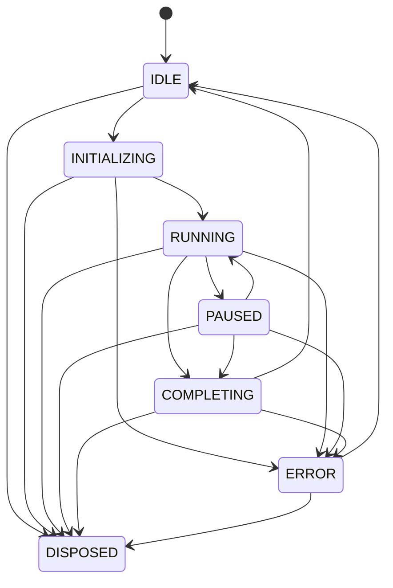

# Internals

This page covers Attocode's internal systems: the agent state machine, error hierarchy, undo system, rules loading, LSP integration, and shared state for multi-agent coordination.

## Agent State Machine

The agent uses a formal finite state machine with 7 lifecycle states:



### States

| State | Description |
|-------|-------------|
| `IDLE` | Agent created but not started, or completed a run |
| `INITIALIZING` | Loading config, tools, providers, features |
| `RUNNING` | Actively processing --- making LLM calls and executing tools |
| `PAUSED` | Temporarily suspended (e.g., waiting for approval) |
| `COMPLETING` | Wrapping up --- generating closure report |
| `ERROR` | An error occurred; can recover to IDLE |
| `DISPOSED` | Permanently shut down; no further transitions possible |

### Valid Transitions

The state machine enforces 18 valid transitions. Invalid transitions raise `InvalidTransitionError` with `from_state` and `to_state` attributes.

### Convenience Methods

```python
machine.initialize()   # IDLE → INITIALIZING
machine.start()        # INITIALIZING → RUNNING
machine.pause()        # RUNNING → PAUSED
machine.resume()       # PAUSED → RUNNING
machine.complete()     # RUNNING/PAUSED → COMPLETING
machine.finish()       # COMPLETING → IDLE
machine.fail(error)    # Any → ERROR
machine.dispose()      # Any → DISPOSED
```

### Transition Listeners

```python
def on_state_change(from_state, to_state, metadata):
    print(f"Agent: {from_state} → {to_state}")

machine.on_transition(on_state_change)
```

Listeners receive `(from_state, to_state, metadata)`. Exceptions in listeners are caught silently --- listeners cannot prevent transitions.

The `history` property returns a list of `(from_state, to_state)` tuples for debugging.

## Error Hierarchy

All agent errors extend from `AgentError`, which carries a category, retryable flag, and details dict:

```
AgentError (base)
├── LLMError           — Empty response, malformed output (retryable)
├── ProviderError      — Rate limit, network, auth (retryable)
│                        Fields: provider, status_code
├── ToolError          — Tool execution failure (not retryable)
│   ├── ToolNotFoundError
│   └── ToolTimeoutError
├── BudgetExhaustedError — Token/cost/time limit exceeded
├── CancellationError    — User or system abort
├── PermissionDeniedError — Tool blocked by policy
│                          Field: tool_name
└── ConfigurationError   — Invalid/missing settings
```

### Error Categories

The `ErrorCategory` enum enables filtering and specialized handling:

| Category | Typical Errors |
|----------|---------------|
| `LLM` | Empty responses, malformed JSON output |
| `PROVIDER` | Rate limits, network errors, authentication failures |
| `TOOL` | File not found, command timeout, execution failure |
| `BUDGET` | Token/cost/duration limits exceeded |
| `CANCELLATION` | User pressed Ctrl+C, system abort |
| `PERMISSION` | Tool blocked by policy engine |
| `CONFIGURATION` | Missing API key, invalid config file |
| `INTERNAL` | Unexpected errors |

### Retryable Errors

The `retryable` flag guides the execution loop:

| Error Type | Retryable | Action |
|-----------|-----------|--------|
| `LLMError` | Yes | Retry the LLM call |
| `ProviderError` | Yes | Retry or fall back to next provider |
| `ToolError` | No | Report to agent, let it try a different approach |
| `BudgetExhaustedError` | No | Stop execution or request extension |
| `CancellationError` | No | Stop immediately |
| `PermissionDeniedError` | No | Report denial, agent may ask user |
| `ConfigurationError` | No | Stop and report config issue |

## Undo System

The `/undo` and `/diff` commands are backed by `FileChangeTracker`, which records before/after snapshots of every file modification.

### How It Works

Every time the agent writes or edits a file, the tracker stores:

- File path
- Content **before** the change (full snapshot)
- Content **after** the change
- Tool name, timestamp, iteration number
- Optional description

### Undo Commands

```
/undo                  # Undo the most recent file change
/undo turn             # Undo all changes in the current iteration
/undo file src/app.py  # Undo the most recent change to a specific file
/diff                  # Show pending (non-undone) changes
```

### Undo Semantics

| Change Type | Undo Action |
|------------|-------------|
| File created | Delete the file from disk |
| File deleted | Restore from `before_content` |
| File modified | Write `before_content` back |

Each change can only be undone once --- setting `undone=True` prevents double-undo. History is capped at 100 entries to prevent unbounded memory growth.

## Rules System

Rules are project-specific or user-specific instructions injected into the agent's system prompt.

### File Locations

Rules are loaded from Markdown files with this priority (highest wins):

| Priority | Path | Scope |
|----------|------|-------|
| 3 (highest) | `.attocode/rules.md` | Project-level |
| 2 | `~/.attocode/rules.md` | User-level |
| 1 (fallback) | `.agent/rules.md` | Legacy project-level |

### Format

Rules files are plain Markdown. The entire content is injected into the system prompt:

```markdown
# Project Rules

- Always use `pytest` for testing, never `unittest`
- Prefer dataclasses over plain dicts for structured data
- All public functions must have type annotations
- Never commit directly to main --- use feature branches
```

### Behavior

- Rules load lazily on first access
- Empty files are silently skipped
- Read errors are caught and ignored (never fails the agent)
- Multiple rules files are joined with `\n\n---\n\n` separator
- UTF-8 with `errors='replace'` for malformed files

## LSP Integration

Attocode includes an async Language Server Protocol client for code navigation, completions, hover info, and diagnostics.

### Built-in Server Configurations

| Language | Server | Extensions |
|----------|--------|-----------|
| TypeScript | `typescript-language-server` | `.ts`, `.tsx`, `.js`, `.jsx`, `.mjs`, `.cjs` |
| Python | `pyright-langserver` | `.py`, `.pyi` |
| Rust | `rust-analyzer` | `.rs` |
| Go | `gopls` | `.go` |
| JSON | `vscode-json-language-server` | `.json`, `.jsonc` |

### Auto-Detection

The LSP manager detects which servers to start based on project files:

| Project File | Server Started |
|-------------|----------------|
| `package.json` or `tsconfig.json` | TypeScript |
| `pyproject.toml` or `requirements.txt` | Python |
| `Cargo.toml` | Rust |
| `go.mod` | Go |

### Capabilities

| Method | Description |
|--------|-------------|
| `get_definition(file, line, col)` | Jump to symbol definition |
| `get_completions(file, line, col)` | Autocomplete suggestions |
| `get_hover(file, line, col)` | Type and documentation popup |
| `get_references(file, line, col)` | Find all usages of a symbol |
| `get_diagnostics(file)` | Cached errors and warnings |

### The `/lsp` Command

```
/lsp                   # Show LSP server status
```

Displays which language servers are running, their status, and capabilities.

### Protocol Details

The client communicates with language servers over JSON-RPC 2.0 via stdio with `Content-Length` header framing. Each server runs as an async subprocess with a background read loop for notifications.

## Shared State

In swarm mode, multiple worker agents need to coordinate. The `shared/` module provides thread-safe state for cross-agent communication.

### Shared Context State

Thread-safe pool for cross-worker failure tracking and reference sharing:

```python
shared = SharedContextState(config=SharedContextConfig(
    max_references=200,
    max_failures_per_worker=50,
))
```

| Method | Description |
|--------|-------------|
| `record_failure(worker_id, input, error)` | Track a worker's failure |
| `get_failure_context(max_failures)` | Formatted text for LLM injection |
| `get_failure_insights()` | Extracted actionable rules |
| `add_references(refs)` | Pool compaction references (deduped) |
| `search_references(query)` | Substring search on pooled refs |

Workers share failure context so the same mistakes aren't repeated across agents.

### Shared Economics State

Cross-worker doom loop detection:

```python
shared_econ = SharedEconomicsState(config=SharedEconomicsConfig(
    global_doom_threshold=10,
))
```

When the same tool+args fingerprint appears across multiple workers exceeding the global threshold (default 10), it's flagged as a global doom loop. This catches systemic issues like an API endpoint being down that affects all workers.

### Worker Budget Tracker

Per-worker budget enforcement that reports to shared state:

```python
tracker = WorkerBudgetTracker(config=WorkerBudgetConfig(
    max_tokens=300_000,
    max_iterations=50,
    doom_loop_threshold=3,
))
```

Uses MD5 fingerprinting of `{"tool": name, "args": args}` for doom loop detection. Tracks the last 20 fingerprints with a local threshold of 3 consecutive identical calls.

### Shared Context Engine

Assembles system prompts for swarm workers using shared state:

```python
engine = SharedContextEngine(shared_context, config=SharedContextEngineConfig(
    max_failure_context=10,
    include_insights=True,
    include_references=True,
))

prompt = engine.build_worker_system_prompt(task)
```

The prompt includes a shared prefix (for KV-cache alignment across workers), failure guidance from cross-worker failures, and a goal recitation block with task metadata.

### Persistence

Shared state supports checkpointing via two persistence adapters:

| Adapter | Storage | Use Case |
|---------|---------|----------|
| `JSONFilePersistenceAdapter` | `.json` files in a directory | Development, debugging |
| `SQLitePersistenceAdapter` | SQLite WAL-mode database | Production, concurrent access |

Both implement the same `PersistenceAdapter` protocol with `save()`, `load()`, `list_keys()`, `delete()`, and `exists()` methods.

## Related Pages

- [Architecture](ARCHITECTURE.md) --- Overall system design
- [Budget System](BUDGET.md) --- Token budgets and economics
- [Advanced Features](advanced-features.md) --- Permission modes, plan mode
- [Extending Attocode](extending.md) --- Adding custom tools and providers
