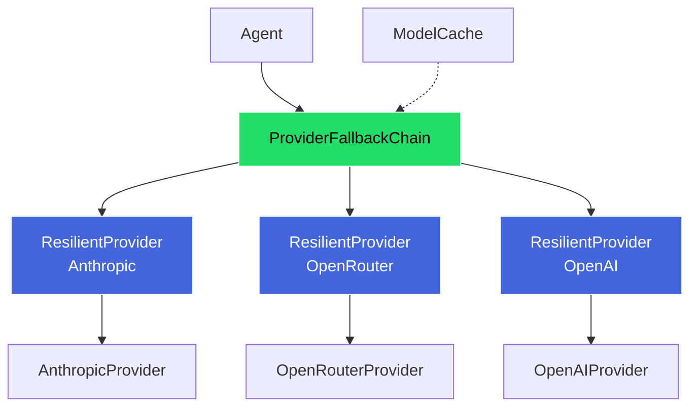
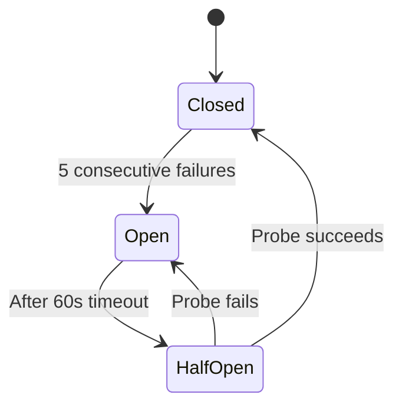

# Provider Resilience & Reliability

Attocode wraps LLM providers with retry logic, circuit breakers, fallback chains, and a dynamic model cache. These layers ensure the agent stays operational even when individual providers have outages, rate limits, or transient errors.

## Architecture



## Resilient Provider

The `ResilientProvider` wraps any single LLM provider with retry, timeout, and circuit breaker:

```python
from attocode.providers import ResilientProvider, ResilienceConfig

config = ResilienceConfig(
    max_retries=3,
    retry_base_delay=1.0,
    retry_max_delay=30.0,
    timeout_seconds=600.0,
    circuit_breaker_threshold=5,
    circuit_breaker_reset_seconds=60.0,
)
provider = ResilientProvider(inner_provider, config=config)
```

### Configuration

| Parameter | Default | Description |
|-----------|---------|-------------|
| `max_retries` | 3 | Number of retry attempts before giving up |
| `retry_base_delay` | 1.0s | Initial delay between retries |
| `retry_max_delay` | 30.0s | Maximum delay (caps exponential growth) |
| `timeout_seconds` | 600.0s | Hard timeout per request |
| `circuit_breaker_threshold` | 5 | Consecutive failures before opening circuit |
| `circuit_breaker_reset_seconds` | 60.0s | Time before circuit breaker tries again |

### Retry with Exponential Backoff

When a request fails with a retryable error, the provider retries with exponential backoff:

```
Attempt 1: immediate
Attempt 2: wait 1s
Attempt 3: wait 2s
Attempt 4: wait 4s
...capped at 30s max
```

The delay formula is `min(base_delay * 2^attempt, max_delay)`. The final attempt has no delay (it either succeeds or the error is raised).

### Error Classification

| Error Type | Retryable? | Behavior |
|-----------|-----------|----------|
| `asyncio.TimeoutError` | Yes | Wrapped as `ProviderError`, retried |
| `ProviderError(retryable=True)` | Yes | Retried with backoff |
| `ProviderError(retryable=False)` | No | Raised immediately (e.g., auth failure) |
| Other exceptions | Yes | Wrapped as `ProviderError`, retried |

### Statistics

The resilient provider tracks operational metrics:

```python
stats = provider.stats
stats.total_calls          # Total chat() invocations
stats.successful_calls     # Calls that succeeded
stats.retried_calls        # Calls that required retries
stats.timed_out_calls      # Calls that hit timeout
stats.circuit_broken_calls # Calls rejected by circuit breaker
stats.total_retry_count    # Total retry attempts across all calls
```

## Circuit Breaker

The circuit breaker prevents cascading failures by fast-failing when a provider is consistently down.

### Three States



| State | Behavior |
|-------|----------|
| **Closed** | Normal operation. Requests pass through. Failure counter increments on each failure. |
| **Open** | Fast failure. All requests immediately raise `ProviderError` without hitting the provider. Transitions to half-open after reset timeout (60s). |
| **Half-Open** | Recovery probe. Allows one request through. If it succeeds, circuit closes. If it fails, circuit reopens. |

### When It Trips

The circuit opens when consecutive failures reach the threshold (default 5). A single success at any point resets the failure counter to zero.

```python
# Check circuit breaker state
state = provider.circuit_breaker_state  # "closed", "open", or "half_open"

# Manual reset (e.g., after fixing an API key)
provider.reset_circuit_breaker()
```

## Fallback Chain

The `ProviderFallbackChain` tries providers in order, falling back to the next on failure:

```python
from attocode.providers import ProviderFallbackChain

chain = ProviderFallbackChain(
    providers=[anthropic_provider, openrouter_provider, openai_provider],
    circuit_breakers={"anthropic": cb1, "openrouter": cb2, "openai": cb3},
    on_fallback=lambda name, err: logger.warning(f"Fell back from {name}: {err}"),
)
```

### Fallback Behavior

1. Try the first provider
2. If it fails (or its circuit breaker is open), skip to the next
3. Continue until one succeeds or all fail
4. If all fail, raise `ProviderError` with combined error messages

Providers with open circuit breakers are skipped without consuming an attempt.

### Health-Based Reordering

```python
# Get list of healthy providers (not circuit-broken)
healthy = chain.get_healthy_providers()

# Reorder: put healthy providers first
chain.reorder_by_health()
```

`reorder_by_health()` uses a stable sort, so healthy providers maintain their relative order while circuit-broken providers move to the end.

### Statistics

```python
stats = chain.stats
stats.total_calls         # Total chat() invocations
stats.primary_successes   # Calls handled by the first provider
stats.fallback_successes  # Calls that required fallback
stats.total_failures      # All providers failed
stats.fallback_rate       # fallback_successes / total_calls
```

## Model Cache

The model cache fetches live model metadata from OpenRouter's API at startup and uses it for context window sizes and pricing throughout the session.

### Initialization

```python
from attocode.providers.model_cache import init_model_cache

await init_model_cache()  # Fetches from OpenRouter /api/v1/models
```

- Runs once at agent startup (idempotent, skips if cache is fresh)
- Uses `OPENROUTER_API_KEY` for auth (optional, improves rate limits)
- **TTL:** 1 hour (3600 seconds)
- **Graceful degradation:** Fails silently, allowing fallback to built-in model data

### What It Caches

| Data | Source | Fallback |
|------|--------|----------|
| Context window sizes | Live API | `BUILTIN_MODELS` constants |
| Input pricing (per million tokens) | Live API | `BUILTIN_MODELS` constants |
| Output pricing (per million tokens) | Live API | `BUILTIN_MODELS` constants |

### Fuzzy Model ID Matching

Model IDs vary across providers (e.g., `claude-sonnet-4-20250514` vs `anthropic/claude-sonnet-4-20250514`). The cache resolves IDs using a 3-step fuzzy match:

1. **Exact match** --- Direct lookup
2. **Suffix match** --- `model_id` suffix matches a cache key suffix
3. **Base match** --- Cache key suffix starts with model_id base (date suffix stripped)

### Anomaly Detection

Context lengths below 1,024 tokens are treated as anomalous and skipped. This prevents bad API data from breaking context window calculations.

### Reconciliation

After fetching live data, the cache compares against hardcoded `BUILTIN_MODELS` and patches any mismatches in-place. Warnings are logged when builtin values drift from live data, helping maintainers keep the hardcoded fallbacks accurate.

### Querying the Cache

```python
from attocode.providers.model_cache import (
    get_cached_context_length,
    get_cached_pricing,
    is_cache_initialized,
)

context_len = get_cached_context_length("claude-sonnet-4-20250514")  # e.g., 200000
pricing = get_cached_pricing("claude-sonnet-4-20250514")
# pricing.input_rate   — cost per million input tokens
# pricing.output_rate  — cost per million output tokens
```

## Related Pages

- [Providers](PROVIDERS.md) --- Provider configuration and API keys
- [Budget System](BUDGET.md) --- How pricing feeds into cost tracking
- [Troubleshooting](troubleshooting.md) --- Diagnosing provider issues
