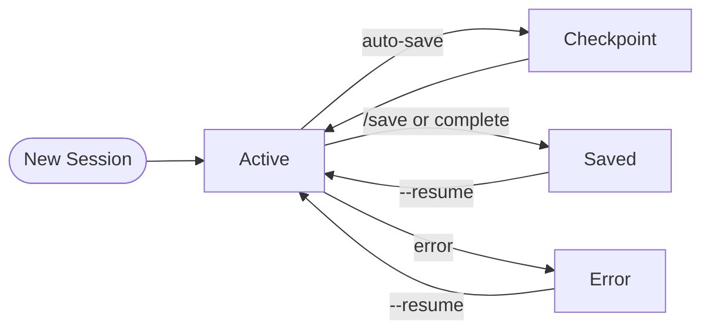

# Sessions & Persistence

Attocode automatically persists session state to SQLite, enabling resume, checkpointing, goal tracking, and conversation threading.

## Session Lifecycle



Every session gets a unique ID and is stored with its task description, model, token usage, cost, and iteration count.

## Creating Sessions

Sessions are created automatically when you start Attocode:

```bash
# Creates a new session
attocode "Fix the login bug"

# The session ID is shown in the status bar
```

Sessions are also created via the `/save` command or automatically saved at regular intervals.

## Checkpoints

Checkpoints capture the full conversation state (messages + metrics) at a point in time. They enable resuming from exactly where you left off.

### Auto-Checkpoints

The `AutoCheckpointManager` saves checkpoints based on:

| Trigger | Default | Description |
|---------|---------|-------------|
| Time interval | Every 2 minutes | Periodic background save |
| Milestones | On achievement | Saves at notable progress points |
| Tool batches | After 3+ tools | Saves after large tool batches |

Auto-checkpoints keep the most recent 5 (configurable) and evict older ones.

### Manual Checkpoints

```
/checkpoint               # Save checkpoint now
/checkpoint "before refactor"  # Save with description
```

## Resuming Sessions

Resume a previous session to continue where you left off:

```bash
# Resume by session ID
attocode --resume abc123

# Or use the slash command
/resume abc123
```

The resume restores:

- Full conversation history (messages)
- Active goals
- Pending plans
- Token usage metrics

## Listing Sessions

```
/sessions          # List recent sessions (20 most recent)
/sessions 50       # Show more
```

Each session shows:

- Session ID
- Task description
- Status (active, completed, paused, error)
- Model used
- Token count and cost
- Iteration count
- Last active timestamp

## Loading Sessions

```
/load <session-id>   # Load a specific session
```

This restores the full session state from the latest checkpoint.

## Goals

Track high-level objectives within a session:

```
/goals               # List active goals
/goals list          # Same as above
/goals add "Implement auth module"   # Add a goal
/goals done 1        # Mark goal #1 complete
/goals all           # Show all goals (including completed)
```

Goals are persisted in SQLite and restored on session resume. They also feed into the [context engineering](context-engineering.md) system for goal recitation.

## Thread Forking

Conversation threads let you branch off into alternative approaches without losing your original work.

### Creating a Fork

```
/fork                          # Fork at current point
/fork "Try alternative approach"  # Fork with label
```

This creates a new thread that copies the conversation history up to the fork point. The original thread remains unchanged.

### Navigating Threads

```
/threads          # List all threads
/switch <id>      # Switch to a different thread
/rollback         # Roll back to parent thread's fork point
/restore          # Restore from a previous thread state
```

### Thread Hierarchy

Threads form a tree structure:

```
main
├── fork-a1b2c3d4 ("Try alternative approach")
│   └── fork-e5f6g7h8 ("Sub-experiment")
└── fork-i9j0k1l2 ("Different strategy")
```

Each fork records:

- Thread ID (e.g., `fork-a1b2c3d4`)
- Label (human-readable description)
- Parent thread reference
- Fork point (message index)
- Creation timestamp

## SQLite Schema

Session data is stored in `.attocode/sessions/sessions.db` with 12 tables:

| Table | Purpose |
|-------|---------|
| `sessions` | Session metadata (id, task, status, model, tokens, cost, iterations) |
| `checkpoints` | Conversation snapshots (messages JSON, metrics) |
| `goals` | Goal tracking (description, status, timestamps) |
| `tool_calls` | Tool execution log (name, args, result, duration, danger level) |
| `file_changes` | File modification history (before/after content for undo) |
| `compaction_history` | Context compaction events (messages before/after, tokens saved) |
| `pending_plans` | Queued plans awaiting approval |
| `dead_letters` | Failed operations for retry |
| `remembered_permissions` | Session-scoped tool permission grants (with fnmatch patterns) |
| `usage_logs` | Per-call token usage (input, output, cache read/write, cost) |
| `schema_version` | Database migration tracking |

All child tables have foreign keys to `sessions(id)` and indexes on `session_id` for fast filtering.

### Session Record Fields

```
id              TEXT PRIMARY KEY
task            TEXT NOT NULL
status          TEXT (active, completed, paused, error)
model           TEXT
total_tokens    INTEGER
total_cost      REAL
iterations      INTEGER
created_at      REAL (Unix timestamp)
updated_at      REAL (Unix timestamp)
metadata        TEXT (JSON)
```

## Handoff

Use `/handoff` to generate a session summary for handing off work to another person or resuming later with context:

```
/handoff
```

This produces a structured summary of the session's progress, decisions, and remaining work.

## Related Pages

- [Advanced Features](advanced-features.md) — Plan mode and task decomposition
- [Tracing](tracing-guide.md) — Detailed execution traces
- [Context Engineering](context-engineering.md) — How context is managed across long sessions
