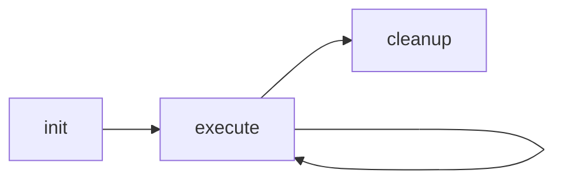

# Skills & Custom Agents

Attocode supports extensible skills and custom agent definitions. Skills inject specialized behavior via prompt content, while custom agents define reusable agent configurations with specific tools, models, and system prompts.

## Directory Structure

```
~/.attocode/                    # User-level (global)
├── skills/
│   └── my-skill/
│       └── SKILL.md
└── agents/
    └── my-agent/
        └── AGENT.yaml

.attocode/                      # Project-level (overrides user-level)
├── skills/
│   └── project-skill/
│       └── SKILL.md
└── agents/
    └── project-agent/
        └── AGENT.yaml
```

**Priority hierarchy:** built-in < user-level (`~/.attocode/`) < project-level (`.attocode/`)

Project-level definitions override user-level ones with the same name. Legacy paths (`.agent/skills/`, `.agent/agents/`) are also supported.

## Skills

Skills are prompt-based extensions that inject specialized instructions into the agent's context. They range from simple one-shot prompts to stateful multi-turn workflows.

### Creating a Skill

```bash
# Scaffold a new skill
/skills new my-skill
```

This creates `.attocode/skills/my-skill/SKILL.md` with a template.

### SKILL.md Format

Two formats are supported:

**Format 1: YAML Frontmatter**

```markdown
---
description: Verify swarm run quality
version: 1.0.0
depends_on: base-skill, helper-skill
lifecycle: simple
compatible_versions:
  base-skill: ">=1.0.0"
---

# Swarm Verification

Instructions for the agent to follow when this skill is invoked...
```

**Format 2: Simple Markdown**

```markdown
# My Skill

Description and instructions for the agent...
```

### Frontmatter Fields

| Field | Type | Description |
|-------|------|-------------|
| `description` | string | Human-readable description |
| `version` | string | Semantic version (e.g., `1.0.0`) |
| `depends_on` | string/list | Comma-separated dependency names |
| `lifecycle` | string | `simple` (default) or `long_running` |
| `compatible_versions` | dict | Version requirements for dependencies |
| `invokable` | bool | Whether the skill can be invoked directly |

### Lifecycle Modes

#### Simple (Default)

One-shot execution. The skill content is injected as context and any arguments are appended:

```
[SKILL: my-skill]
<skill content>
<arguments>
```

#### Long-Running

Three-phase lifecycle with state persistence between turns:



| Phase | Description |
|-------|-------------|
| `init` | Initialize skill state, set up context |
| `execute` | Main execution (can repeat across turns) |
| `cleanup` | Finalize and clean up state |

State is persisted per-session as JSON files in `{session_dir}/skill_state/{skill_name}.json`.

Long-running skills include state context in their injected prompts:

```
[SKILL INIT: my-skill]
<content>
[State: new session]

[SKILL CONTINUE: my-skill]
<content>
[State: key1=value1, key2=value2]

[SKILL CLEANUP: my-skill]
Finalize and clean up skill state.
```

### Dependency Resolution

Skills can declare dependencies on other skills. Dependencies are resolved via topological sort (Kahn's algorithm):

```yaml
---
depends_on: auth-skill, logging-skill
compatible_versions:
  auth-skill: ">=1.0.0"
---
```

When executing ordered skills, dependencies are loaded first:

```
Input:  [my-skill]  (depends on auth-skill, which depends on base-skill)
Output: [base-skill, auth-skill, my-skill]
```

Circular dependencies are detected and raise `SkillDependencyError`.

### Skill Commands

| Command | Description |
|---------|-------------|
| `/skills` | List all available skills |
| `/skills list` | Same as above |
| `/skills info <name>` | Show skill details (source, description, metadata) |
| `/skills new <name>` | Create a new skill scaffold |
| `/skills edit <name>` | Open skill file in editor |
| `/skills reload` | Reload skills from disk |

## Custom Agents

Custom agents define reusable agent configurations with specific models, tools, system prompts, and parameters.

### Creating an Agent

```bash
# Scaffold a new agent
/agents new my-agent
```

This creates `.attocode/agents/my-agent/AGENT.yaml` with a template.

### AGENT.yaml Format

```yaml
name: my-agent
description: A specialized code review agent
model: claude-sonnet-4-20250514
max_iterations: 20
temperature: 0.3

tools:
  - read_file
  - glob
  - grep
  - list_files

system_prompt: |
  You are a code review specialist. Focus on:
  - Security vulnerabilities
  - Performance issues
  - Code style consistency
  - Test coverage gaps

metadata:
  category: review
  author: team
```

### AGENT.yaml Fields

| Field | Type | Default | Description |
|-------|------|---------|-------------|
| `name` | string | directory name | Agent identifier |
| `description` | string | `""` | Human-readable description |
| `model` | string \| null | default model | LLM model to use |
| `system_prompt` | string \| null | none | Custom system prompt |
| `max_iterations` | int | 50 | Maximum ReAct iterations |
| `temperature` | float \| null | default | LLM temperature |
| `tools` | list[string] \| null | all tools | Allowed tool names |
| `metadata` | dict | `{}` | Arbitrary key-value pairs |

### Built-in Agents

Attocode ships with 3 built-in agents:

| Agent | Tools | Max Iterations | Description |
|-------|-------|---------------|-------------|
| `coder` | read, write, edit, bash, glob, grep | 50 | General-purpose coding agent |
| `researcher` | read, glob, grep, list_files | 30 | Read-only codebase exploration |
| `reviewer` | read, glob, grep | 20 | Code review agent |

### Agent Commands

| Command | Description |
|---------|-------------|
| `/agents` | List all registered agents |
| `/agents list` | Same as above |
| `/agents info <name>` | Show agent details |
| `/agents new <name>` | Create a new agent scaffold |
| `/agents edit <name>` | Open agent file in editor |
| `/agents reload` | Reload agents from disk |

### Spawning Agents

Use `/spawn` to delegate a task to a specific agent:

```
/spawn researcher "Find all authentication-related files"
/spawn reviewer "Review the changes in src/auth/"
```

Or let the agent spawn subagents autonomously via the `spawn_agent` tool.

## Initialization

Use `/init` to set up the `.attocode/` directory structure:

```
/init
```

This creates:

```
.attocode/
├── config.json    # Project config (model, sandbox settings)
├── rules.md       # Project-specific rules
├── swarm.yaml     # Swarm configuration
├── skills/        # Empty skills directory
└── agents/        # Empty agents directory
```

## Related Pages

- [CLI Reference](cli-reference.md) — All slash commands
- [Advanced Features](advanced-features.md) — Subagent spawning details
- [Extending Attocode](extending.md) — Custom tools and providers
