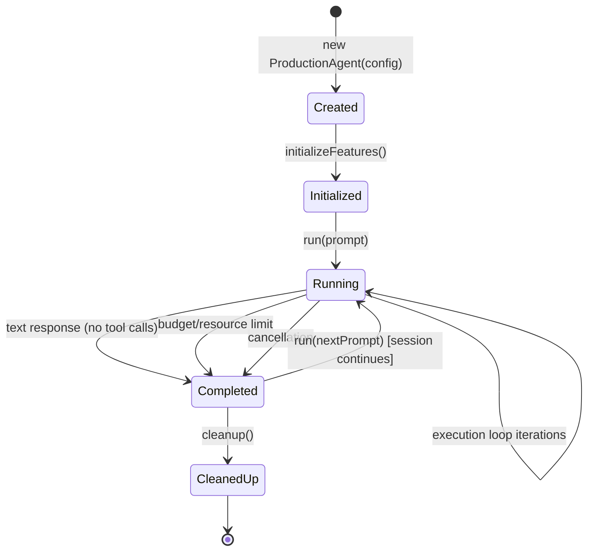

# ProductionAgent

The `ProductionAgent` class in `src/agent.ts` (~3,100 lines) is the central orchestrator of the entire system. It owns all state, coordinates integrations, and delegates execution to extracted core modules.

## Responsibilities

- **Configuration**: Accepts `ProductionAgentConfig` (~50 feature flags), merges with defaults via `buildConfig()`
- **Feature initialization**: Creates 30+ nullable integration managers based on config
- **Message building**: Assembles system prompts with cache markers for KV-cache reuse
- **Execution orchestration**: Delegates to the extracted execution loop for the ReAct cycle
- **Subagent spawning**: Creates child agents with inherited shared state
- **Session management**: Save, load, and list sessions via SQLite persistence
- **Event emission**: Publishes 80+ event types for TUI and observability consumers
- **Cleanup**: Graceful shutdown of all managers, LSP servers, and subagent resources

## Agent Lifecycle



### Phase 1: Creation

The constructor receives `Partial<ProductionAgentConfig> & { provider: LLMProvider }`. It calls `buildConfig()` to merge user config with defaults, initializes the tools map from the config tools array, and sets up the mode manager and pending plan manager.

### Phase 2: Feature Initialization

`initializeFeatures()` (extracted to `agent/feature-initializer.ts`, ~760 lines) runs 32 sequential initialization steps. Each step checks whether its feature is enabled via `isFeatureEnabled()` before creating the corresponding manager:

1. Hooks and Plugins (`HookManager`)
2. Memory (`MemoryManager`)
3. Planning and Reflection (`PlanningManager`)
4. Observability and Trace Collector (`ObservabilityManager`, `TraceCollector`)
5. Safety and Policy Engine (`SafetyManager`, policy profile resolution)
6. Routing (`RoutingManager`)
7. Multi-Agent (`MultiAgentManager`)
8. ReAct Pattern (`ReActManager`)
9. Execution Policies (`ExecutionPolicyManager`)
10. Thread Management (`ThreadManager`)
11. Rules (`RulesManager` with `DEFAULT_RULE_SOURCES`)
12. Economics (`ExecutionEconomicsManager` with `STANDARD_BUDGET`)
13. State Machine (`AgentStateMachine`)
14. Work Log (`WorkLog`)
15. Verification Gate (`VerificationGate`)
16. Injection Budget (`InjectionBudgetManager`)
17. Self-Improvement (`SelfImprovementProtocol`)
18. Subagent Output Store (`SubagentOutputStore`)
19. Auto Checkpoint (`AutoCheckpointManager`)
20. Tool Recommendation (`ToolRecommendationEngine`)
21. Agent Registry (`AgentRegistry`)
22. Cancellation (`CancellationManager`)
23. Resource Manager (`ResourceManager`)
24. LSP (`LSPManager`)
25. Semantic Cache (`SemanticCacheManager`)
26. Skills (`SkillManager`)
27. Context Engineering (`ContextEngineeringManager`)
28. Codebase Context (`CodebaseContextManager`)
29. Learning Store (`LearningStore`)
30. Compactor and Auto-Compaction (`Compactor`, `AutoCompactionManager`)
31. Task Manager (`TaskManager`)
32. Swarm Orchestrator (`SwarmOrchestrator`)

Additional setup: file change tracker, capabilities registry, shared blackboard, budget pool, type checker state, and spawn/task tools registration.

### Phase 3: Run

`run(prompt)` is the main entry point. It:
1. Calls `buildMessages()` to assemble the message array
2. Delegates to `executeDirectly()` (the extracted execution loop)
3. Returns an `AgentResult` with completion status, response text, and metrics

### Phase 4: Cleanup

`cleanup()` disposes of all resources: auto-compaction subscriptions, LSP servers, trace collectors, subagent registrations, and event listener unsubscribers tracked in `this.unsubscribers[]`.

## Builder Pattern

`ProductionAgentBuilder` (in `agent/agent-builder.ts`) provides a fluent API:

```typescript
const agent = new ProductionAgentBuilder()
  .provider(anthropicProvider)
  .model('claude-sonnet-4-20250514')
  .systemPrompt('You are a coding assistant.')
  .tools(myTools)
  .hooks({ builtIn: { logging: true } })
  .memory({ types: { episodic: true, semantic: true } })
  .build();
```

The `createProductionAgent()` factory function provides a simpler alternative for direct construction.

## Message Building

`buildMessages()` (extracted to `agent/message-builder.ts`) constructs the system prompt and message array. It uses the **Trick P (KV-Cache Context)** pattern, ordering content for optimal prompt cache reuse:

1. **Static system prompt** -- base instructions, never change
2. **Rules content** -- from `.attocode/rules.md` and rule sources
3. **Tool descriptions** -- registered tools formatted for the model
4. **Skills prompt** -- active skills injection
5. **Memory context** -- retrieved episodic/semantic memories
6. **Learning context** -- cross-session learnings (up to 5)
7. **Codebase context** -- intelligently selected code snippets
8. **Dynamic content** -- environment facts, scaling guidance, complexity assessment

When `ContextEngineeringManager` is available, the static portions are wrapped in `CacheableContentBlock` objects with `cache_control: { type: 'ephemeral' }` markers so the Anthropic API can reuse KV-cache across turns.

The builder takes a `MessageBuilderDeps` interface (narrow dependency surface) rather than the full agent, enabling isolated testing.

## Session API

`session-api.ts` provides session persistence functions, each taking a narrow `SessionApiDeps` interface:

| Function | Description |
|----------|-------------|
| `trackFileChange()` | Records file operations for undo capability |
| `undoLastFileChange()` | Reverts the most recent change to a file |
| `undoCurrentTurn()` | Reverts all changes in the current iteration |
| `reset()` | Resets agent state to initial values |
| `loadMessages()` | Loads messages from a saved session |
| `getSerializableState()` | Returns state snapshot for persistence |
| `validateCheckpoint()` | Validates checkpoint data integrity |
| `loadState()` | Restores agent state from a checkpoint |

## SubAgentFactory Pattern

To avoid circular dependencies between `subagent-spawner.ts` and `ProductionAgent`, a factory function pattern is used:

```typescript
// In core/types.ts
type SubAgentFactory = (
  config: Partial<ProductionAgentConfig> & { provider: LLMProvider }
) => SubAgentInstance;

// ProductionAgent passes itself as the factory
const factory: SubAgentFactory = (config) => new ProductionAgent(config);
```

The `SubAgentInstance` interface exposes only the methods the spawner needs: `run()`, `setMode()`, `setApprovalScope()`, `subscribe()`, `requestWrapup()`, `cleanup()`, etc. The spawner never imports `ProductionAgent` directly.

## State Management

`AgentState` tracks all mutable runtime state:

```typescript
interface AgentState {
  status: 'idle' | 'running' | 'completed' | 'error';
  messages: Message[];
  plan?: AgentPlan;
  memoryContext: string[];
  metrics: AgentMetrics;
  iteration: number;
  // ... additional tracking fields
}
```

`AgentMetrics` accumulates totals across the session: `totalTokens`, `inputTokens`, `outputTokens`, `estimatedCost`, `llmCalls`, `toolCalls`, `duration`, `successCount`, `failureCount`, `retryCount`, and `cacheHitRate`.
