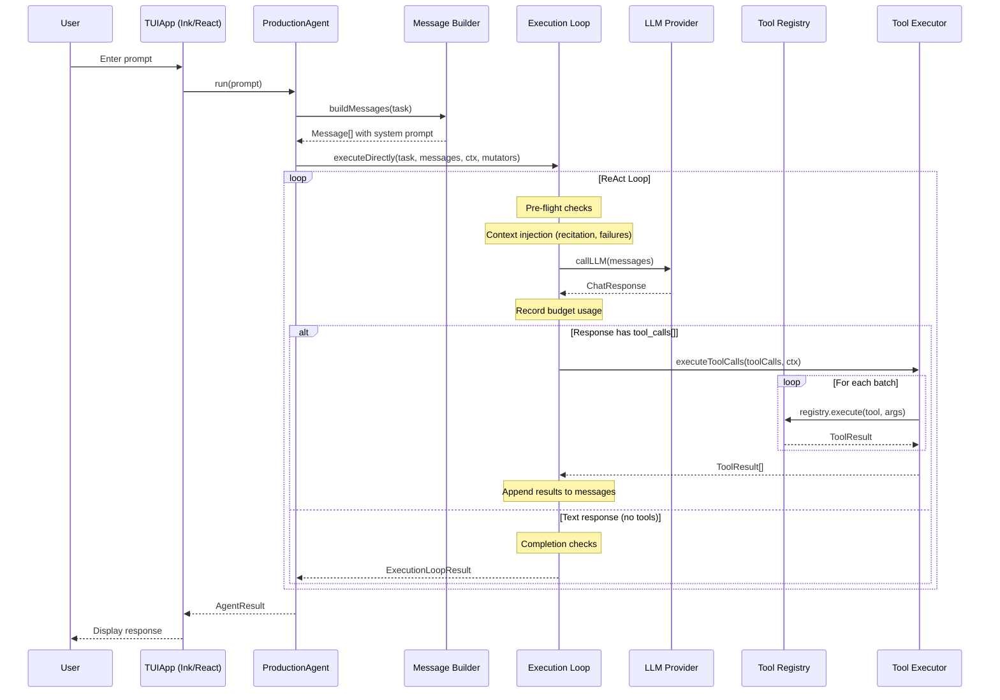
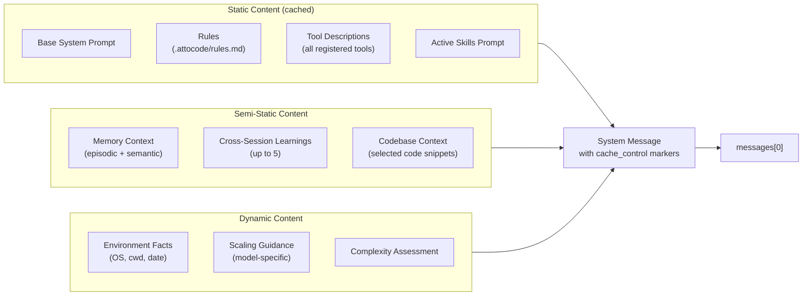
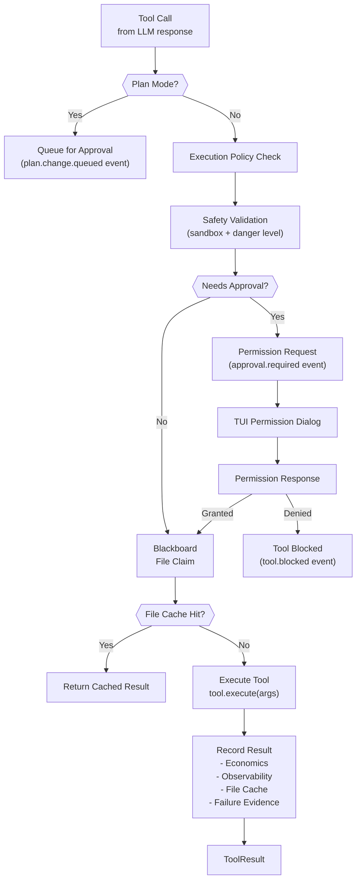
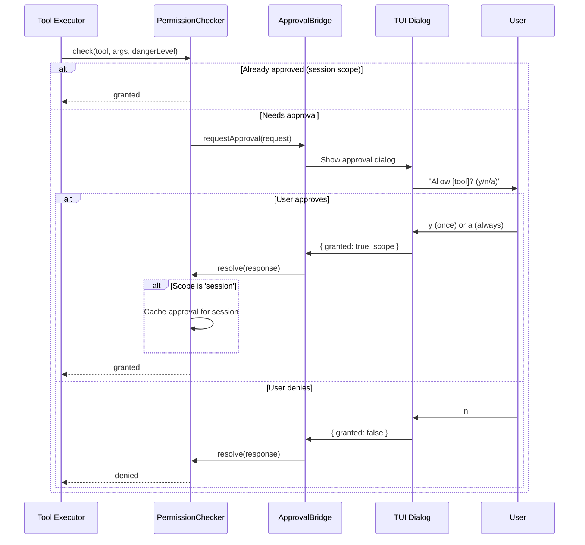
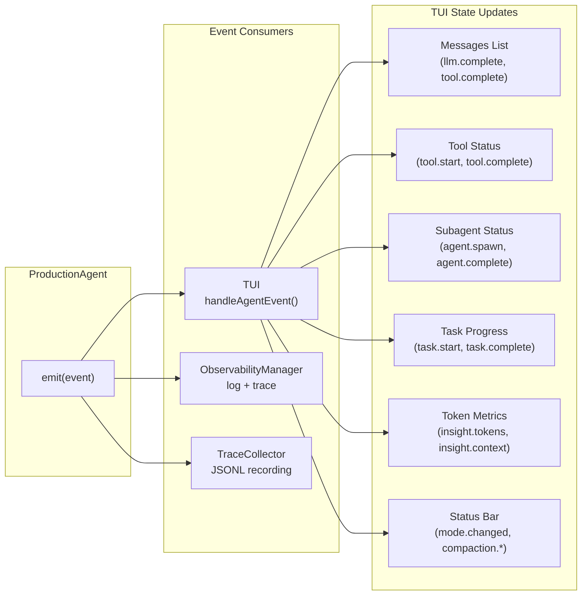
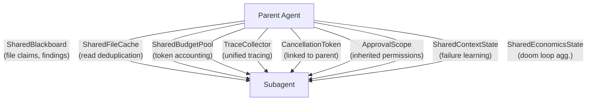
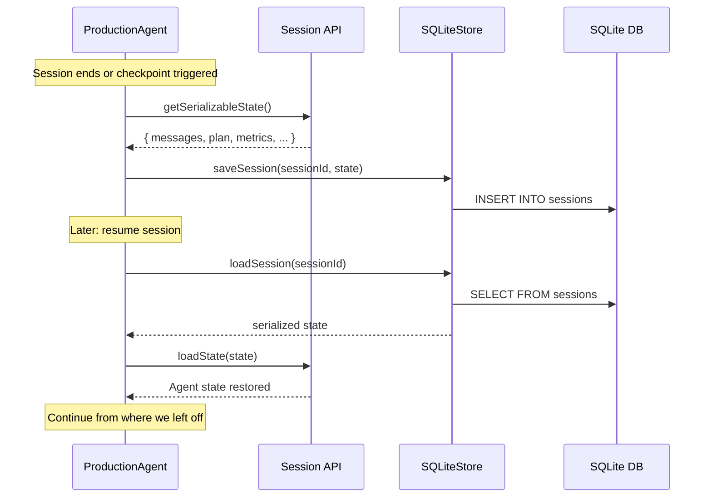

# Data Flow

This page traces the complete flow of data through the system, from user input to final response, including the permission and event subsystems.

## Main Request Flow

## System Prompt Assembly

The `buildMessages()` function assembles the system prompt from multiple sources, ordered for optimal KV-cache reuse:

Static content uses `cache_control: { type: 'ephemeral' }` markers so the Anthropic API can reuse the KV-cache across conversation turns. The order matters: static content first, dynamic content last, to maximize cache prefix hits.

## Tool Execution Pipeline

Each tool call passes through a multi-stage pipeline:

## Permission Flow

When a tool requires user approval, the request flows through the permission system:

Permission scope levels:
- **`once`**: Approval valid for this single tool call only
- **`session`**: Approval cached for the rest of the session (same tool + similar args)
- **`always`**: Persisted across sessions (stored in config)

## Event Flow

The agent emits events at every significant step. The TUI subscribes to these events to update its display:

### Key Event Sequences

**Normal tool execution:**
1. `iteration.before` -- loop starts new iteration
2. `llm.start` -- calling the LLM
3. `llm.complete` -- response received with tool calls
4. `tool.start` -- beginning tool execution (one per tool)
5. `insight.tool` -- tool completed with duration and result summary
6. `tool.complete` -- tool finished
7. `insight.tokens` -- token usage for the LLM call
8. `iteration.after` -- iteration complete

**Subagent delegation:**
1. `agent.spawn` -- subagent created with task
2. `tool.start` (spawn_agent) -- the spawn tool is executing
3. (subagent runs its own event stream internally)
4. `agent.complete` -- subagent finished with result
5. `tool.complete` (spawn_agent) -- spawn tool returns result

**Budget warning flow:**
1. `insight.context` -- context usage approaching limit
2. `compaction.warning` -- token threshold crossed
3. `compaction.auto` -- automatic compaction triggered
4. `resilience.retry` -- budget recovery attempted
5. `resilience.recovered` or `error` -- recovery result

## Subagent Data Inheritance

When a subagent is spawned, it inherits shared state from its parent:

The subagent receives constrained budgets (`SUBAGENT_BUDGET`) and a linked cancellation token that fires when either the parent cancels or the subagent's own timeout expires. The graceful timeout system provides a wrapup phase before hard cancellation.

## Session Persistence Flow

Sessions are persisted to SQLite for resume capability:

Key tables:
- `sessions` -- session metadata (ID, creation time, status)
- `checkpoints` -- checkpoint data with full message arrays
- `learnings` -- cross-session learnings from failures
- `goals` -- goal tracking for multi-session work
