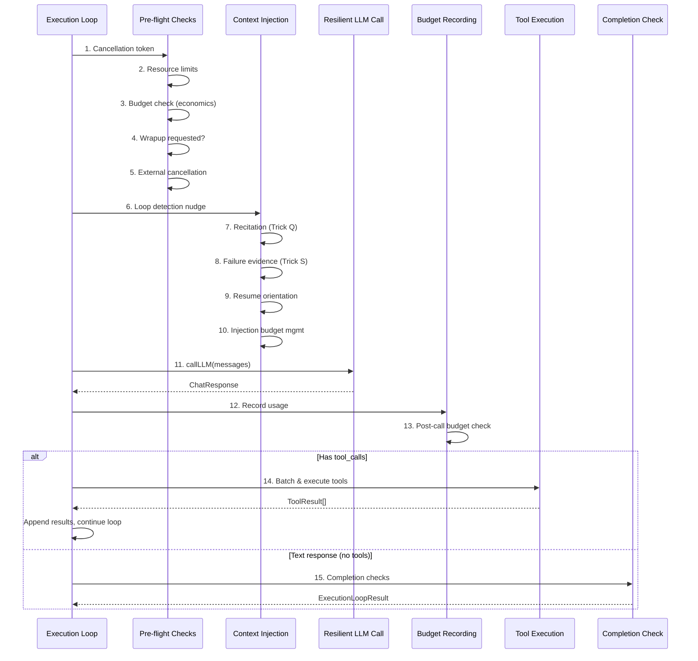

# Execution Loop

The execution loop (`src/core/execution-loop.ts`, ~1,500 lines) implements the core ReAct (Reason + Act) cycle. It is the extracted body of `ProductionAgent.executeDirectly()` and operates on an `AgentContext` snapshot plus `AgentContextMutators` for state changes.

## Loop Structure



## Phase 1: Pre-flight Checks

Each iteration begins with five sequential checks. If any check fails, the loop terminates with an appropriate `ExecutionTerminationReason`:

| Check | Termination Reason | Description |
|-------|-------------------|-------------|
| Cancellation token | throws `CancellationError` | User pressed Ctrl+C or subagent was cancelled |
| Resource manager | `resource_limit` | Memory, CPU, or file descriptor limits exceeded |
| Economics budget | `budget_limit` or `max_iterations` | Token budget, cost limit, or iteration limit hit |
| Wrapup requested | Sets `forceTextOnly = true` | Subagent timeout grace period, injects `TIMEOUT_WRAPUP_PROMPT` |
| External cancellation | throws `CancellationError` | Parent agent's cancellation token fired |

**Budget recovery**: When the economics check fails due to token or cost limits, the loop attempts emergency recovery before terminating. It compacts tool outputs and truncates messages (keeping system + last 10), then injects the work log. If context is reduced by at least 20%, execution continues.

## Phase 2: Context Injection

Before calling the LLM, the loop injects contextual guidance into the message array:

### Loop Detection Nudge
When `economics.checkBudget()` returns an `injectedPrompt` (e.g., "You've been reading files without making changes"), it is appended as a user message. The loop detector tracks repeated tool calls with identical arguments and triggers a doom loop warning after 3 repetitions.

### Recitation (Trick Q)
`contextEngineering.injectRecitation()` periodically inserts a goal reminder message. The reminder includes the original task, current plan status, active files, and recent errors. Recitation frequency adapts based on context size -- more frequent as context grows to counteract the "lost in the middle" effect.

### Failure Evidence (Trick S)
`contextEngineering.getFailureContext()` retrieves the last 5 recorded failures and injects them as a system message before the most recent user message. This prevents the agent from repeating the same mistakes.

### Resume Orientation
After compaction clears the context, the loop detects the presence of a `[Conversation Summary]` marker and injects a nudge: "Context was compacted. Review the summary and start working immediately."

### Injection Budget Management
`InjectionBudgetManager` tracks how many tokens are spent on injected guidance per iteration. Each injection is proposed as an `InjectionSlot` with a name, priority, and max token budget. The manager selects the highest-priority slots within the budget, dropping lower-priority ones if necessary.

## Phase 3: Resilient LLM Call

The actual LLM call goes through `callLLM()` (in `response-handler.ts`), which handles prompt caching, routing, and tracing. The execution loop then applies resilience wrappers:

### Empty Response Retry (up to 2 attempts)
If the LLM returns no content and no tool calls, a nudge message is appended and the call is retried. After 2 failures, the empty response is accepted.

### Thinking-Only Nudge
Some models (e.g., DeepSeek R1) produce `thinking` content without visible output. The loop nudges: "You produced reasoning but no visible response." If the nudge fails, the thinking content is promoted to the response.

### Max-Tokens Continuation (up to 3 continuations)
When `stopReason === 'max_tokens'` and no tool calls are present, the loop appends the partial response as an assistant message and asks the model to continue. Content is accumulated across continuations.

### Truncated Tool Call Recovery
When `stopReason === 'max_tokens'` with tool calls present, the tool call arguments are likely truncated. The loop discards the malformed tool calls and asks the model to retry with smaller arguments.

## Phase 4: Budget Recording

After each LLM call:

1. `economics.recordLLMUsage()` updates token counters with input, output, cache read, and cache write tokens
2. A post-call budget check runs -- if the budget is now exceeded, `forceTextOnly` is set for the next iteration
3. Token usage events are emitted for the TUI to display

## Phase 5: Tool Execution Branch

When the LLM response contains `toolCalls[]`, they flow through the tool executor:

1. **Batch grouping**: `groupToolCallsIntoBatches()` classifies tools as parallelizable (read_file, glob, grep), conditionally parallel (write_file/edit_file on different files), or sequential (bash, spawn_agent)
2. **Plan mode interception**: In plan mode, tool calls are queued instead of executed, then presented to the user for approval
3. **Execution policy check**: `ExecutionPolicyManager` evaluates whether the tool is allowed under the current policy profile
4. **Safety check**: `SafetyManager` validates the tool call against sandbox rules and danger level
5. **Permission check**: If the tool requires approval, the request flows through `PermissionChecker` to the TUI
6. **Blackboard file claim**: For write operations, the agent claims the file on the shared blackboard to prevent conflicts with sibling subagents
7. **File cache**: Read results are stored in `SharedFileCache` for cross-agent deduplication
8. **Execute**: The tool's `execute()` function runs with the validated arguments
9. **Record**: Tool result, duration, and any failures are recorded for economics, observability, and failure evidence

Tool results are appended as `tool` role messages, and the loop continues to the next iteration.

## Phase 6: Completion Branch

When the LLM returns a text response without tool calls:

1. **Incomplete action check**: `detectIncompleteActionResponse()` scans for phrases like "I'll now create..." without corresponding tool calls. If detected (up to 2 retries), a nudge is injected asking the model to actually use tools.
2. **TypeScript compile gate**: If enabled, `runTypeCheck()` runs `tsc --noEmit` on modified files. Compilation errors are injected as a nudge for the model to fix.
3. **Verification gate**: `VerificationGate` checks whether completion criteria are satisfied (e.g., required tests passing). If not, a nudge is injected.
4. **Return result**: `ExecutionLoopResult` is returned with `success`, `terminationReason`, optional `failureReason`, and `openTasks` summary.

## Termination Reasons

```typescript
type ExecutionTerminationReason =
  | 'completed'           // Normal completion
  | 'resource_limit'      // Memory/CPU/FD limit
  | 'budget_limit'        // Token/cost budget exceeded
  | 'max_iterations'      // Iteration limit hit
  | 'hard_context_limit'  // Context window full
  | 'incomplete_action'   // Model said it would act but didn't
  | 'open_tasks'          // Tasks remain in task manager
  | 'error';              // Unrecoverable error
```
