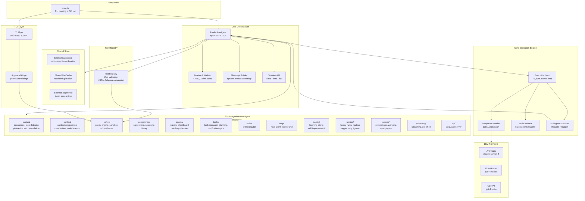

# System Overview

Attocode is a production AI coding agent built in TypeScript. It follows a modular, layered architecture where a central orchestrator (`ProductionAgent`) coordinates over 30 nullable integration managers, an LLM provider layer, a tool registry, and a terminal UI.

## High-Level Architecture



## Null-Safe Manager Pattern

Every integration manager on `ProductionAgent` is declared as nullable (`| null`). During feature initialization, each manager is instantiated only if its corresponding configuration section is enabled. All call sites guard with optional chaining:

```typescript
// Every manager follows this pattern
private economics: ExecutionEconomicsManager | null = null;
private safety: SafetyManager | null = null;
private codebaseContext: CodebaseContextManager | null = null;
// ... 30+ more

// Call sites use optional chaining
ctx.economics?.checkBudget();
ctx.safety?.validateExecution(tool, args);
```

This means every feature is independently toggleable. A minimal agent can run with zero integrations enabled, while a full production agent activates all 30+.

## AgentContext and AgentContextMutators

When the execution engine was extracted from `ProductionAgent` into separate modules (execution-loop, tool-executor, response-handler, subagent-spawner), a clean dependency injection pattern was introduced:

- **`AgentContext`** -- a read-only snapshot of all agent state: config, provider, tools map, 30+ nullable managers, mode manager, and callbacks like `emit()` and `getMaxContextTokens()`. Extracted modules receive this interface instead of a reference to `ProductionAgent`, preventing circular dependencies.

- **`AgentContextMutators`** -- a small set of setter functions for fields that extracted modules need to write back: `setBudgetPool`, `setCacheableSystemBlocks`, `setCompactionPending`, `setWrapupRequested`, `setLastComplexityAssessment`, `setExternalCancellationToken`.

This split enforces a clear boundary: modules can read anything through `AgentContext` but can only mutate specific fields through explicit mutator functions.

## Integration Directory Structure

The 30+ managers are organized into 13 domain subdirectories under `src/integrations/`:

| Directory | Responsibility | Key Modules |
|-----------|---------------|-------------|
| `budget/` | Token economics, loop detection | economics, loop-detector, phase-tracker, cancellation |
| `context/` | Context engineering, compaction | context-engineering, auto-compaction, codebase-ast |
| `safety/` | Permission, sandboxing, policy | policy-engine, sandbox, edit-validator, type-checker |
| `persistence/` | Session storage, history | sqlite-store, session-repository, history |
| `agents/` | Multi-agent coordination | agent-registry, shared-blackboard, delegation-protocol |
| `tasks/` | Task management, planning | task-manager, smart-decomposer, verification-gate |
| `skills/` | Skill loading and execution | skills, skill-executor |
| `mcp/` | Model Context Protocol tools | mcp-client, mcp-tool-search, mcp-tool-validator |
| `quality/` | Learning, self-improvement | learning-store, auto-checkpoint, tool-recommendation |
| `utilities/` | Cross-cutting concerns | hooks, rules, routing, logger, retry, diff-utils |
| `swarm/` | Parallel worker orchestration | swarm-orchestrator, worker-pool, quality-gate |
| `streaming/` | Stream handling | streaming, pty-shell |
| `lsp/` | Language Server Protocol | lsp manager |

Each subdirectory has its own `index.ts` barrel file. The root `integrations/index.ts` (~100 lines) re-exports from all subdirectory barrels, giving consumers a single import point.

## LLM Provider Layer

Three provider adapters implement a common `LLMProvider` interface:

| Provider | Priority | Default Model | Key Feature |
|----------|----------|---------------|-------------|
| OpenRouter | 0 (highest) | google/gemini-2.0-flash | 100+ models, thinking support |
| Anthropic | 1 | claude-sonnet-4 | Native tool use, prompt caching |
| OpenAI | 2 | gpt-4-turbo-preview | Standard function calling |
| Mock | 100 (lowest) | N/A | 4 predefined test scenarios |

Auto-detection selects the first available provider by priority. Each adapter translates between the unified `Message`/`ChatResponse` types and provider-specific API formats.

## Data Flow Summary

1. **User input** arrives via TUI (Ink/React) or REPL fallback
2. **`ProductionAgent.run(prompt)`** builds messages, enters the execution loop
3. **Execution loop** calls the LLM, processes tool calls, manages budget
4. **Tool calls** flow through the registry with permission and safety checks
5. **Results** are appended to messages and the loop continues
6. **On completion**, `AgentResult` is returned to the TUI for display

See [Data Flow](./data-flow.md) for the complete sequence diagram.
