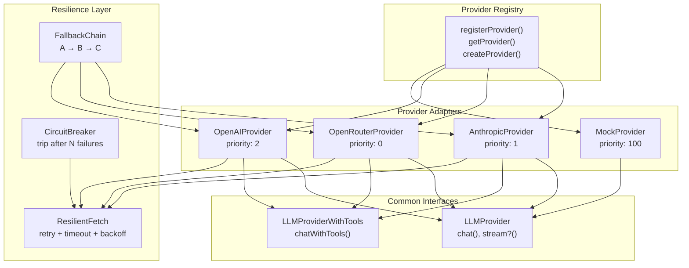
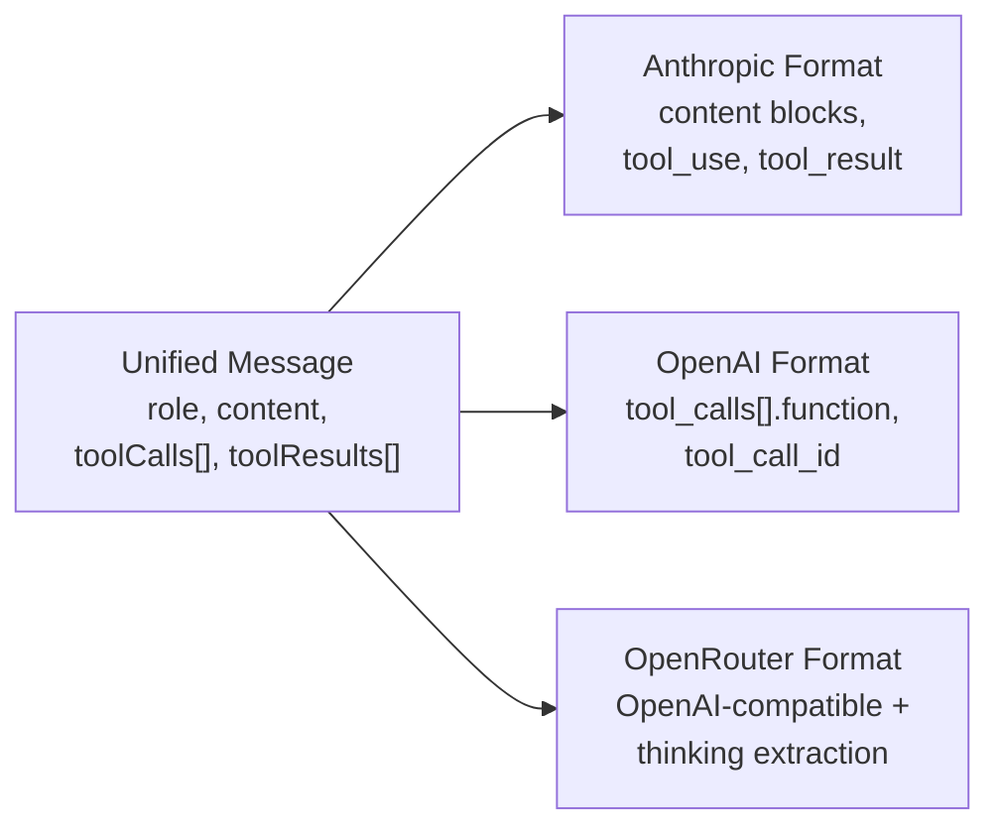

# Provider Adapters

The provider system abstracts LLM API differences behind a unified interface. Three production adapters and one mock adapter are available, with auto-detection selecting the best available provider at startup.

## Architecture



## Common Interfaces

All providers implement at minimum `LLMProvider`:

```typescript
interface LLMProvider {
  name?: string;
  chat(
    messages: (Message | MessageWithStructuredContent)[],
    options?: ChatOptions
  ): Promise<ChatResponse>;
  stream?(messages: Message[], options?: ChatOptions): AsyncIterable<StreamChunk>;
}

interface ChatOptions {
  model?: string;
  maxTokens?: number;
  temperature?: number;
  tools?: ToolDefinition[];
}

interface ChatResponse {
  content: string;
  toolCalls?: ToolCall[];
  usage?: TokenUsage;
  model?: string;
  stopReason?: 'end_turn' | 'tool_use' | 'max_tokens' | 'stop_sequence';
  thinking?: string;
}
```

`TokenUsage` tracks input, output, cache read, cache write tokens, and estimated cost:

```typescript
interface TokenUsage {
  inputTokens: number;
  outputTokens: number;
  totalTokens: number;
  cacheReadTokens?: number;
  cacheWriteTokens?: number;
  cost?: number;
}
```

## Provider Auto-Detection

Providers register themselves with a priority and an `isAvailable()` check (typically verifying that an API key environment variable is set):

```typescript
// Each adapter self-registers at import time
registerProvider('openrouter', {
  priority: 0,    // Highest priority
  isAvailable: () => hasEnv('OPENROUTER_API_KEY'),
  create: (config) => new OpenRouterProvider(config),
});

registerProvider('anthropic', {
  priority: 1,
  isAvailable: () => hasEnv('ANTHROPIC_API_KEY'),
  create: (config) => new AnthropicProvider(config),
});

registerProvider('openai', {
  priority: 2,
  isAvailable: () => hasEnv('OPENAI_API_KEY'),
  create: (config) => new OpenAIProvider(config),
});

registerProvider('mock', {
  priority: 100,  // Lowest priority, testing only
  isAvailable: () => true,
  create: () => new MockProvider(),
});
```

`getProvider()` returns the highest-priority available provider. The detection order is:

| Priority | Provider | Env Variable | Default Model |
|----------|----------|-------------|---------------|
| 0 | OpenRouter | `OPENROUTER_API_KEY` | google/gemini-2.0-flash |
| 1 | Anthropic | `ANTHROPIC_API_KEY` | claude-sonnet-4-20250514 |
| 2 | OpenAI | `OPENAI_API_KEY` | gpt-4-turbo-preview |
| 100 | Mock | (always available) | N/A |

## Anthropic Provider

`src/providers/adapters/anthropic.ts` adapts the Anthropic Messages API:

- **Default model**: `claude-sonnet-4-20250514`
- **Tool format**: Anthropic's native `input_schema` format with `tool_use` content blocks
- **System message separation**: Anthropic requires system messages in a separate `system` parameter, not in the messages array
- **Prompt caching**: Supports `cache_control: { type: 'ephemeral' }` markers on content blocks. The message builder places static content (rules, tool descriptions) before dynamic content for maximum KV-cache reuse
- **Thinking support**: Extracts `thinking` content blocks from responses for models with extended thinking

## OpenRouter Provider

`src/providers/adapters/openrouter.ts` provides access to 100+ models through a unified API:

- **Default model**: `google/gemini-2.0-flash` (cost-optimized)
- **API format**: OpenAI-compatible with OpenRouter-specific headers (`X-Title`, `HTTP-Referer`)
- **Thinking/reasoning support**: Handles `<think>` blocks from models like DeepSeek R1 and QwQ, extracting them into the `thinking` field
- **Cost tracking**: Queries the OpenRouter cost endpoint to report accurate per-request costs
- **Cache tracking**: Reports cache read/write tokens when the underlying model supports them
- **Model flexibility**: Supports any model available on OpenRouter by passing the model ID (e.g., `anthropic/claude-opus-4`, `openai/gpt-4o-mini`, `meta-llama/llama-3.1-8b-instruct`)

## OpenAI Provider

`src/providers/adapters/openai.ts` implements the OpenAI Chat Completions API:

- **Default model**: `gpt-4-turbo-preview`
- **Tool format**: OpenAI function calling format with `tool_calls` in the response
- **Organization header**: Supports `organization` in config for multi-org accounts
- **Message translation**: Converts between the unified `Message` format and OpenAI's `{ role, content, tool_calls, tool_call_id }` format

## Mock Provider

`src/providers/adapters/mock.ts` provides 4 predefined scenarios for testing:

- Returns canned responses based on message content patterns
- Priority 100 ensures it is only used when no real provider is configured
- Useful for unit tests and CI environments without API keys

## Message Format Translation

Each adapter translates between the unified `types.ts` format and provider-specific formats:



Key translation differences:
- **Anthropic**: Tool calls are `tool_use` content blocks; tool results are `tool_result` content blocks with a `tool_use_id` reference
- **OpenAI/OpenRouter**: Tool calls are in a `tool_calls` array with `function.name` and `function.arguments` (JSON string); tool results are separate messages with `tool_call_id`
- **System messages**: Anthropic separates them; OpenAI/OpenRouter include them in the messages array

## Resilience Layer

All providers use `resilientFetch()` for network requests, which provides:

| Feature | Description | Default |
|---------|-------------|---------|
| Timeout | Request timeout to prevent hangs | 30,000ms |
| Retry | Exponential backoff for transient failures | 3 attempts |
| Rate limiting | Respects `Retry-After` header on HTTP 429 | +2 extra retries |
| Retryable codes | HTTP 429, 500, 502, 503, 504 | Configurable |
| Cancellation | Aborts request when cancellation token fires | Optional |
| Backoff | Exponential with jitter, capped at max delay | 1s base, 30s max |

At a higher level, the `providerResilience` config enables:

- **CircuitBreaker**: Trips after N consecutive failures, enters half-open state after a cooldown, prevents wasted API calls during outages
- **FallbackChain**: Chains providers in priority order (e.g., Anthropic -> OpenRouter -> OpenAI), automatically falling to the next on failure
