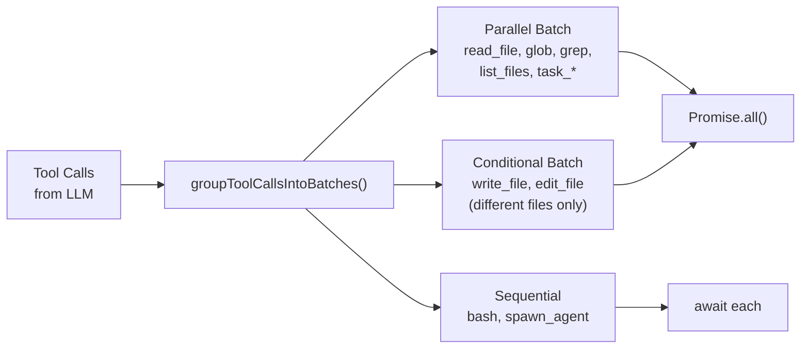

# Tool System

The tool system provides a centralized registry for tool management, Zod-based validation, permission checking, and batched execution. Tools are the primary way the agent interacts with the filesystem, executes commands, and delegates work.

## ToolRegistry

`src/tools/registry.ts` implements the central tool registry with these capabilities:

- **Registration**: `register(tool)` and `unregister(name)` for dynamic tool management
- **Lookup**: `get(name)` returns a tool definition, `list()` returns all registered tools
- **Zod-to-JSON-Schema conversion**: `zodToJsonSchema()` converts Zod parameter schemas into the JSON Schema format that LLM providers expect
- **Permission checking**: Integrates with `PermissionChecker` for approval workflows
- **Event emission**: Publishes `ToolEvent` objects (register, unregister, execute, error) to listeners
- **Retry**: Wraps execution with configurable retry logic via `withRetry()`
- **Dead letter queue**: Failed tool calls can be forwarded to a `DeadLetterQueue` for post-mortem analysis

### Zod-to-JSON-Schema Conversion

Tools define their parameters using Zod schemas for runtime validation. The registry converts these to JSON Schema for the LLM:

```typescript
// Zod schema (for validation)
z.object({
  path: z.string().describe('Absolute file path'),
  content: z.string().describe('File content to write'),
})

// Converted to JSON Schema (for LLM)
{
  type: 'object',
  properties: {
    path: { type: 'string', description: 'Absolute file path' },
    content: { type: 'string', description: 'File content to write' }
  },
  required: ['path', 'content']
}
```

The converter handles `ZodObject`, `ZodString`, `ZodNumber`, `ZodBoolean`, `ZodArray`, `ZodEnum`, `ZodOptional`, `ZodDefault`, `ZodUnion`, and `ZodLiteral` types.

## Tool Definition

Each tool is defined with the `ToolDefinition` interface:

```typescript
interface ToolDefinition {
  name: string;
  description: string;
  parameters: Record<string, unknown>;  // JSON Schema
  execute: (args: Record<string, unknown>) => Promise<unknown>;
  dangerLevel?: 'safe' | 'moderate' | 'dangerous';
  getDangerLevel?: (args: Record<string, unknown>) => DangerLevel;
}
```

The `dangerLevel` field provides a static danger classification, while `getDangerLevel` allows dynamic classification based on arguments (e.g., `bash` is `safe` for `ls` but `dangerous` for `rm -rf`).

## Built-in Tools

| Tool | Danger Level | Description |
|------|-------------|-------------|
| `read_file` | safe | Read file contents with optional line range |
| `write_file` | moderate | Write content to file (atomic write with backup) |
| `edit_file` | moderate | Apply targeted edits to existing files |
| `list_files` | safe | List directory contents with glob support |
| `bash` | dynamic | Execute shell commands (danger depends on command) |
| `grep` | safe | Search file contents with regex |
| `glob` | safe | Find files matching glob patterns |
| `spawn_agent` | moderate | Delegate task to a subagent |
| `task_create` | safe | Create a new task in the task manager |
| `task_update` | safe | Update task status |
| `task_get` | safe | Get task details |
| `task_list` | safe | List all tasks |
| `undo_file` | moderate | Revert the last change to a specific file |
| `undo_turn` | moderate | Revert all changes from the current turn |

## Batch Execution

The tool executor (`src/core/tool-executor.ts`) groups tool calls into batches for optimal execution:



### Parallelizable Tools
Read-only tools with no side effects run concurrently via `Promise.all()`:
- `read_file`, `glob`, `grep`, `list_files`, `search_files`, `search_code`, `get_file_info`
- `task_create`, `task_update`, `task_get`, `task_list`

### Conditionally Parallel Tools
`write_file` and `edit_file` can run in parallel only if they target different file paths. `extractToolFilePath()` examines the tool arguments to determine the target path.

### Sequential Tools
`bash` and `spawn_agent` always run sequentially because they have unpredictable side effects.

## Tool Coercion

Weaker models sometimes produce incorrect types in tool arguments (e.g., `"true"` instead of `true`). The executor applies coercion functions:

- `coerceBoolean()`: Converts `"true"`, `"false"`, `"1"`, `"0"` strings to booleans
- `coerceString()`: Converts numbers and booleans to strings when the schema expects a string

This improves compatibility with models that struggle with strict JSON typing.

## MCP Tool Lazy-Loading

Tools from MCP (Model Context Protocol) servers are not loaded eagerly. Instead, a `toolResolver` callback is registered:

```typescript
toolResolver?: (toolName: string) => ToolDefinition | null;
```

When the LLM calls a tool that is not in the registry, the executor invokes `toolResolver`. If it returns a definition, the tool is registered on the fly and executed. This avoids loading hundreds of MCP tools upfront when only a few will be used.

MCP tool summaries (name + description, no full schema) are included in the system prompt so the model knows what tools are available for lazy loading.

## File Change Tracking

Every write operation (`write_file`, `edit_file`) records a file change via `trackFileChange()`:

```typescript
fileChangeTracker.recordChange({
  filePath: '/path/to/file.ts',
  operation: 'write',
  contentBefore: '...',   // for undo
  contentAfter: '...',
  turnNumber: 5,
  toolCallId: 'tc_123',
});
```

This enables the `undo_file` and `undo_turn` tools, which restore previous file contents. Changes are tracked per-turn for bulk rollback.

## Execution Pipeline

For each tool call, the executor runs through this pipeline:

1. **Plan mode check**: If in plan mode, queue the tool call instead of executing
2. **Execution policy**: Check `ExecutionPolicyManager` for allow/deny rules
3. **Safety validation**: Check `SafetyManager` for sandbox and danger level rules
4. **Permission check**: If approval is required, request it through the permission checker
5. **Blackboard claim**: Claim the target file on `SharedBlackboard` (prevents sibling agent conflicts)
6. **File cache check**: For reads, check `SharedFileCache` first
7. **Execute**: Run the tool's `execute()` function
8. **Record result**: Update economics, observability, file cache, and failure evidence
9. **AST invalidation**: Invalidate cached AST for modified files
10. **Syntax validation**: Run `validateSyntax()` on edited files to catch obvious errors
