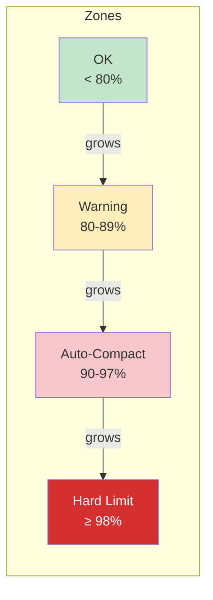

# Auto-Compaction

Auto-compaction monitors token usage during the agent loop and triggers context summarization when the conversation grows too large for the context window. It integrates with Reversible Compaction (Trick R) for reference preservation.

## Three-Tier Threshold System

The `AutoCompactionManager` uses a three-tier design to handle context growth gracefully:



| Zone | Threshold | Behavior |
|------|-----------|----------|
| **OK** | < 80% | Normal operation, no action |
| **Warning** | 80-89% | Alert emitted, suggest `/compact` |
| **Auto-Compact** | 90-97% | Automatic compaction (mode-dependent) |
| **Hard Limit** | >= 98% | Agent cannot continue, manual intervention required |

### Compaction Modes

The `mode` setting controls what happens in the auto-compact zone:

| Mode | Behavior |
|------|----------|
| `auto` | Compaction runs automatically without asking |
| `approval` | Emits `needs_approval` event, waits for user confirmation |
| `manual` | Auto-compact zone treated as warning; user must run `/compact` |

## Configuration

```typescript
interface AutoCompactionConfig {
  mode: 'auto' | 'approval' | 'manual';
  warningThreshold: number;                // Default: 0.80
  autoCompactThreshold: number;            // Default: 0.90
  hardLimitThreshold: number;              // Default: 0.98
  preserveRecentUserMessages: number;      // Default: 5
  preserveRecentAssistantMessages: number; // Default: 5
  cooldownMs: number;                      // Default: 60000 (1 minute)
  maxContextTokens: number;                // Default: 200000 (Claude)
  compactHandler?: CompactHandler;         // Custom handler (e.g., reversible)
}
```

Thresholds must be in ascending order: `warning < autoCompact < hardLimit`. The constructor validates this and throws if violated.

## AutoCompactionManager

### `checkAndMaybeCompact(options)`

The main method called each iteration of the agent loop:

```typescript
const result = await autoCompaction.checkAndMaybeCompact({
  currentTokens: estimatedTokens,
  messages: currentMessages,
});

switch (result.status) {
  case 'ok':        // Continue normally
  case 'warning':   // Log warning, continue
  case 'compacted': // Use result.compactedMessages
  case 'needs_approval': // Ask user
  case 'hard_limit':     // Cannot continue
}
```

### Cooldown

After each compaction, a cooldown period (default: 60 seconds) prevents rapid re-compaction. During cooldown, the auto-compact zone is treated as warning.

### Custom Compaction Handler

A `compactHandler` function enables integration with reversible compaction:

```typescript
interface CustomCompactionResult {
  summary: string;
  tokensBefore: number;
  tokensAfter: number;
  preservedMessages: Message[];
  references?: Reference[];   // From reversible compaction
}
```

When a custom handler is provided, the `AutoCompactionManager` uses it instead of the default `Compactor`. References from the handler are included in the `CompactionCheckResult`.

## Compactor (Default)

The `Compactor` class (`src/integrations/context/compaction.ts`) handles LLM-based message summarization when no custom handler is provided:

```typescript
const compactor = createCompactor(llmProvider, {
  tokenThreshold: 80000,         // When to consider compaction
  preserveRecentCount: 10,       // Messages to keep verbatim
  summaryMaxTokens: 2000,        // Max tokens for the summary
});
```

### Summarization Prompt

The compactor sends older messages to the LLM with a structured prompt requesting:
1. Current task and overall goal
2. What has been completed (files, features)
3. What remains to be done
4. The next action to take
5. Key errors or blockers
6. Important file paths and patterns

The summary replaces older messages as a system context message while recent messages are preserved verbatim.

### Fallback Summary

If the LLM call fails, a fallback summary extracts user requests (first 5, truncated to 100 chars) and unique tool names from the compacted messages.

## Emergency Truncation

When LLM-based compaction fails entirely, the `AutoCompactionManager` falls back to **emergency truncation**:

1. Keep the system message
2. Insert a marker: `[CONTEXT REDUCED - Emergency truncation]`
3. Keep the last N messages (preserveRecentUserMessages + preserveRecentAssistantMessages)
4. Discard everything in between

This is a last resort that loses context but keeps the agent running.

## Context Breakdown

The `getContextBreakdown()` utility shows where tokens are being spent:

```
Context Token Breakdown (Total: ~45,000 tokens)

  System prompt:   [████████░░░░░░░░░░░░]  8,000 tokens (18%)
  Tool schemas:    [██████░░░░░░░░░░░░░░]  6,000 tokens (13%)
  Rules content:   [██░░░░░░░░░░░░░░░░░░]  2,000 tokens (4%)
  Memory context:  [████░░░░░░░░░░░░░░░░]  4,000 tokens (9%)
  Conversation:    [████████████████████]  25,000 tokens (56%)
```

This helps identify which sections are consuming the most budget.

## Key Files

- `src/integrations/context/auto-compaction.ts` (~652 lines) -- Threshold monitoring and compaction triggering
- `src/integrations/context/compaction.ts` (~581 lines) -- LLM-based summarization and token estimation
