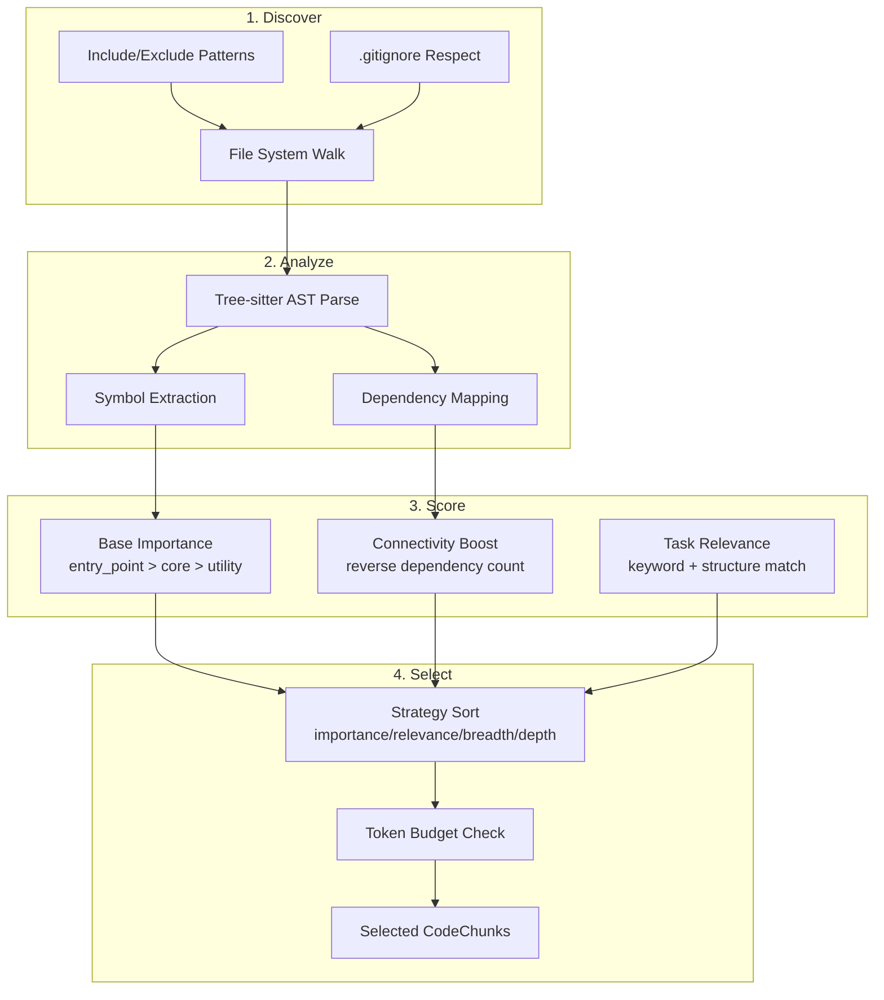

# Codebase Context

The codebase context system provides intelligent, budget-aware code selection for the agent's context window. Rather than blindly dumping file contents into the prompt, it analyzes the repository structure, scores files by importance, and selects the most relevant code that fits within a token budget.

## Architecture

The system is split across three files (Phase 3d extraction):

| File | Lines | Responsibility |
|------|-------|---------------|
| `codebase-context.ts` | ~1,097 | Manager class, types, factory functions |
| `code-analyzer.ts` | ~530 | File discovery, AST parsing, dependency analysis |
| `code-selector.ts` | ~809 | Relevance scoring, budget-constrained selection, search |

Supporting modules:

| File | Purpose |
|------|---------|
| `codebase-ast.ts` | Tree-sitter AST parsing with cache |
| `semantic-cache.ts` | Embedding-based LLM response caching |
| `file-cache.ts` | Cross-agent file read deduplication (LRU) |

## Pipeline



## Discovery

The `discoverFiles()` function walks the file system from a root directory:

- Matches files against configurable include patterns (default: `**/*.ts`, `**/*.tsx`, `**/*.js`, `**/*.jsx`, `**/*.py`, `**/*.go`, `**/*.rs`)
- Excludes directories like `node_modules`, `.git`, `dist`, `build`, `coverage`, `target`, `vendor`
- Respects `.gitignore` rules
- Skips files larger than `maxFileSize` (default: 100KB)

## Analysis

Each discovered file is processed into a `CodeChunk`:

```typescript
interface CodeChunk {
  id: string;               // Relative file path
  filePath: string;         // Relative from repo root
  content: string;          // Full file content
  tokenCount: number;       // Estimated tokens (~4 chars/token)
  importance: number;       // Score 0-1
  type: CodeChunkType;      // entry_point, core_module, utility, types, config, test, etc.
  symbols: string[];        // Symbol names (functions, classes, variables)
  symbolDetails: Array<{    // Structured symbol info
    name: string;
    kind: string;           // function, class, interface, variable, etc.
    exported: boolean;
    line: number;
  }>;
  dependencies: string[];   // Imported symbols/modules
}
```

**Tree-sitter AST parsing** (via `codebase-ast.ts`) extracts symbols and dependencies with language-aware accuracy. The AST parse results are cached for performance.

### Chunk Types

| Type | Pattern | Base Importance |
|------|---------|----------------|
| `entry_point` | `index.ts`, `main.ts`, `app.ts`, `server.ts` | Highest |
| `core_module` | Files under `src/`, `lib/`, `core/` | High |
| `types` | Type definition files | Medium |
| `config` | Configuration files | Medium |
| `utility` | Utility/helper files | Medium-Low |
| `test` | Test files | Low |
| `other` | Everything else | Low |

### Dependency Graph

When `analyzeDependencies` is enabled (default), the analyzer builds both forward and reverse dependency graphs:

- **Forward graph**: file -> files it imports
- **Reverse graph**: file -> files that import it

Files with high reverse-dependency counts (many importers) receive an importance boost via `adjustImportanceByConnectivity()`.

## Scoring

### Base Importance

Set by file type (`entry_point` = highest, `test` = lowest).

### Connectivity Boost

Files imported by many others are more architecturally important. The reverse dependency count adjusts importance upward.

### Task Relevance

When a `task` string is provided in selection options, `calculateRelevance()` scores each chunk against the task description using keyword matching and structural analysis.

## Selection

### Selection Strategies

```typescript
type SelectionStrategy =
  | 'importance_first'   // Global importance, then fit to budget
  | 'relevance_first'    // Task relevance, then fit to budget
  | 'breadth_first'      // Diverse files from different directories
  | 'depth_first';       // Related files deeply (follow dependency chains)
```

### Budget-Constrained Selection

The selector sorts chunks by the chosen strategy, then greedily adds chunks until the token budget is exhausted:

```typescript
const selection = await codebase.selectRelevantCode({
  task: 'implement user authentication',
  maxTokens: 8000,
  strategy: 'relevance_first',
  includeTypes: true,
  includeTests: false,
});

// Result
interface SelectionResult {
  chunks: CodeChunk[];        // Selected code
  totalTokens: number;        // Tokens used
  budgetRemaining: number;    // Tokens left
  excluded: string[];         // Files that didn't fit
  stats: {
    filesConsidered: number;
    filesSelected: number;
    coveragePercent: number;
    averageImportance: number;
  };
}
```

### LSP-Enhanced Selection

When an LSP manager is available, `getEnhancedContext()` uses Language Server Protocol data to boost relevance:

- Files that **reference** the currently edited file are boosted
- Files that the edited file **depends on** are boosted
- Symbols at the cursor position are used for targeted lookups

```typescript
const result = await codebase.getEnhancedContext({
  task: 'fix bug in authentication',
  maxTokens: 10000,
  editingFile: 'src/auth/login.ts',
  editingPosition: { line: 25, character: 10 },
  lspBoostFactor: 0.3,   // How much to boost LSP-related files
});
```

### Incremental Expansion

`expandContext()` adds related files to an existing selection by following dependency chains:

```typescript
const expanded = await codebase.expandContext(currentChunks, {
  maxTokensToAdd: 4000,
  direction: 'both',   // 'dependencies' | 'dependents' | 'both'
});
```

## RepoMap

The `RepoMap` structure holds the complete analysis result:

```typescript
interface RepoMap {
  root: string;
  chunks: Map<string, CodeChunk>;
  entryPoints: string[];
  coreModules: string[];
  dependencyGraph: Map<string, Set<string>>;
  reverseDependencyGraph: Map<string, Set<string>>;
  totalTokens: number;
  analyzedAt: Date;
}
```

The `generateLightweightRepoMap()` function produces an aider-style tree view with key symbols, used as fallback context when task-specific selection returns nothing.

## Caching

### Analysis Cache

`CodebaseContextManager` caches `RepoMap` results with a configurable TTL (default: 5 minutes). Cache is checked before re-analyzing.

### Warm Startup (Persistence)

Analysis results can be persisted to SQLite via `CodebasePersistenceStore`. On subsequent sessions, only changed files (detected by content hash) are re-processed. Unchanged files are restored from the saved analysis.

### SharedFileCache

An in-memory LRU cache (`file-cache.ts`) shared across parent and child agents. Eliminates redundant file reads in multi-agent workflows:

- Max cache size: 5MB (configurable)
- TTL: 5 minutes per entry
- Write operations invalidate cache entries
- All paths normalized via `path.resolve()` for consistent keys

### SemanticCache

Embedding-based response caching (`semantic-cache.ts`). Returns a cached LLM response if a new query is semantically similar (above configurable threshold) to a previous one.

## Key Files

All files are located in `src/integrations/context/`:

- `codebase-context.ts` -- Main manager and types
- `code-analyzer.ts` -- Discovery, AST, dependency analysis
- `code-selector.ts` -- Selection, ranking, search
- `codebase-ast.ts` -- Tree-sitter integration
- `file-cache.ts` -- Cross-agent LRU file cache
- `semantic-cache.ts` -- Embedding-based response cache
