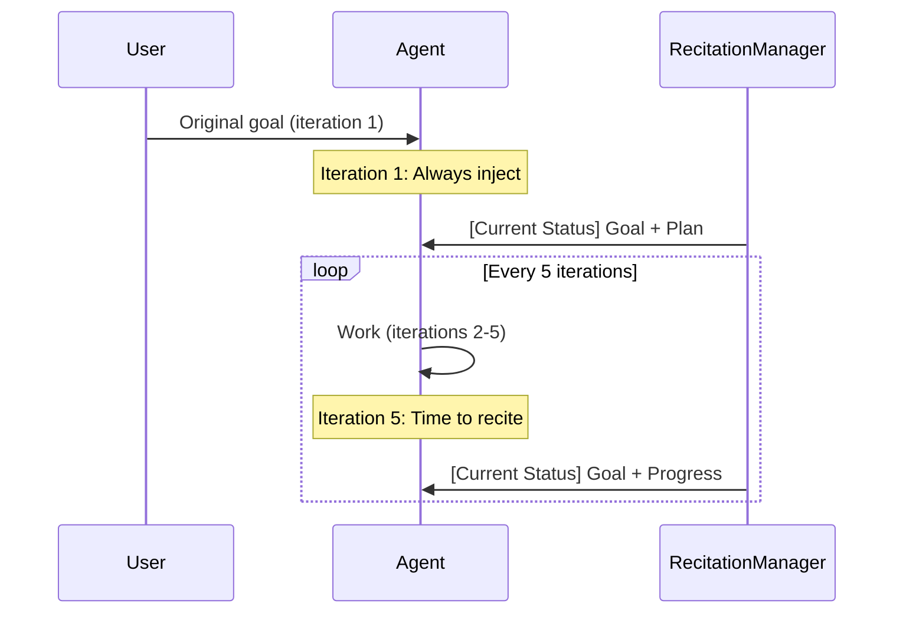

# Goal Recitation (Trick Q)

## Problem

In long conversations (50+ tool calls), the model suffers from the **lost-in-middle** effect: information buried in the middle of the context receives less attention than information at the beginning or end. The original goal, stated at the start of a session, gradually fades from the model's effective attention, causing the agent to drift off-task.

## Solution

Periodically inject a compact summary of the current goal, plan progress, and todo status at the **end** of the message sequence, leveraging the model's recency bias. This "recitation" pushes critical information into the model's recent attention span.



## Configuration

```typescript
interface RecitationConfig {
  frequency: number;          // Inject every N iterations (default: 5)
  sources: RecitationSource[]; // What to include
  maxTokens?: number;         // Max tokens for block (default: 500)
  customBuilder?: (state: RecitationState) => string | null;
  trackHistory?: boolean;     // Track injection history (default: true)
}

type RecitationSource = 'plan' | 'todo' | 'goal' | 'memory' | 'custom';
```

## Key Methods

### `shouldInject(iteration)`

Returns `true` if recitation should be injected at this iteration:
- **Always** injects on iteration 1 (regardless of frequency)
- After that, injects every `frequency` iterations since the last injection

### `buildRecitation(state)`

Assembles the recitation content from the provided state. Sources are included in order:

1. **goal**: `**Goal**: Implement user authentication`
2. **plan**: Plan progress with current task and next pending tasks
3. **todo**: Todo status counts (done, active, pending) with items
4. **memory**: Relevant context items (max 3 shown)
5. **custom**: Output from `customBuilder` function

Active files and recent errors are always appended if present.

Content is truncated if it exceeds `maxTokens` (estimated at ~4 chars/token).

### `injectIfNeeded(messages, state)`

The primary method called from the agent loop. If injection is due, it builds the recitation and inserts it as a system message **before the last user message** (keeping it in the recency window):

```typescript
const enrichedMessages = recitation.injectIfNeeded(messages, {
  iteration: currentIteration,
  goal: 'Implement user authentication',
  plan: currentPlan,
  todos: currentTodos,
});
```

### Example Injected Block

```
[Current Status - Iteration 15]

**Goal**: Implement user authentication with JWT tokens

**Plan Progress**: 3/5 tasks completed
**Current Task**: Add password hashing middleware
**Next**: Implement refresh token rotation; Add rate limiting

**Todo Status**: 2 done, 1 active, 2 pending
**In Progress**: Password hashing middleware

**Active files**: src/auth/middleware.ts, src/auth/jwt.ts
```

## Adaptive Frequency

The `calculateOptimalFrequency()` utility adjusts injection frequency based on context size -- heavier contexts need more frequent recitation:

| Context Size | Frequency |
|-------------|-----------|
| < 10,000 tokens | Every 10 iterations |
| 10,000 - 30,000 | Every 7 iterations |
| 30,000 - 60,000 | Every 5 iterations |
| > 60,000 tokens | Every 3 iterations |

The `ContextEngineeringManager` calls `updateRecitationFrequency(contextTokens)` to automatically adjust.

## Injection Budget Integration

Goal recitation is assigned **priority 3** (Low) in the `InjectionBudgetManager`. This means it will be dropped if higher-priority injections (budget warnings, doom loop detection, failure context) consume the entire injection budget (~1,500 tokens).

## Key File

`src/tricks/recitation.ts` (~555 lines)
