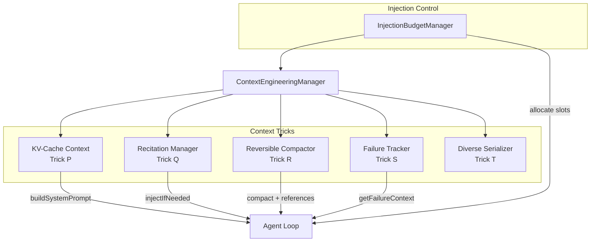

# Context Engineering

Context engineering is the discipline of managing an AI agent's context window -- the fundamental constraint that determines what an agent can see, remember, and reason about at any given moment.

Attocode implements five context engineering techniques, labeled P through T:

| Trick | Name | Purpose |
|-------|------|---------|
| **P** | KV-Cache Optimization | Structure prompts for maximum cache hits |
| **Q** | Goal Recitation | Periodically reinject goals to combat lost-in-middle |
| **R** | Reversible Compaction | Preserve references during context summarization |
| **S** | Failure Evidence | Track and surface past failures to prevent repetition |
| **T** | Serialization Diversity | Multiple formats for robustness |

## Why It Matters

In long-running agent sessions (50+ iterations), several problems emerge:

1. **Context overflow**: Messages exceed the context window limit
2. **Lost-in-middle**: The model "forgets" information in the middle of long contexts
3. **Cache waste**: Unnecessary cache invalidation increases cost 10x
4. **Repeated mistakes**: Without failure memory, agents repeat the same errors
5. **Irreversible loss**: Traditional summarization destroys retrievable details

## Architecture

The `ContextEngineeringManager` (`src/integrations/context/context-engineering.ts`) orchestrates all five techniques. It initializes the appropriate sub-managers based on configuration and exposes a unified API for the agent loop:



The `InjectionBudgetManager` (`src/integrations/budget/injection-budget.ts`) manages a ~1,500 token budget for context injections with priority-based slot allocation:

| Priority | Slot | Source |
|----------|------|--------|
| 0 (Critical) | Budget warning / timeout | Economics system |
| 1 (High) | Loop detection nudge | LoopDetector |
| 2 (Medium) | Failure context / learning | FailureTracker (Trick S) |
| 3 (Low) | Goal recitation | RecitationManager (Trick Q) |
| 4 (Lowest) | Exploration / phase nudge | PhaseTracker |

When the injection budget is exceeded, lowest-priority slots are dropped first. Slots can also be truncated to partially fit remaining budget (minimum 100 tokens).

## Integration with Shared State

In swarm (multi-agent) mode, the `ContextEngineeringManager` can bind to a `SharedContextState` object. This enables:

- **Cross-worker failure learning**: All workers read/write to the same `FailureTracker`
- **Reference pooling**: References extracted during compaction are pushed to a shared pool accessible by all workers

```typescript
// In swarm worker initialization
contextEngineering.setSharedState(sharedState);
```

## Source Files

| File | Lines | Purpose |
|------|-------|---------|
| `src/tricks/kv-cache-context.ts` | ~620 | Trick P implementation |
| `src/tricks/recitation.ts` | ~555 | Trick Q implementation |
| `src/tricks/reversible-compaction.ts` | ~804 | Trick R implementation |
| `src/tricks/failure-evidence.ts` | ~817 | Trick S implementation |
| `src/integrations/context/context-engineering.ts` | ~647 | Manager orchestrating all tricks |
| `src/integrations/context/auto-compaction.ts` | ~652 | Threshold-based auto-compaction |
| `src/integrations/context/compaction.ts` | ~581 | LLM-based summarization |
| `src/integrations/budget/injection-budget.ts` | ~191 | Priority-based injection budget |
