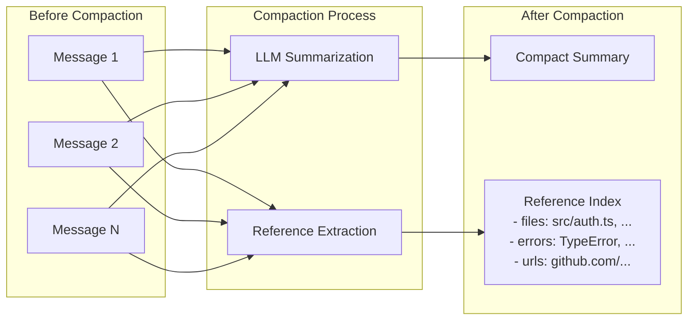

# Reversible Compaction (Trick R)

## Problem

Traditional context compaction summarizes conversation history into a shorter form, permanently discarding details. When a file path, URL, or function name is summarized away, the agent can never recover it -- even if it becomes relevant later. This makes compaction a one-way, lossy operation.

## Solution

During compaction, extract **references** -- minimal retrieval keys (file paths, URLs, function names, error messages, commands) -- and preserve them alongside the summary. Later, the agent can query these references to recover details without needing the full message history.



## Reference Types

```typescript
type ReferenceType =
  | 'file'       // File paths (Unix, Windows, relative)
  | 'url'        // URLs (with context: GitHub, StackOverflow, docs)
  | 'function'   // Function/method names (definitions and calls)
  | 'class'      // Class/type names
  | 'error'      // Error messages and stack traces
  | 'command'    // Shell commands (npm, git, docker, etc.)
  | 'snippet'    // Abbreviated code snippets
  | 'decision'   // Key decisions made during the session
  | 'custom';    // Custom reference type via extractors
```

## Reference Structure

```typescript
interface Reference {
  id: string;              // Unique identifier (e.g., "file-1706123456-abc123")
  type: ReferenceType;     // Category of reference
  value: string;           // The actual path, URL, name, etc.
  context?: string;        // Brief context (e.g., "GitHub PR", "definition")
  timestamp: string;       // When this reference was encountered
  sourceIndex?: number;    // Original message index (before compaction)
  relevance?: number;      // Score 0-1 for prioritization
}
```

## Extraction Functions

Each reference type has a dedicated extractor:

| Function | What It Extracts |
|----------|-----------------|
| `extractFileReferences()` | Unix paths, Windows paths, relative paths with extensions |
| `extractUrlReferences()` | HTTP(S) URLs with context detection (GitHub, SO, docs) |
| `extractFunctionReferences()` | Function definitions and camelCase method calls |
| `extractErrorReferences()` | Error class names and error messages (max 3) |
| `extractCommandReferences()` | Shell commands from `$` prompts, code blocks, and known CLIs |

The `extractReferences()` function dispatches to all configured extractors and supports custom extractors via a `Map<ReferenceType, ReferenceExtractor>`.

## ReversibleCompactor

The main class that performs compaction with reference preservation:

```typescript
const compactor = createReversibleCompactor({
  preserveTypes: ['file', 'url', 'function', 'error', 'command'],
  maxReferences: 50,          // Keep at most 50 references
  deduplicate: true,           // Remove duplicate type:value pairs
  minRelevance: 0,             // Minimum relevance score to keep
});

const result = await compactor.compact(messages, {
  summarize: async (msgs) => await llm.summarize(msgs),
});
```

### CompactionResult

```typescript
interface CompactionResult {
  summary: string;              // The condensed summary
  references: Reference[];     // Preserved retrieval keys
  stats: CompactionStats;      // Compression statistics
}

interface CompactionStats {
  originalMessages: number;
  originalTokens: number;
  compactedTokens: number;
  referencesExtracted: number;
  referencesPreserved: number;  // After dedup + limits
  compressionRatio: number;     // compactedTokens / originalTokens
}
```

### Querying References Later

After compaction, the agent can search preserved references:

```typescript
// By type
const fileRefs = compactor.getReferencesByType('file');

// By search query
const authRefs = compactor.searchReferences('auth');

// By ID
const ref = compactor.getReference('file-1706123456-abc123');
```

### Reconstruction Prompt

The `createReconstructionPrompt(references)` utility generates an LLM-readable block that tells the agent how to re-retrieve details:

```
The following references were preserved from earlier context.
Use these to retrieve details if needed:

**Files** (can be read with read_file tool):
  - src/auth/middleware.ts
  - src/auth/jwt.ts

**URLs** (can be fetched for details):
  - https://github.com/org/repo/issues/42 [GitHub Issue]

**Functions** (search codebase if details needed):
  - authenticateUser
  - validateToken

**Errors encountered**:
  - TypeError: Cannot read property 'token' of undefined
```

### Relevance Scoring

The `calculateRelevance()` function scores a reference based on:
- Whether its value matches words in the current goal (+0.1 per match)
- Whether it matches recent topics (+0.15 per match)
- Type-based adjustment: errors get +0.1, files get +0.05

When `maxReferences` is exceeded, references are sorted by relevance and only the most relevant are kept.

## Key File

`src/tricks/reversible-compaction.ts` (~804 lines)
