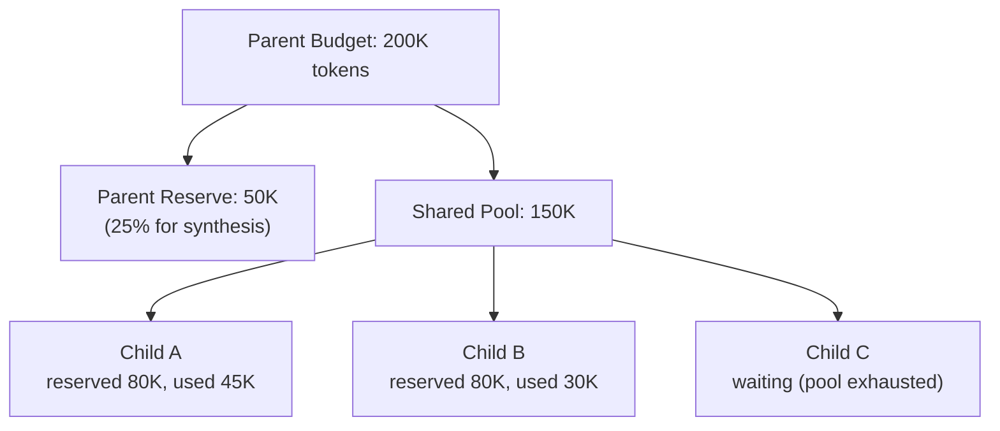
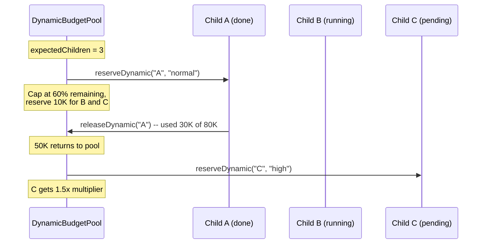

# Budget Pooling

When multiple agents work in parallel, each getting an independent budget can lead to unbounded cost (e.g., 5 subagents x 200K tokens = 1M tokens exposure). Budget pooling constrains the total tree cost to the parent's budget by making children draw from a shared pool.

## Shared Budget Pool

The `SharedBudgetPool` in `src/integrations/budget/budget-pool.ts` implements pessimistic reservation-based accounting:



### Pool Configuration

```typescript
interface BudgetPoolConfig {
  totalTokens: number;      // Total tokens in the pool
  maxPerChild: number;      // Max any single child can consume
  totalCost?: number;       // Total cost cap (default: $0.50)
  maxCostPerChild?: number; // Max cost per child (default: $0.25)
}
```

### Allocation Lifecycle

1. **`reserve(childId)`** -- Allocates up to `maxPerChild` tokens, constrained by remaining pool capacity. Both tokens and cost are reserved pessimistically.
2. **`recordUsage(childId, tokens, cost)`** -- Updates actual consumption counters. Returns `false` if the child has exceeded its allocation.
3. **`release(childId)`** -- Returns unused reserved tokens back to the pool. Must be called after the child completes.
4. **`getStats()`** -- Reports pool utilization, active allocations, and remaining capacity.

The pool tracks both `totalTokensUsed` (actual consumption) and `totalTokensReserved` (pessimistic reservation). Remaining capacity is calculated as `totalTokens - max(used, reserved)`.

### Factory Function

```typescript
const pool = createBudgetPool(
  parentBudgetTokens,   // e.g., 200000
  parentReserveRatio,   // default: 0.25 (25% reserved for parent synthesis)
  maxPerChild,          // default: 100000
);
```

## Dynamic Budget Pool

The `DynamicBudgetPool` in `dynamic-budget.ts` extends the shared pool with rebalancing to prevent starvation during sequential spawning:

### Key Features

| Feature | Description |
|---------|-------------|
| **Sequential spawn cap** | Never allocate more than 60% of remaining budget to any single child (`maxRemainingRatio`) |
| **Expected children** | `setExpectedChildren(count)` reserves minimum budget (10K tokens each) for future children |
| **Priority allocation** | Critical children get 2x budget, high gets 1.5x, low gets 0.5x |
| **Auto-rebalance on release** | When a child completes, unused budget returns to the pool |

### Priority Multipliers

```typescript
const PRIORITY_MULTIPLIERS = {
  low: 0.5,
  normal: 1.0,
  high: 1.5,
  critical: 2.0,
};
```

### Dynamic Allocation Flow



The `reserveDynamic()` method computes the final allocation as the minimum of: the 60% ratio cap, remaining budget minus future reserves, and the priority-adjusted share.

## Injection Budget Manager

The `InjectionBudgetManager` in `injection-budget.ts` controls a separate, smaller budget for context injection slots. Each iteration, the economics system may want to inject multiple nudges (doom loop warning, goal recitation, failure context). The injection budget prevents these from overwhelming the conversation.

### Priority Slots

| Priority | Slots | Description |
|----------|-------|-------------|
| 0 (critical) | `budget_warning`, `timeout_wrapup` | Must always be delivered |
| 1 (high) | `doom_loop` | Stuck state recovery |
| 2 (medium) | `failure_context`, `learning_context` | Error patterns and lessons |
| 3 (low) | `recitation` | Goal reinforcement |
| 4 (lowest) | `exploration_nudge`, `phase_guidance` | Phase transition hints |

### Allocation Algorithm

The default total injection budget is **1,500 tokens per iteration**. The `allocate()` method:

1. Sorts all proposed injections by priority (lower number = higher priority)
2. Accepts proposals that fit within the remaining budget
3. Truncates proposals that partially fit (with a "truncated for context budget" marker)
4. Drops proposals that do not fit at all

### Stats Tracking

```typescript
interface InjectionBudgetStats {
  proposedTokens: number;   // Total tokens proposed
  acceptedTokens: number;   // Tokens actually injected
  droppedCount: number;     // Proposals dropped entirely
  truncatedCount: number;   // Proposals truncated to fit
  droppedNames: string[];   // Names of dropped injections
}
```

## Source Files

| File | Purpose |
|------|---------|
| `src/integrations/budget/budget-pool.ts` | `SharedBudgetPool`, allocation types, `createBudgetPool()` |
| `src/integrations/budget/dynamic-budget.ts` | `DynamicBudgetPool`, priority rebalancing |
| `src/integrations/budget/injection-budget.ts` | `InjectionBudgetManager`, priority slots |
