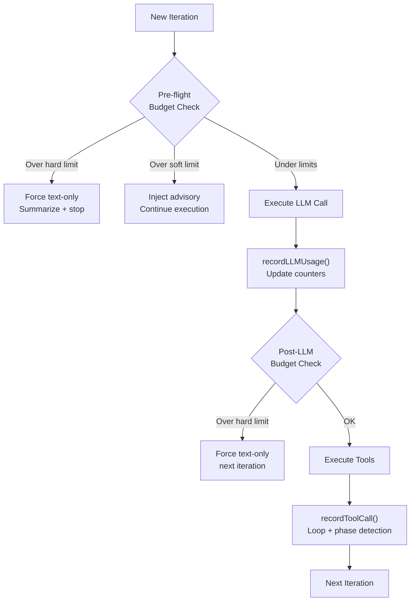

# Budget System

Attocode replaces hard-coded iteration limits with an intelligent economics system. The `ExecutionEconomicsManager` (~1,258 lines in `economics.ts`) tracks token, cost, and time budgets with soft and hard thresholds, injecting contextual nudges instead of abrupt stops.

## Budget Dimensions

Every agent run operates under an `ExecutionBudget` with three independent dimensions:

| Dimension | Hard Limit (default) | Soft Limit (default) | Unit |
|-----------|---------------------|---------------------|------|
| **Tokens** | 200,000 | 150,000 | input + output tokens |
| **Cost** | $1.00 | $0.75 | USD |
| **Duration** | 900,000 (15 min) | 720,000 (12 min) | milliseconds |

Iterations are tracked as soft guidance (`targetIterations: 20`) with an absolute safety cap (`maxIterations: 100`).

## Budget Check Flow



Budget is checked at three points:

1. **Pre-flight** -- before each LLM call. If a hard limit is exceeded, the agent is forced into text-only mode and must summarize.
2. **Post-LLM** -- after the response arrives. Updates usage counters via `recordLLMUsage()` and checks if the budget was crossed.
3. **Per-iteration** -- at the start of each loop iteration, combining all dimension checks into a `BudgetCheckResult`.

## Enforcement Modes

The `enforcementMode` field controls how strictly limits are applied:

- **`strict`** (default) -- hard limits are enforced across all dimensions. Exceeding any dimension stops execution.
- **`doomloop_only`** -- budget checks only trigger on doom loop detection. Useful for tasks where cost is acceptable but getting stuck is not.

## Soft vs Hard Limits

**Soft limits** (default ~80% of hard) trigger advisory nudges:

```
[System] Budget advisory (tokens at 82%) detected. Continue execution
and focus on concrete tool actions to complete the task.
```

**Hard limits** (100%) force text-only mode and inject a structured wrapup prompt:

```
[System] Maximum steps reached. You must now:
1. Summarize what you've accomplished
2. List any remaining work
3. Explain any blockers encountered

Do NOT call any more tools. Respond with text only.
```

For subagents nearing timeout, a structured JSON wrapup prompt requests findings, actions taken, failures, remaining work, and suggested next steps.

## Usage Tracking

The `ExecutionUsage` object is updated after every LLM call via `recordLLMUsage()`:

```typescript
interface ExecutionUsage {
  tokens: number;        // Total tokens (input + output)
  inputTokens: number;
  outputTokens: number;
  cost: number;          // USD, from provider pricing or calculated
  duration: number;      // Wall-clock ms (excludes paused time)
  iterations: number;
  toolCalls: number;
  llmCalls: number;
}
```

Cost is calculated using the provider's actual cost when available (e.g., OpenRouter returns cost directly). Otherwise it falls back to model-based pricing tables. Duration tracking supports `pauseDuration()` and `resumeDuration()` to exclude time spent waiting for subagents.

## Tunable Thresholds

The `EconomicsTuning` interface exposes knobs for fine-grained control:

| Parameter | Default | Description |
|-----------|---------|-------------|
| `doomLoopThreshold` | 3 | Identical calls before doom loop detection |
| `doomLoopFuzzyThreshold` | 4 | Near-identical calls before fuzzy detection |
| `explorationFileThreshold` | 10 | Unique files read before saturation warning |
| `explorationIterThreshold` | 15 | Exploration iterations with diminishing returns |
| `zeroProgressThreshold` | 5 | Text-only turns before force stop |
| `progressCheckpoint` | 5 | Iteration interval for adaptive budget checks |
| `maxToolCallsPerResponse` | 25 | Max tool calls from a single LLM response |
| `circuitBreakerFailureThreshold` | 5 | Consecutive tool failures before circuit trip |

These can be set via the `tuning` field in the budget configuration.

## Economics Events

The manager emits typed events for monitoring and trace collection:

| Event | Description |
|-------|-------------|
| `budget.warning` | Soft limit crossed, includes percent used |
| `budget.exceeded` | Hard limit crossed, includes limit and actual |
| `progress.stuck` | No meaningful progress detected |
| `progress.made` | Files read or modified |
| `doom_loop.detected` | Same tool called repeatedly |
| `phase.transition` | Agent moved to a new execution phase |
| `exploration.saturation` | Too many files read without edits |
| `extension.requested` / `granted` / `denied` | Budget extension lifecycle |

## Source Files

| File | Purpose |
|------|---------|
| `src/integrations/budget/economics.ts` | `ExecutionEconomicsManager`, budget types, presets |
| `src/integrations/budget/loop-detector.ts` | Doom loop detection (see [Loop Detection](./loop-detection)) |
| `src/integrations/budget/phase-tracker.ts` | Phase tracking (see [Phase Tracking](./phase-tracking)) |
