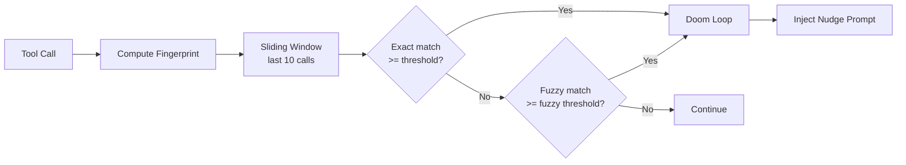

# Loop Detection

The `LoopDetector` (~319 lines in `loop-detector.ts`) identifies when an agent is stuck calling the same tool with the same arguments repeatedly. Rather than hard-stopping, it injects escalating nudge prompts that guide the agent toward a different strategy.

## Detection Mechanism

Every tool call is converted into a **fingerprint** -- a stable hash of the tool name plus its primary arguments. The detector tracks a sliding window of the last 10 tool calls and flags a doom loop when the same fingerprint appears consecutively at or above the threshold.



### Fingerprinting Details

The `computeToolFingerprint()` function extracts only primary argument keys for comparison:

- **Primary keys**: `path`, `file_path`, `command`, `pattern`, `query`, `url`, `content`, `filename`, `offset`, `limit`
- **Bash file-read normalization**: commands like `cat foo.ts`, `head foo.ts`, and `tail foo.ts` targeting the same file produce the identical fingerprint `bash:file_read:foo.ts`
- Complex bash commands (those containing pipes `|`, redirects `>`, or semicolons `;`) bypass file-read normalization and use full args

### Two-Tier Detection

| Type | Default Threshold | How It Works |
|------|------------------|--------------|
| **Exact** | 3 | Same tool name + identical serialized arguments |
| **Fuzzy** | 4 | Same structural fingerprint (primary keys only, ignoring optional params) |

Fuzzy detection only runs if the exact check did not already trigger. When the fuzzy count exceeds the fuzzy threshold, it is used in place of the exact count.

## Escalating Nudge Prompts

The severity of the injected prompt scales with the repetition count:

**3 repetitions (initial warning):**
```
[System] You've called {tool} with the same arguments 3 times.
This indicates a stuck state. Either:
1. Try a DIFFERENT approach or tool
2. If blocked, explain what's preventing progress
3. If the task is complete, say so explicitly
```

**4-5 repetitions (warning):**
```
[System] WARNING: You've called {tool} {N} times with identical arguments.
This is a stuck state.
1. Try a DIFFERENT approach or tool
2. If blocked, explain the blocker
```

**6+ repetitions (critical):**
```
[System] CRITICAL: You've called {tool} with the same arguments {N} times.
You are in a doom loop. You MUST:
1. STOP calling {tool} immediately
2. Explain what you're stuck on
3. Try a completely different approach
Further identical calls will be rejected.
```

## Specialized Detection Patterns

Beyond generic doom loops, the system recognizes specific stuck patterns:

### Test-Fix Cycle

After N consecutive test failures (tracked by `PhaseTracker`), a rethink prompt is injected:

```
[System] You've had {N} consecutive test failures. Step back and rethink:
1. Re-read the error messages carefully
2. Consider whether your approach is fundamentally wrong
3. Try a DIFFERENT fix strategy instead of iterating on the same one
```

### Bash Failure Cascade

Consecutive bash command failures trigger a cascade warning. If the failing commands are file operations (cat, echo, sed), the prompt specifically redirects to proper tools (`write_file`, `edit_file`, `read_file`).

### Summary Loop

Consecutive text-only turns (LLM responses with no tool calls) indicate the agent is stuck summarizing instead of working. The `SUMMARY_LOOP_PROMPT` tells it to pick a task and start using tools immediately.

## Global Doom Loop Detection (Swarm Mode)

In swarm mode, the `SharedEconomicsState` aggregates fingerprints across all workers. Each worker's `ExecutionEconomicsManager` reports fingerprints to the shared state. When the same fingerprint accumulates 10+ calls across multiple workers, a global doom loop is declared:

```
[System] GLOBAL DOOM LOOP: {totalCalls} calls to {tool} across
{workerCount} workers. The entire swarm is stuck on this approach.
1. Try a fundamentally different strategy
2. Do NOT retry the same tool/parameters
3. Consider whether the task goal itself needs re-evaluation
```

The `SharedEconomicsState` tracks per-fingerprint counts and the set of workers that contributed, supports checkpoint serialization via `toJSON()` / `restoreFrom()`, and can be cleared when a swarm completes.

## LoopDetectionState

The internal state tracked by the detector:

```typescript
interface LoopDetectionState {
  doomLoopDetected: boolean;
  lastTool: string | null;
  consecutiveCount: number;
  threshold: number;       // Default: 3
  fuzzyThreshold: number;  // Default: 4
  lastWarningTime: number;
}
```

The state can be reset via `reset()` while preserving tuning thresholds.

## Source Files

| File | Purpose |
|------|---------|
| `src/integrations/budget/loop-detector.ts` | `LoopDetector`, fingerprinting, nudge prompts |
| `src/shared/shared-economics-state.ts` | `SharedEconomicsState`, cross-worker aggregation |
| `src/integrations/budget/economics.ts` | Re-exports `LoopDetector` for backward compatibility |
