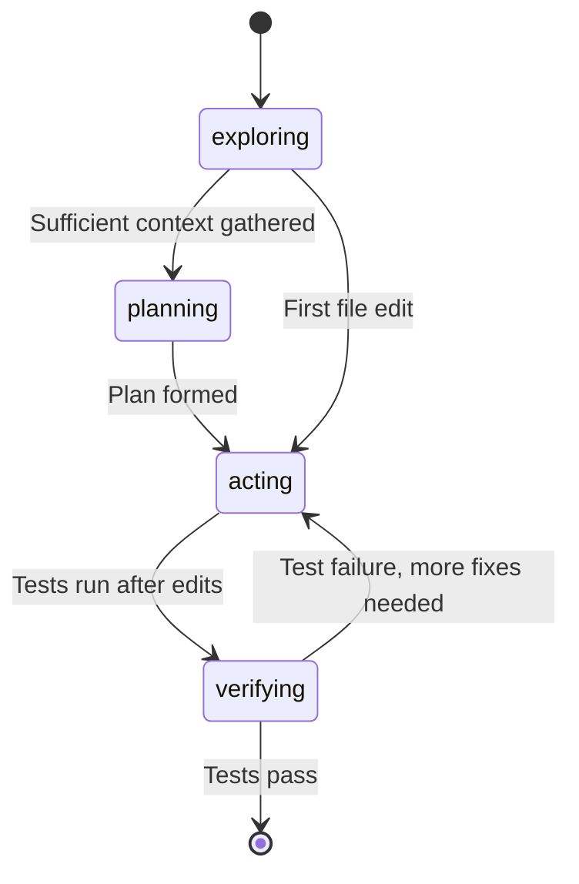

# Phase Tracking

The `PhaseTracker` (~313 lines in `phase-tracker.ts`) monitors the agent's execution phase and detects when it spends too long exploring without acting. It provides contextual nudges -- not hard stops -- to keep the agent productive throughout its budget.

## Execution Phases

Every agent session moves through four phases:



| Phase | Description | Triggered By |
|-------|-------------|-------------|
| **exploring** | Reading files, searching code, gathering context | Initial state |
| **planning** | Forming a plan of action | Manual transition or planning tool |
| **acting** | Editing files, writing code | First `write_file` or `edit_file` call |
| **verifying** | Running tests, validating changes | `bash` with test/build commands after edits |

## Phase Detection Signals

The tracker infers the current phase from tool call patterns:

| Tool Pattern | Detected Phase |
|-------------|---------------|
| `read_file`, `grep`, `glob`, `search`, `find_files`, `search_files` | exploring |
| `write_file`, `edit_file` | acting (auto-transition from exploring/planning) |
| `bash` with `test`, `pytest`, `npm test`, `jest` keywords (after edits) | verifying |

Phase transitions are automatic: the first `edit_file` call transitions from exploring to acting, and the first test command after edits transitions from acting to verifying.

## Phase State

The `PhaseState` tracks detailed metadata about the current phase:

```typescript
interface PhaseState {
  phase: 'exploring' | 'planning' | 'acting' | 'verifying';
  explorationStartIteration: number;
  uniqueFilesRead: Set<string>;     // All files read during session
  uniqueSearches: Set<string>;      // All search queries performed
  filesModified: Set<string>;       // All files edited
  testsRun: number;                 // Total test runs
  shouldTransition: boolean;        // Exploration saturation flag
  iterationsInPhase: number;        // Iterations in current phase
  recentNewFiles: number;           // New files in recent window (resets every 3 iterations)
  lastTestPassed: boolean | null;
  consecutiveTestFailures: number;
  inTestFixCycle: boolean;
  consecutiveBashFailures: number;
  consecutiveTextOnlyTurns: number;
}
```

## Exploration Saturation

The tracker detects two forms of exploration saturation, both checked only during the exploring phase:

### File Threshold

After reading `explorationFileThreshold` (default: 10) unique files without making any edits:

```
[System] You've read {N} files across {M} iterations.
If you understand the issue:
- Make the code changes now
- Run tests to verify
If you're still gathering context, briefly explain what you're looking for.
```

### Diminishing Returns

When the agent has been exploring for `explorationIterThreshold` (default: 15) iterations and the last 3 iterations yielded fewer than 2 new files, the tracker flags diminishing returns and emits an `exploration.saturation` event.

## Phase Budget Enforcement

The `PhaseBudgetConfig` limits how much of the total iteration budget each phase can consume:

| Parameter | Default | Description |
|-----------|---------|-------------|
| `maxExplorationPercent` | 30% | Max iterations for exploration |
| `reservedVerificationPercent` | 20% | Iterations reserved for verification |
| `enabled` | false | Must be explicitly enabled (used in eval mode) |

When the exploration budget is exceeded:

```
[System] You've spent {N}% of your iterations in exploration.
Start making edits NOW.
Do not read more files. Use what you know to make the fix.
```

When the verification reserve is reached (iterations running low):

```
[System] You are running low on iterations. Run your tests NOW
to verify your changes.
Do not make more edits until you've confirmed whether the current fix works.
```

## Test Outcome Tracking

The phase tracker monitors bash command output to parse test results:

- **Pure pass**: Output contains "passed" or "PASSED" with no failures -- resets `consecutiveTestFailures`, clears `inTestFixCycle`
- **Pure failure**: Output contains "failed" / "FAILED" / "ERROR" with no passes -- increments `consecutiveTestFailures`, sets `inTestFixCycle`
- **Mixed results**: Some passed and some failed -- treated as a failure for tracking purposes
- **Bash failures**: Non-test bash command failures increment `consecutiveBashFailures`, which resets on success

## Economics Events

Phase transitions and saturation emit events consumed by the trace collector:

```typescript
| { type: 'phase.transition'; from: string; to: string; reason: string }
| { type: 'exploration.saturation'; filesRead: number; iterations: number }
```

These events appear in the dashboard timeline and are used for post-hoc analysis.

The phase tracker uses **contextual nudges, not hard stops**. An agent in exploration saturation receives a prompt suggesting it start editing, but it is not forcibly prevented from reading more files.

## Source Files

| File | Purpose |
|------|---------|
| `src/integrations/budget/phase-tracker.ts` | `PhaseTracker`, nudge prompts, phase state |
| `src/integrations/budget/economics.ts` | `PhaseState` type, `PhaseBudgetConfig`, `EconomicsEvent` |
