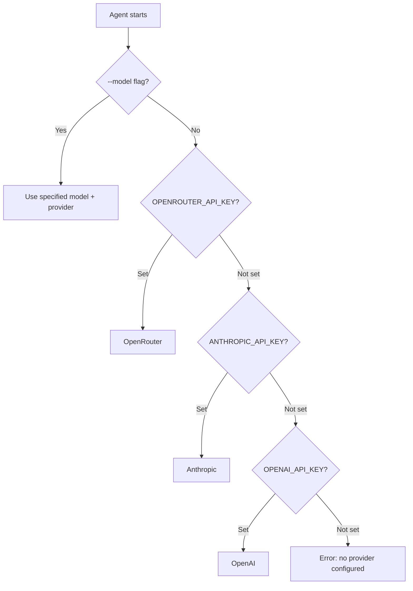

# CLI Reference

Complete reference for Attocode's command-line interface, flags, environment variables, and npm scripts.

## Usage

```bash
attocode [COMMAND] [OPTIONS] [TASK]

# Development (TypeScript directly)
npx tsx src/main.ts [OPTIONS] [TASK]

# Built version
node dist/src/main.js [OPTIONS] [TASK]
```

## Commands

| Command | Description |
|---------|-------------|
| `init` | Interactive first-time setup (API key, model, directory structure) |

When no command is given, Attocode starts an interactive session.

## Options

### General

| Flag | Short | Default | Description |
|------|-------|---------|-------------|
| `--help` | `-h` | | Show help text and exit |
| `--version` | `-v` | | Print version and exit |
| `--model MODEL` | `-m` | auto | Model to use (e.g., `anthropic/claude-sonnet-4`) |
| `--permission MODE` | `-p` | `interactive` | Permission mode (see below) |
| `--yolo` | | | Shorthand for `--permission yolo` |
| `--max-iterations N` | `-i` | `50` | Maximum ReAct loop iterations |
| `--task TASK` | `-t` | | Run a single task non-interactively |

A bare argument (without a flag) is also treated as a task:

```bash
# These are equivalent
npx tsx src/main.ts --task "List all files"
npx tsx src/main.ts "List all files"
```

### Permission Modes

| Mode | Behavior |
|------|----------|
| `strict` | Ask approval for every tool call |
| `interactive` | Ask for dangerous operations only (default) |
| `auto-safe` | Auto-approve safe operations, ask for risky ones |
| `yolo` | Auto-approve everything (use with caution) |

### Interface

| Flag | Default | Description |
|------|---------|-------------|
| `--tui` | auto | Force the rich Ink-based terminal UI |
| `--legacy` / `--no-tui` | | Force legacy readline REPL mode |
| `--theme THEME` | `auto` | Color theme: `dark`, `light`, or `auto` |
| `--trace` | off | Save JSONL execution traces to `.traces/` |
| `--debug` | off | Enable verbose debug logging |

### Swarm Mode

| Flag | Description |
|------|-------------|
| `--swarm` | Enable swarm mode with auto-detected worker models |
| `--swarm CONFIG` | Enable swarm mode with a YAML/JSON config file |
| `--swarm-resume [ID]` | Resume a swarm session (omit ID for latest) |
| `--resume [ID]` | Shorthand for `--swarm-resume` |
| `--paid-only` | Restrict swarm to paid models only (no free tier) |

## Environment Variables

### Provider API Keys

| Variable | Provider | Notes |
|----------|----------|-------|
| `OPENROUTER_API_KEY` | OpenRouter | Recommended -- access to many models |
| `ANTHROPIC_API_KEY` | Anthropic | Direct Anthropic API access |
| `OPENAI_API_KEY` | OpenAI | Direct OpenAI API access |

### Optional

| Variable | Description |
|----------|-------------|
| `OPENROUTER_MODEL` | Override the default model when using OpenRouter |

Auto-detection priority: **OpenRouter > Anthropic > OpenAI**. Set only the key for the provider you want to use, or set multiple and the highest-priority one is selected.



## npm Scripts

| Script | Command | Description |
|--------|---------|-------------|
| `npm run build` | `tsc` | Compile TypeScript to `dist/` |
| `npm run dev` | `tsx watch src/main.ts` | Development mode with auto-reload |
| `npm start` | `tsx src/main.ts` | Run directly from TypeScript |
| `npm test` | `vitest` | Run test suite (watch mode) |
| `npm run test:run` | `vitest run` | Run tests once and exit |
| `npm run test:coverage` | `vitest run --coverage` | Generate coverage report |
| `npm run typecheck` | `tsc --noEmit` | Type-check without emitting |
| `npm run lint` | `eslint src/` | Lint source files |
| `npm run lint:fix` | `eslint src/ --fix` | Lint and auto-fix |
| `npm run format` | `prettier --write ...` | Format source files |
| `npm run format:check` | `prettier --check ...` | Check formatting |
| `npm run check-deps` | `madge --circular ...` | Detect circular dependencies |
| `npm run dashboard` | | Start trace dashboard (dev) |
| `npm run dashboard:build` | | Build trace dashboard |
| `npm run dashboard:start` | | Run trace dashboard (production) |
| `npm run eval` | | Run evaluation suite |
| `npm run eval:golden` | | Run golden evaluation set |

## Files and Directories

| Path | Description |
|------|-------------|
| `.attocode/` | Project-level configuration |
| `~/.attocode/` | User-level global configuration |
| `.agent/sessions/` | Session persistence (SQLite) |
| `.traces/` | Execution traces (JSONL, when `--trace` enabled) |
| `.mcp.json` | MCP server configuration |
| `.env` | Environment variables (loaded via dotenv) |

## Examples

```bash
# First-time setup
npx tsx src/main.ts init

# Interactive session
npx tsx src/main.ts

# Single task
npx tsx src/main.ts "Explain the agent architecture"

# Specific model with auto-safe permissions
npx tsx src/main.ts -m anthropic/claude-sonnet-4 -p auto-safe

# Swarm mode with tracing
npx tsx src/main.ts --swarm --trace "Build a REST API"

# Swarm with custom config
npx tsx src/main.ts --swarm .attocode/swarm.yaml --paid-only "Refactor auth"

# Debug mode with legacy REPL
npx tsx src/main.ts --debug --legacy
```
