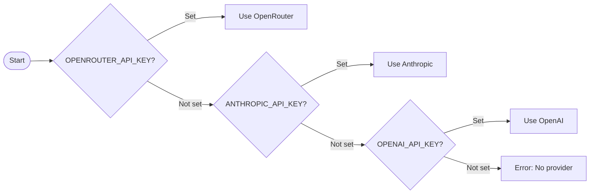

# Quick Start

This guide gets you from zero to a working Attocode session in under five minutes.

## Running Attocode

There are two ways to launch the agent:

```bash
# Development mode (interprets TypeScript directly)
npx tsx src/main.ts

# Built mode (after running npm run build)
node dist/src/main.js
```

## TUI Mode

By default, Attocode launches in **TUI mode** -- a rich terminal interface built with Ink (React for the terminal). TUI mode is the primary interface and provides:

- Syntax-highlighted output
- Inline tool call displays
- Keyboard shortcuts (Ctrl+C to exit, Alt+T to toggle tool details, Alt+O for thinking)
- Real-time status bar with token usage and cost

If your terminal does not support TUI (no TTY detected), Attocode falls back to a basic **REPL mode** automatically. You can also force either mode:

```bash
# Force TUI mode
npx tsx src/main.ts --tui

# Force legacy REPL mode
npx tsx src/main.ts --legacy
```

## Your First Task

Once launched, type a prompt and press Enter. The agent executes a **ReAct loop** -- it reasons about the task, selects tools, executes them, observes results, and repeats until the task is complete.

Try this as a first interaction:

```
Read the README and summarize the project
```

The agent will use its file-reading tools to open `README.md`, then produce a summary. You will see each tool call and its result inline.

## Provider Auto-Detection

Attocode checks for configured providers in this order:



You can override the auto-detected model with `--model`:

```bash
npx tsx src/main.ts --model anthropic/claude-sonnet-4
```

## Single-Task Mode

For non-interactive use (scripts, CI, etc.), pass the task directly:

```bash
npx tsx src/main.ts "List all TypeScript files in src/"
```

The agent runs, completes the task, prints the result, and exits.

## Debug Mode

Enable verbose logging to troubleshoot provider connections, persistence, and tool execution:

```bash
npx tsx src/main.ts --debug
```

## Tracing

Capture a full execution trace for later analysis:

```bash
npx tsx src/main.ts --trace
```

Traces are saved as JSONL files in the `.traces/` directory. You can visualize them with the built-in trace dashboard:

```bash
npm run dashboard
```

## Interactive Commands

Inside a running session, type `/help` to see all available commands. Some highlights:

| Command | Description |
|------------|--------------------------------------|
| `/help` | Show all commands |
| `/status` | Display token usage and metrics |
| `/compact` | Compress context to free up space |
| `/checkpoint` | Save a checkpoint |
| `/restore` | Restore a previous checkpoint |
| `/sessions` | List saved sessions |
| `/resume` | Resume a previous session |
| `/mcp` | Manage MCP tool servers |

## Keyboard Shortcuts (TUI Mode)

| Shortcut | Action |
|----------|------------------------------|
| Ctrl+C | Exit |
| Ctrl+L | Clear screen |
| Ctrl+P | Command palette / help |
| ESC | Cancel current operation |
| Alt+T | Toggle tool details |
| Alt+O | Toggle thinking display |

## Next Steps

- [Configuration](./configuration.md) -- customize behavior with config files and rules
- [CLI Reference](./cli-reference.md) -- full list of flags and environment variables
