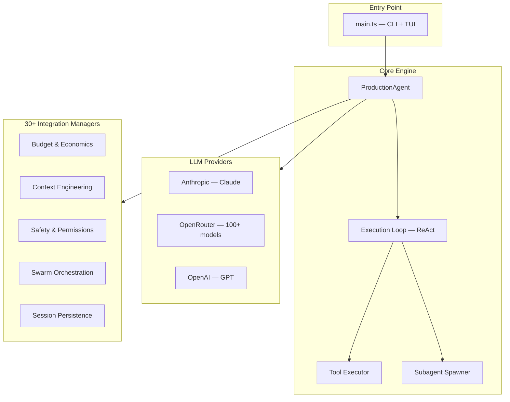

# Welcome to Attocode

Attocode is a **production AI coding agent** built from first principles in TypeScript. It combines a ReAct execution engine, multi-agent swarm orchestration, context engineering techniques, and a full terminal UI into a single, cohesive system.

## What is Attocode?

Attocode is an autonomous coding agent that can:

- **Read, write, and edit code** across entire codebases
- **Execute shell commands** with safety sandboxing
- **Decompose complex tasks** into subtasks and delegate to specialized subagents
- **Orchestrate swarms** of parallel workers for large-scale changes
- **Manage context intelligently** using five context engineering techniques
- **Track budgets** for tokens, cost, and time with automatic loop detection
- **Persist sessions** with checkpoint/resume and session forking

## Architecture at a Glance



## Key Numbers

| Metric | Value |
|--------|-------|
| Source files | 200+ |
| Lines of TypeScript | ~50,000+ |
| Integration subsystems | 13 |
| LLM provider adapters | 3 (Anthropic, OpenAI, OpenRouter) |
| Built-in tools | 15+ |
| Slash commands | 70+ |
| Agent event types | 80+ |
| Test files | 136 |

## Documentation Sections

| Section | What You'll Learn |
|---------|-------------------|
| [Getting Started](./getting-started/installation) | Installation, first run, configuration |
| [Architecture](./architecture/overview) | System design, execution loop, data flow |
| [Features](./features/tui-interface) | TUI, commands, modes, sessions, skills |
| [Multi-Agent](./multi-agent/subagents) | Subagents, swarm mode, task decomposition |
| [Context Engineering](./context-engineering/overview) | KV-cache, recitation, compaction, failure tracking |
| [Safety](./safety/permission-model) | Permissions, policies, sandboxing |
| [Economics](./economics/budget-system) | Budgets, loop detection, phase tracking |
| [Observability](./observability/tracing) | Tracing, dashboard, session comparison |
| [Extending](./extending/custom-tools) | Custom tools, providers, skills, agents |
| [Reference](./reference/config-reference) | Config options, events, tool catalog |
| [Internals](./internals/persistence-schema) | SQLite schema, message format, testing |

## Quick Start

```bash
# Install
npm install

# Run in development
npx tsx src/main.ts

# Run with specific provider
ANTHROPIC_API_KEY=sk-... npx tsx src/main.ts

# Run with tracing enabled
npx tsx src/main.ts --trace
```

See the [Installation Guide](./getting-started/installation) for detailed setup instructions.
