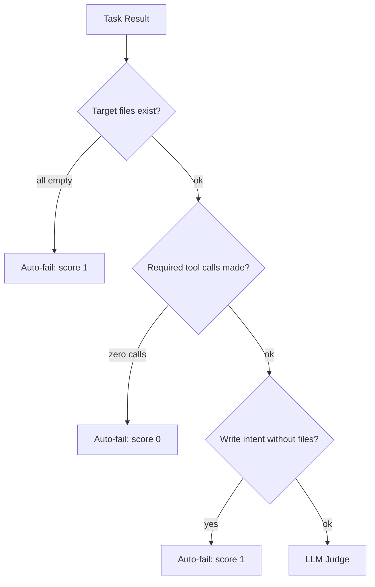

# Quality Gates

Quality gates validate worker outputs before accepting them as complete. The system combines automated pre-flight checks, LLM-based scoring, failure classification, and completion verification.

## QualityGate

The `QualityGate` in `swarm-quality-gate.ts` evaluates each completed task using a two-stage process.

### Stage 1: Pre-Flight Checks

Cheap, synchronous checks that run before the LLM judge:



Pre-flight rejects do not count toward the circuit breaker counter, preventing cascading shutdowns from systemic issues like missing tools.

| Check | Condition | Score |
|-------|-----------|-------|
| **Artifact verification** | All target files empty or missing | 1 |
| **Zero tool calls** | `requiresToolCalls` is true but 0 calls made | 0 |
| **Write intent** | Task description implies file creation but 0 files produced | 1 |

### Stage 2: LLM Judge

The orchestrator model scores the result 1-5 with written feedback. The judge receives:
- The original task description and acceptance criteria
- The worker's output text
- An artifact report (file existence, size, content preview)
- Temporal grounding (current date) to catch stale content

A configurable `qualityThreshold` (default: 3) determines pass/fail. Failed tasks are retried or generate fixup tasks.

### Quality Gate Result

```typescript
interface QualityGateResult {
  score: number;           // 1-5
  feedback: string;        // Explanation
  passed: boolean;         // score >= threshold
  artifactAutoFail?: boolean;  // Failed due to missing files
  preFlightReject?: boolean;   // No LLM call was made
  gateError?: boolean;    // Judge evaluation itself failed
}
```

## VerificationGate

The `VerificationGate` prevents premature completion by checking that required verification steps have been performed.

### Criteria

```typescript
interface VerificationCriteria {
  requiredTests?: string[];        // Test paths that must be run
  requireFileChanges?: boolean;    // Must have edited files
  maxAttempts?: number;            // Nudge limit (default: 2)
  requireCompilation?: boolean;    // TypeScript must compile
  compilationMaxAttempts?: number; // Compilation nudge limit (default: 8)
}
```

### Verification Flow

1. Agent signals completion intent.
2. `VerificationGate.check()` evaluates criteria against tracked state.
3. If unsatisfied, a nudge message is injected into the conversation.
4. After `maxAttempts` nudges, the gate forces allow (avoids infinite loops).

Used in three contexts:
- **TUI mode**: Off by default.
- **Eval mode**: Auto-configured from `FAIL_TO_PASS` test specifications.
- **Swarm mode**: Set by the orchestrator per worker task.

## FailureClassifier

The `FailureClassifier` categorizes task failures to determine the appropriate recovery strategy:

| Failure Class | Retryable | Error Type | Example |
|--------------|-----------|------------|---------|
| `timeout` | Yes | timeout | Worker exceeded time limit |
| `rate_limited` | Yes | 429 | Provider rate limit hit |
| `provider_transient` | Yes | error | Temporary provider issue |
| `provider_spend_limit` | No | 402 | API key budget exhausted |
| `provider_auth` | No | error | Invalid API key |
| `policy_blocked` | No | error | Tool call blocked by policy |
| `invalid_tool_args` | No | error | Malformed tool arguments |
| `missing_target_path` | No | error | Referenced files do not exist |
| `permission_required` | No | error | Needs user approval |
| `unknown` | No | error | Unclassified failure |

Each classification maps to a `TaskFailureMode` (`timeout`, `rate-limit`, `error`, `quality`, `hollow`, `cascade`) which affects how downstream tasks handle partial dependency completion.

## Fixup Task Generation

When a task fails quality evaluation, the orchestrator can generate a fixup task:

1. The original task description and the quality gate feedback are combined.
2. A new `SwarmTask` is created with type `implement` (or the original type).
3. The fixup task depends on the failed task's completed dependencies.
4. It is injected into the next wave of the task queue.

## Foundation Task Handling

Foundation tasks (3+ dependents) receive relaxed quality treatment:

- Quality threshold reduced by 1 (e.g., 3 becomes 2).
- Extra retry attempt before generating fixup tasks.
- Rationale: Foundation task failure cascades to all dependents, so it is better to accept marginally lower quality than to block the entire downstream graph.

## DeadLetterQueue

Permanently failed operations are sent to the `DeadLetterQueue` for later retry or manual intervention:

```typescript
interface DeadLetterItem {
  id: string;
  sessionId?: string;
  operation: string;    // e.g. 'tool:bash', 'mcp:playwright:click'
  args: string;         // Serialized JSON
  error: string;
  category: ErrorCategory;
  status: DeadLetterStatus; // pending | retrying | resolved | abandoned
  retryCount: number;
  createdAt: Date;
}
```

At session start, pending items can be drained and retried. The DLQ integrates with SQLite for durability across sessions.

## Key Files

| File | Description |
|------|-------------|
| `src/integrations/swarm/swarm-quality-gate.ts` | Pre-flight checks and LLM judge |
| `src/integrations/tasks/verification-gate.ts` | Completion verification criteria |
| `src/integrations/swarm/failure-classifier.ts` | Failure categorization and retry decisions |
| `src/integrations/quality/dead-letter-queue.ts` | Persistent failed operation storage |
