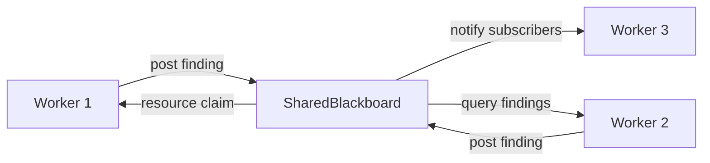

# Shared State

Multi-agent execution requires coordination without tight coupling. Attocode provides several shared state mechanisms that enable workers to learn from each other, avoid conflicts, and share budget.

## SharedBlackboard

The blackboard pattern enables real-time knowledge sharing between parallel agents.



### Findings

Agents post discoveries as typed findings:

```typescript
interface Finding {
  id: string;
  agentId: string;
  topic: string;
  content: string;
  confidence: number;        // 0-1
  type: FindingType;         // discovery | analysis | solution | problem | question | answer | progress | blocker | resource
  relatedFiles?: string[];
  relatedSymbols?: string[];
  tags?: string[];
  timestamp: Date;
  supersedesId?: string;     // Replaces a previous finding
}
```

### Resource Claims

Prevent file edit conflicts between concurrent workers:

```typescript
interface ResourceClaim {
  resource: string;       // File path, API endpoint, etc.
  agentId: string;
  type: ClaimType;        // read | write | exclusive
  claimedAt: Date;
  expiresAt: Date;
  intent?: string;
}
```

### Topic Subscriptions

Agents subscribe to findings by topic pattern, type, or tags. When a matching finding is posted, the subscriber's callback fires immediately. This enables reactive coordination: a researcher can post a finding about an API pattern, and a coder working on a related file receives it in real time.

### Deduplication

Before researching a topic, agents can query the blackboard to check if another agent already investigated it. This avoids redundant work across parallel workers.

### Cleanup

- **Per-agent cleanup**: `releaseAll(agentId)` removes all claims and `unsubscribeAgent(agentId)` removes all subscriptions for that agent.
- **Full cleanup**: `clear()` resets the entire blackboard when the session ends.

## SharedContextState

Central failure tracker and reference pool shared across all swarm workers. Workers plug into this via `ContextEngineeringManager.setSharedState()`.

### Failure Learning

When one worker encounters an error (e.g., a tool call pattern that fails), the failure is recorded in a shared `FailureTracker`. Subsequent workers see these failures in their system prompt and can avoid repeating the same mistakes.

Configuration:
- `maxFailures`: Maximum failures to track (default: 100)
- `maxReferences`: Maximum compaction references (default: 200)

### Reference Pooling

Compaction references from `reversible-compaction.ts` are shared across workers. When one worker compacts a conversation segment, the reference is available to all workers for retrieval, preventing information loss across the swarm.

## SharedEconomicsState

Detects doom loops that span multiple workers. Each worker's local doom loop detector only sees its own calls, but the shared state aggregates tool call fingerprints across all workers.

```typescript
class SharedEconomicsState {
  // Record a tool call fingerprint from any worker
  recordToolCall(workerId: string, fingerprint: string): void;

  // Check if a pattern has exceeded the global threshold
  isGlobalDoomLoop(fingerprint: string): boolean;
}
```

Default threshold: 10 identical tool calls across all workers before triggering a global doom loop alert. This catches situations where multiple workers independently attempt the same failing approach.

## SharedBudgetPool

Parent-child token budget sharing for subagents and swarm workers.

### Budget Partitioning

In swarm mode, the total budget is split:
- **Orchestrator reserve** (default 15%): Decomposition, quality gates, synthesis.
- **Worker pool** (remaining 85%): Shared among all workers with per-worker caps.

### Allocation Flow

1. Worker requests budget via `pool.reserve(workerId)`.
2. Pool returns a `BudgetAllocation` with `tokenBudget` and `costBudget`.
3. Worker uses allocation; soft limit fires at 70%.
4. On completion, unused tokens return to the pool via `pool.release(workerId)`.

If the pool is exhausted, workers receive a minimal fallback (5,000 tokens, $0.01) rather than being blocked entirely.

## SharedFileCache

Cross-agent file read deduplication. When multiple workers need to read the same file, only the first read hits the filesystem; subsequent reads return the cached content. This is especially valuable in swarm mode where 10-20 workers may all need to read the same configuration or source files.

## Checkpoint Serialization

All shared state is included in swarm checkpoints via `SwarmStateStore`. On resume:

1. Task queue state (completed/failed/pending) is restored.
2. SharedContextState failures and references are rebuilt.
3. SharedBlackboard findings are replayed.
4. Budget pool allocations are recalculated from remaining work.

This enables swarms to survive interruptions and resume from the last checkpoint.

## Key Files

| File | Description |
|------|-------------|
| `src/integrations/agents/shared-blackboard.ts` | Blackboard pattern implementation |
| `src/shared/shared-context-state.ts` | Cross-worker failure tracking and reference pooling |
| `src/shared/shared-economics-state.ts` | Global doom loop detection |
| `src/shared/context-engine.ts` | Shared context injection into worker prompts |
| `src/shared/budget-tracker.ts` | Per-worker budget tracking with doom loop reporting |
| `src/integrations/swarm/swarm-budget.ts` | Swarm-specific budget pool wrapper |
| `src/integrations/swarm/swarm-state-store.ts` | Checkpoint persistence |
