# Subagents

Attocode can spawn specialized subagents to handle delegated tasks. Each subagent is a full ProductionAgent instance with its own tool set, budget, and lifecycle.

## Spawnable Agent Types

| Type | Purpose |
|------|---------|
| `researcher` | Explore codebase, gather information |
| `coder` | Write and edit code |
| `reviewer` | Review code for issues |
| `architect` | Design system architecture |
| `debugger` | Diagnose and fix bugs |
| `documenter` | Write documentation |

## Spawning Lifecycle

```mermaid
sequenceDiagram
    participant Parent as Parent Agent
    participant Registry as AgentRegistry
    participant Pool as BudgetPool
    participant Sub as Subagent

    Parent->>Parent: Duplicate check (60s window)
    Parent->>Registry: Load agent definition
    Parent->>Parent: Filter tools (whitelist/deny)
    Parent->>Parent: Inject context (blackboard, plan, constraints)
    Parent->>Pool: reserve(childId, tokens)
    Parent->>Sub: Create via SubAgentFactory
    Parent->>Sub: Graceful timeout (300s, idle:120s, wrapup:30s)
    Sub->>Sub: Run ReAct loop
    Sub-->>Parent: Events (tool, llm)
    Parent->>Sub: onWrapupWarning (30s before end)
    Sub->>Sub: requestWrapup() → forceTextOnly
    Sub-->>Parent: Return result
    Parent->>Parent: Merge plans, parse report, cleanup
    Parent->>Pool: release(childId)
```



## Spawn Constraints

The `spawn_agent` tool accepts optional constraints:

```typescript
interface SpawnConstraints {
  maxTokens?: number;          // Token budget for this agent
  focusAreas?: string[];       // Files/directories to focus on
  excludeAreas?: string[];     // Files/directories to ignore
  requiredDeliverables?: string[]; // Expected outputs
  timeboxMinutes?: number;     // Time limit
}
```

## Structured Report

Every subagent returns a structured report:

```typescript
interface SpawnResult {
  output: string;
  report?: {
    exitReason: string;
    findings: string[];
    actionsTaken: string[];
    failures: string[];
    remainingWork: string[];
    suggestedNextSteps: string[];
  };
  outputStoreId?: string;  // Reference for large outputs
}
```

## Duplicate Spawn Prevention

Spawns are deduplicated within a 60-second window using both exact and semantic matching. The `calculateTaskSimilarity()` function compares new spawn requests against recent ones. If similarity exceeds 75%, the spawn is blocked and the previous result is returned instead. Swarm workers (prefixed `swarm-`) bypass deduplication since the orchestrator handles task uniqueness.

## Graceful Timeout

Subagents use a three-phase timeout:

1. **Active phase** (300s default): Normal execution with full tool access.
2. **Wrapup warning** (30s before end): `onWrapupWarning` fires, the agent receives `requestWrapup()` and should begin summarizing.
3. **Force text-only**: No more tool calls allowed; the agent must return a text response.
4. **Idle timeout** (120s): If no tool calls or LLM activity occurs, the subagent terminates early.

## Budget Allocation

Budget is allocated from the parent's `SharedBudgetPool` when available:

- If the pool has capacity, the subagent receives a dynamic allocation with a soft limit at 70%.
- If the pool is exhausted, the subagent receives a minimal fallback budget (5,000 tokens, $0.01).
- Explicit `constraints.maxTokens` overrides pool allocation entirely.
- On completion, unused budget is released back to the pool.

## Cleanup

- **Subagents**: Per-agent blackboard cleanup (`releaseAll` + `unsubscribeAgent`) removes all findings and resource claims.
- **Root agent**: Full `clear()` on the blackboard when the session ends.

## Key Files

| File | Description |
|------|-------------|
| `src/core/subagent-spawner.ts` | Spawning lifecycle, budget allocation, duplicate prevention |
| `src/tools/agent.ts` | `createBoundSpawnAgentTool()` factory for the `spawn_agent` tool |
| `src/integrations/agents/agent-registry.ts` | Agent definition loading and dynamic registration |
| `src/integrations/agents/delegation-protocol.ts` | Delegation prompt construction |
