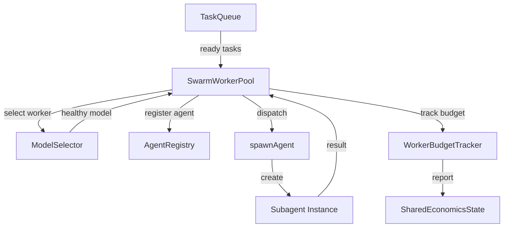

# Worker Pool

The `SwarmWorkerPool` manages concurrent worker dispatch using slot-based concurrency control and dynamic agent registration. Each worker is a subagent spawned via the existing `spawnAgent()` infrastructure.

## Architecture



## Worker Dispatch

The `dispatch(task, preSelectedWorker?)` method handles the full dispatch flow:

1. **Slot check**: Verifies `availableSlots > 0` (based on `maxConcurrency`).
2. **Budget check**: Confirms the budget pool has remaining capacity.
3. **Worker selection**: Uses the pre-selected worker or calls `selectWorker(task)` to match task capability to worker spec.
4. **Agent registration**: Creates a unique agent name (`swarm-{worker}-{taskId}`) and registers a dynamic `AgentDefinition` with the `AgentRegistry`.
5. **Budget calculation**: Computes token budget from `TaskTypeConfig.tokenBudgetRange`, scaled by complexity (0.3 + complexity * 0.14) and retry attempt (1.0x, 1.3x, 1.6x, 2.0x).
6. **Timeout calculation**: Base timeout from `TaskTypeConfig`, multiplied by 2.5x for foundation tasks, then by complexity and retry multipliers.
7. **Spawn**: Calls `spawnAgent(agentName, taskPrompt)` with a backstop timeout (base + 60s) for crash recovery.
8. **Tracking**: Creates a `WorkerBudgetTracker` for orchestrator-side visibility.

### Pre-Selected Worker

The `dispatch()` method accepts an optional pre-selected worker to avoid the double-selection bug where `selectWorker()` picks a different model between wave planning and actual dispatch. When the orchestrator pre-selects a worker during wave scheduling, it passes it through to `dispatch()`.

## Concurrency Limits

Concurrency is controlled by `SwarmConfig.maxConcurrency` (default: 5):

```typescript
get availableSlots(): number {
  return Math.max(0, this.config.maxConcurrency - this.activeWorkers.size);
}
```

Active workers are tracked in a `Map<string, ActiveWorker>` keyed by task ID. The pool exposes `activeCount` and `getActiveWorkerStatus()` for monitoring.

## Task Queue and Wave Scheduling

The `SwarmTaskQueue` organizes tasks into waves based on the dependency graph's `parallelGroups`:

- **Wave N** contains all tasks whose dependencies were satisfied by waves 0 through N-1.
- Within a wave, tasks dispatch in parallel up to `maxConcurrency`.
- Between waves, execution is sequential to respect dependencies.
- Empty waves are skipped automatically.
- Stale dispatched tasks (no worker activity after `dispatchLeaseStaleMs`, default 5 minutes) are recovered back to ready state.

### Partial Dependency Handling

When a task has mixed completed/failed dependencies, the `partialDependencyThreshold` (default 0.5) determines whether to proceed. The threshold is also adjusted by failure mode: external failures like timeouts (0.3) are more lenient than quality failures (0.7).

## Model Selector

The `ModelHealthTracker` tracks per-model success and failure rates:

```typescript
interface ModelHealthRecord {
  model: string;
  successes: number;
  failures: number;
  timeouts: number;
  totalTokens: number;
  avgLatencyMs: number;
}
```

### Health-Aware Selection

`selectWorkerForCapability()` matches tasks to workers by capability (`code`, `research`, `review`, `test`, `document`, `write`) and uses round-robin dispatch with health awareness. Unhealthy models (high failure rate) are deprioritized.

### Failover

When a model fails, `selectAlternativeModel()` picks a different model from the worker pool with the same capability. The alternative is assigned to the task via `task.assignedModel` for retry dispatch, ensuring the same failing model is not used again.

### Fallback Workers

If the OpenRouter API is unavailable for model discovery, the system uses hardcoded fallback workers with provider-diverse models to maintain independent rate limit pools:

| Worker | Model | Capabilities |
|--------|-------|-------------|
| `coder` | mistralai/mistral-large | code, test |
| `coder-alt` | z-ai/glm-4.7-flash | code, test |
| `coder-alt2` | allenai/olmo-3.1-32b | code, test |
| `researcher` | moonshotai/kimi-k2.5 | research, review |
| `documenter` | mistralai/ministral-14b | document |

## Request Throttle

The `SwarmThrottle` prevents 429 rate limiting across all workers using a token bucket with FIFO queuing:

| Config | Free Tier | Paid Tier |
|--------|-----------|-----------|
| `maxConcurrent` | 2 | 5 |
| `refillRatePerSecond` | 0.5 (30 req/min) | 2.0 (120 req/min) |
| `minSpacingMs` | 1500ms | 200ms |

Adaptive backoff increases spacing on rate limit hits (up to 3 backoff levels) and recovers after a 10-second cooldown without errors. Since all subagents share the parent's provider by reference, wrapping the provider with the throttle automatically rate-limits all downstream LLM calls.

## Per-Worker Budget Tracking

Each dispatched worker gets a `WorkerBudgetTracker` that:

- Tracks input/output tokens and iteration count against per-worker limits.
- Records tool call fingerprints and reports them to `SharedEconomicsState` for cross-worker doom loop detection.
- Returns `WorkerBudgetCheckResult` with `canContinue: false` when budget is exhausted.

## Key Files

| File | Description |
|------|-------------|
| `src/integrations/swarm/worker-pool.ts` | Worker dispatch, slot management, prompt building |
| `src/integrations/swarm/task-queue.ts` | Wave-based scheduling, dependency resolution |
| `src/integrations/swarm/model-selector.ts` | Health tracking, capability matching, failover |
| `src/integrations/swarm/request-throttle.ts` | Token bucket rate limiter |
| `src/integrations/swarm/swarm-budget.ts` | Swarm-specific budget pool wrapper |
| `src/shared/budget-tracker.ts` | Per-worker budget and doom loop tracking |
