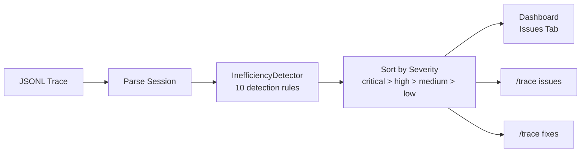

# Issue Detection

The `InefficiencyDetector` in the trace library automatically analyzes session traces to find patterns that indicate wasted budget, stuck states, or suboptimal agent behavior. Issues are surfaced in the dashboard, CLI, and can be used to drive automated improvements.

## How It Works



The detector takes a `ParsedSession` (containing iterations, metrics, tools, and subagent links), runs 10 detection rules, and produces a sorted list of typed `Inefficiency` objects. Each issue includes a code location mapping pointing to the relevant source files.

## Detected Issue Types

### Excessive Iterations

Sessions using more iterations than typical (7+ medium, 10+ high). Suggests task complexity may require decomposition or prompt improvement.

### Cache Inefficiency

Low average cache hit rate (below 50% for multi-iteration sessions, below 30% is high severity). Also detects **sudden cache drops** -- when hit rate falls from 60%+ to below 20% between iterations, indicating a cache invalidation event.

### Redundant Tool Calls

Same tool called 3+ times across the session (5+ is high severity). Suggests the agent is re-reading files or repeating searches that could be cached or remembered.

### Error Loop

3+ consecutive iterations with tool errors. If the session ends with consecutive errors, the severity escalates to critical. Indicates unrecoverable failure loops.

### Slow Tools

Tools averaging over 5 seconds (medium) or 10 seconds (high) per execution. Reports average and max duration for the offending tool.

### Token Spike

Sudden 200%+ increase in token usage between iterations (when absolute count exceeds 10K). Often caused by large tool results or context explosion.

### Thinking Overhead

Extended thinking tokens consuming more than 70% of total output. Suggests the task may not benefit from extended thinking mode.

### Subagent Inefficiency

Same subagent type failing 2+ times, or overall subagent failure rate exceeding 50% (when 3+ subagents were spawned). Indicates task delegation or subagent configuration problems.

### Context Limit Warning

Total input tokens approaching 90% of the estimated context window (200K). Critical severity indicates the session is at risk of context overflow. Medium severity at 70%.

### Tool Timeout Patterns

Tools timing out 2+ times (medium) or 3+ times (high). Also checks the overall timeout rate -- if more than 20% of all tool calls time out, a high-severity issue is raised.

## Severity Levels

| Level | Meaning | Dashboard Indicator |
|-------|---------|-------------------|
| **low** | Minor observation, may not need action | Gray |
| **medium** | Potential inefficiency worth investigating | Yellow |
| **high** | Clear problem that impacted session quality | Orange |
| **critical** | Severe issue that likely caused session failure | Red |

Issues are sorted by severity (critical first) in the output.

## Code Location Mapping

Each issue type maps to relevant source files and components:

| Issue Type | Primary Location | Secondary Location |
|------------|-----------------|-------------------|
| `excessive_iterations` | `ProductionAgent.run` | `ContextEngineering` |
| `cache_inefficiency` | `CacheBoundaryTracker` | `ContextEngineering` |
| `redundant_tool_calls` | `executeToolCalls` | `FailureEvidence` |
| `error_loop` | `FailureEvidence` | `ProductionAgent.run` |
| `slow_tool` | Tool implementations | `MCPClient` |
| `token_spike` | `AutoCompactionManager` | `ReversibleCompaction` |
| `thinking_overhead` | `AnthropicProvider` | `callLLM` |
| `subagent_inefficiency` | `spawnAgent` | `spawnAgentsParallel` |
| `context_limit_warning` | `AutoCompactionManager` | `ProductionAgent.run` |
| `tool_timeout_patterns` | Tool implementations | `CancellationManager` |

## CLI Commands

### View Issues

```bash
/trace issues [session-id]
```

Lists all detected issues for a session with severity, type, and description.

### View Suggested Fixes

```bash
/trace fixes [session-id]
```

For each detected issue, suggests concrete improvements:

| Issue | Suggested Fix |
|-------|--------------|
| Low cache hit rate | Check for dynamic content in early messages or unstable system prompts |
| Excessive iterations | Review task complexity and consider breaking into subtasks |
| Redundant tool calls | Consider caching tool results or improving memory/context management |
| Error loop ending session | Implement better error handling or failure detection to break loops |
| Tool timeout pattern | Increase tool timeout or optimize tool implementation |

## Dashboard Integration

The **Issues** tab on the session detail page shows issue counts by severity as badges, expandable issue cards with evidence and affected iterations, suggested remediation, and filtering by severity and type.

## Programmatic Access

```typescript
const detector = new InefficiencyDetector(parsedSession);
const issues = detector.detect();
// issues sorted by severity: critical > high > medium > low
```

## Source Files

| File | Purpose |
|------|---------|
| `tools/trace-dashboard/src/lib/analyzer/inefficiency-detector.ts` | `InefficiencyDetector`, 10 detection rules |
| `tools/trace-dashboard/src/lib/types.ts` | `Inefficiency` and `ParsedSession` type definitions |
| `tools/trace-dashboard/src/api/routes/sessions.ts` | `/sessions/:id/issues` endpoint |
