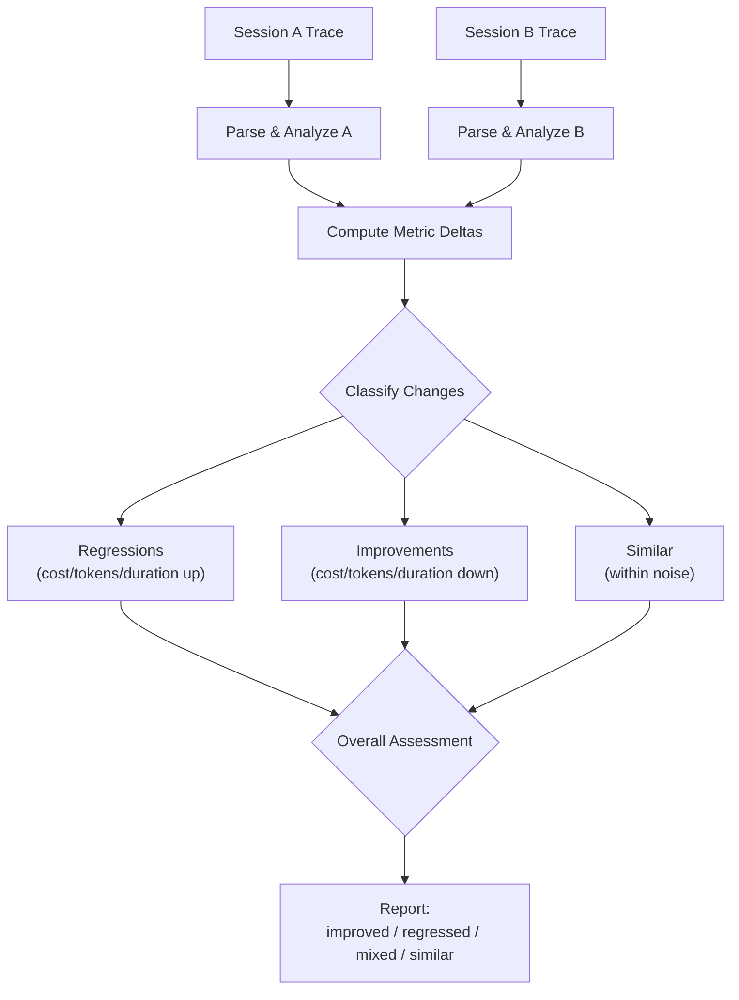

# Session Comparison

Session comparison lets you evaluate the impact of prompt changes, model upgrades, configuration tweaks, or any other variable by placing two session traces side by side. It computes metric deltas, flags regressions and improvements, and produces an overall assessment.

## Usage

### CLI

```bash
# Compare two sessions by ID
/trace compare session-abc123 session-def456
```

### Dashboard

Navigate to the **Compare** page and select two sessions from the dropdown, or use the API directly:

```
GET /api/compare?a=session-abc123&b=session-def456
```

Both session IDs should be URL-encoded. The API returns a structured comparison object or a 404 if either session is not found.

## Compared Metrics

The comparison reports deltas across all tracked dimensions:

| Metric | Description |
|--------|-------------|
| **Total tokens** | Input + output token count |
| **Input tokens** | Tokens sent to the LLM |
| **Output tokens** | Tokens generated by the LLM |
| **Cost** | USD spent on API calls |
| **Duration** | Wall-clock time (excluding paused subagent time) |
| **Iterations** | Number of ReAct loop cycles |
| **Tool calls** | Total tool invocations |
| **Cache hit rate** | Fraction of input tokens from KV cache |
| **LLM calls** | Number of LLM API requests |

Each metric shows the value for session A, session B, the absolute delta, and the percent change.

## Comparison Flow



## Assessment Categories

| Assessment | Criteria |
|------------|----------|
| **improved** | Key metrics decreased without quality regression |
| **regressed** | Key metrics increased or quality decreased |
| **mixed** | Some metrics improved, others regressed |
| **similar** | All deltas within the noise threshold |

### Regression Detection

A metric is flagged as a **regression** when:

- Cost increased by more than 10%
- Token usage increased by more than 15%
- Duration increased by more than 20%
- Cache hit rate dropped by more than 5 percentage points

### Improvement Detection

A metric is flagged as an **improvement** when the inverse conditions hold -- cost or tokens decreased meaningfully while the task still completed successfully.

## Use Cases

### Prompt Engineering

Compare two runs of the same task with different system prompts to see whether a prompt change reduced token waste or improved cache hit rates.

### Model Comparison

Run the same task on two different models (e.g., `claude-sonnet-4` vs `claude-opus-4`) and compare cost, speed, and iteration count.

### Configuration Tuning

Test different `EconomicsTuning` thresholds (e.g., lowering `doomLoopThreshold` from 3 to 2) and verify the impact on stuck-state recovery without increasing cost.

### Regression Testing

After a code change to the agent itself, re-run a benchmark task and compare traces to catch performance regressions before deployment.

## Dashboard View

The Compare page in the dashboard renders:

- A **metric table** with A/B values, delta, and percent change columns
- Color-coded indicators: green for improvements, red for regressions, gray for similar
- A **timeline overlay** showing both sessions' iteration patterns on the same axis
- A **summary card** with the overall assessment and key findings

## Source Files

| File | Purpose |
|------|---------|
| `tools/trace-dashboard/src/api/routes/compare.ts` | Comparison API endpoint |
| `tools/trace-dashboard/src/api/trace-service.ts` | `compareSessions()` service function |
| `tools/trace-dashboard/src/lib/analyzer/` | Session analysis and delta computation |
| `tools/trace-dashboard/src/pages/ComparePage.tsx` | Dashboard comparison UI |
