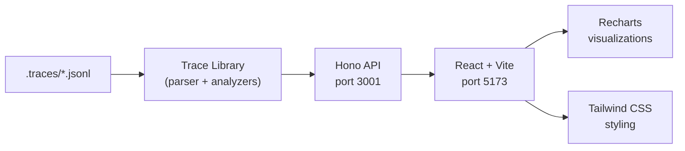

# Trace Dashboard

The trace dashboard is a web-based interface for visualizing and analyzing agent execution traces. It provides interactive views for session timelines, token flow, swarm orchestration, and automated issue detection.

## Quick Start

```bash
# From the project root
npm run dashboard        # Start dev servers (API + Vite)
npm run dashboard:build  # Build for production
npm run dashboard:start  # Run production build
```

The API server runs on **port 3001** and the Vite dev server on **port 5173**.

## Architecture



**Stack:** Hono backend, React frontend, Vite bundler, Tailwind CSS, Recharts for charts.

**Trace library** (`tools/trace-dashboard/src/lib/`) provides parsing, analysis, views, and output generation. The library is shared between CLI trace commands and the dashboard.

## Pages

### Session List

The landing page shows all traced sessions with filtering and sorting by date, duration, model, status, and token usage. Sessions can be uploaded from external JSONL files.

### Session Detail

Each session has five tabbed views:

| Tab | Content |
|-----|---------|
| **Summary** | Overall metrics: tokens, cost, duration, iterations, cache hit rate |
| **Timeline** | Chronological event feed -- LLM calls, tool executions, phase transitions |
| **Tree** | Hierarchical view of iterations with nested tool calls and subagent trees |
| **Tokens** | Interactive token flow charts showing input/output/cache per iteration |
| **Issues** | Detected inefficiencies with severity indicators (see [Issue Detection](./issue-detection)) |

### Compare

Side-by-side comparison of two sessions. See [Session Comparison](./session-comparison).

### Swarm Dashboard

Real-time and post-hoc swarm visualization:

- **Worker timeline** -- Gantt-style view of worker lifetimes and task assignments
- **Task DAG** -- Dependency graph of decomposed tasks with status coloring
- **Quality heatmap** -- Pass/fail matrix across quality gates per task
- **Budget treemap** -- Token allocation and consumption per worker
- **Event feed** -- Live stream of swarm events (via SSE)

### Code Map

Visualizes which files and symbols the agent interacted with:

- File dependency graph
- Symbol table with read/write/create annotations
- Hotspot detection (most-touched files)

### Swarm History

Historical view of past swarm runs with outcome summaries and comparison links.

### Agent Topology

Displays the parent-child agent hierarchy with data flow relationships.

## API Endpoints

All routes are prefixed with `/api`.

### Sessions

| Method | Path | Description |
|--------|------|-------------|
| GET | `/sessions` | List all sessions |
| POST | `/sessions/upload` | Upload a JSONL trace file |
| GET | `/sessions/uploaded` | List uploaded sessions |
| GET | `/sessions/:id` | Session summary |
| GET | `/sessions/:id/timeline` | Chronological events |
| GET | `/sessions/:id/tree` | Hierarchical view |
| GET | `/sessions/:id/tokens` | Token flow data |
| GET | `/sessions/:id/issues` | Detected issues |
| GET | `/sessions/:id/swarm` | Swarm-specific data |
| GET | `/sessions/:id/codemap` | File/symbol map |
| GET | `/sessions/:id/agents` | Agent relationship graph |
| GET | `/sessions/:id/dataflow` | Data flow between agents |
| GET | `/sessions/:id/export/html` | Export as HTML report |
| GET | `/sessions/:id/export/csv` | Export as CSV |
| GET | `/sessions/:id/raw` | Raw JSONL entries |

### Compare

| Method | Path | Description |
|--------|------|-------------|
| GET | `/compare?a={idA}&b={idB}` | Compare two sessions |

### Swarm (Live)

| Method | Path | Description |
|--------|------|-------------|
| GET | `/swarm/state` | Current swarm state |
| GET | `/swarm/stream` | SSE event stream |
| GET | `/swarm/tasks` | Task list with status |
| GET | `/swarm/history` | Historical swarm runs |
| GET | `/swarm/codemap` | Live code interaction map |
| GET | `/swarm/blackboard` | Shared blackboard state |
| GET | `/swarm/budget-pool` | Budget pool allocations |

## Source Files

| File | Purpose |
|------|---------|
| `tools/trace-dashboard/src/api/server.ts` | Hono entry point with CORS and routing |
| `tools/trace-dashboard/src/api/routes/sessions.ts` | Session API routes |
| `tools/trace-dashboard/src/api/routes/compare.ts` | Comparison route |
| `tools/trace-dashboard/src/api/routes/swarm-live.ts` | Swarm live routes with SSE |
| `tools/trace-dashboard/src/api/trace-service.ts` | Service layer wrapping the trace library |
| `tools/trace-dashboard/src/lib/` | Trace parsing, analysis, views, output generation |
| `tools/trace-dashboard/src/pages/` | React page components (7 pages) |
