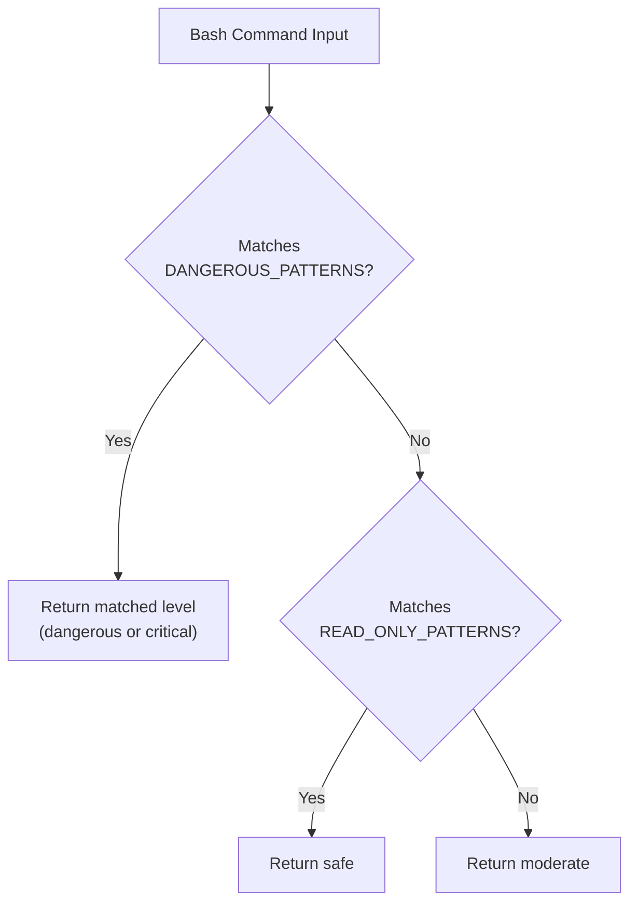

# Bash Safety

The bash tool is the most powerful -- and most dangerous -- capability available to the agent. Multiple safety layers work together to prevent destructive commands while allowing productive shell usage.

## Command Classification

The `classifyBashCommandDangerLevel()` function in `src/tools/permission.ts` applies a three-tier classification:



1. **Dangerous pattern check** -- The `DANGEROUS_PATTERNS` array catches `sudo`, `rm -rf`, `mkfs`, `curl|bash`, etc. Returns the highest matched danger level.
2. **Read-only check** -- Delegates to `isReadOnlyBashCommand()` from `bash-policy.ts`. Matches ~35 patterns including `ls`, `cat`, `grep`, `find`, `git status/log/diff`, `npm test`, `vitest`, `jest`, `pytest`, `tsc --noEmit`.
3. **Default moderate** -- Unknown commands get `moderate`, ensuring they receive appropriate review.

### Read-Only Patterns (excerpt)

```
ls, cat, head, tail, wc, find, grep, rg, fd, tree, pwd,
which, whoami, env, echo, du, df, file, stat, uname, date,
git (status|log|diff|show|branch|remote|tag),
npm (list|ls|view|audit|test|run test),
diff, jq, sort, uniq, cut, tr, vitest, jest, pytest
```

### Write Command Patterns

```
rm, mv, cp, mkdir, touch, chmod, chown,
sed -i, awk -i, perl -i,
git (add|commit|push|pull|merge|rebase|reset|checkout),
npm/yarn/pnpm (install|add|remove|uninstall)
```

## Timeout Handling

The bash tool enforces a timeout with escalating termination:

```
1. SIGTERM sent at timeout
2. Wait 1 second
3. SIGKILL if still alive
4. Wait 2 seconds
5. Kill entire process group if still alive
```

### Timeout Normalization

The `normalizeTimeoutMs()` function catches a common LLM mistake -- passing seconds instead of milliseconds:

```typescript
function normalizeTimeoutMs(timeout: number): number {
  if (timeout > 0 && timeout < 300) {
    return timeout * 1000; // Treat as seconds
  }
  return timeout;
}
```

Values below 300 are assumed to be in seconds (e.g., `60` becomes `60000ms`). The threshold at 300 avoids mangling legitimate sub-second timeouts used in tests.

## Output Limits

Bash output is capped at **100KB**. When truncated, a marker is appended so the agent knows the output was incomplete. This prevents a single verbose command from consuming the entire context window.

## Environment Safety

The bash tool sets `TERM=dumb` to disable terminal formatting (colors, cursor movement, progress bars) that would pollute the agent's context with ANSI escape sequences.

## Edit Validator

After file edits (`write_file`, `edit_file`), the `validateSyntax()` function in `src/integrations/safety/edit-validator.ts` performs post-edit syntax checking using tree-sitter AST parsing:

- Parses the edited file into an AST
- Walks the tree for `ERROR` nodes
- Reports line/column/snippet for each syntax error
- Supports TypeScript, JavaScript, TSX, JSX, and Python
- Unsupported file types always return `valid: true` (no-op)

This catches broken edits before they reach runtime, reducing wasted iterations on syntax errors.

## File Mutation Detection

The `detectFileMutationViaBash()` function in `bash-policy.ts` catches indirect file writes that bypass the `write_file` tool:

| Pattern | Example |
|---------|---------|
| Heredoc | `cat << EOF > file.txt` |
| Redirect | `echo "data" > file.txt` |
| Append | `echo "data" >> file.txt` |
| `tee` | `echo "data" \| tee file.txt` |
| In-place edit | `sed -i 's/old/new/' file.txt` |

When `bashWriteProtection` is set to `block_file_mutation`, these patterns are blocked even if the overall bash mode is `full`.

## Source Files

| File | Purpose |
|------|---------|
| `src/tools/bash.ts` | Bash tool definition, timeout handling, output limits |
| `src/tools/permission.ts` | `classifyBashCommandDangerLevel()`, `classifyCommand()` |
| `src/integrations/safety/bash-policy.ts` | `READ_ONLY_PATTERNS`, `WRITE_COMMAND_PATTERNS`, `FILE_MUTATION_PATTERNS` |
| `src/integrations/safety/edit-validator.ts` | Post-edit tree-sitter syntax validation |
