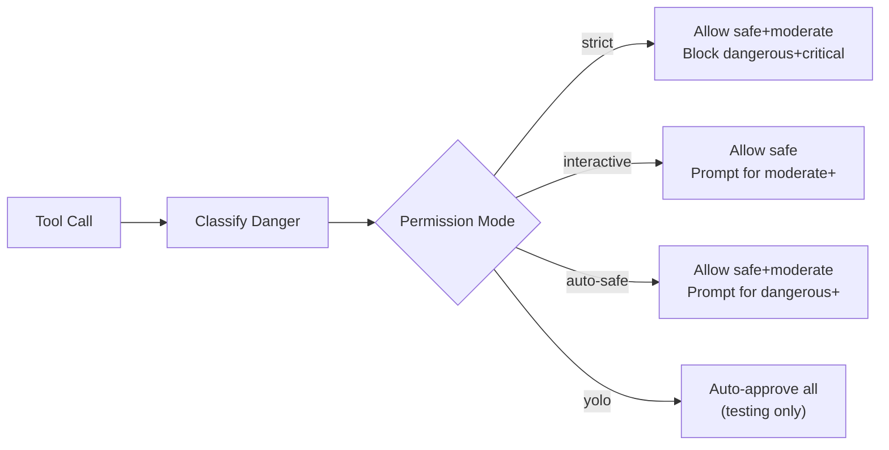

# Permission Model

Every tool call passes through a four-tier danger classification system before execution. The permission model ensures that read operations run silently, writes get appropriate review, and destructive commands are never executed without explicit consent.

## Danger Levels

Every tool carries a static `dangerLevel` and an optional `getDangerLevel(input)` callback for dynamic classification at call time.

| Level | Description | Examples |
|-------|-------------|----------|
| **safe** | Read-only, no side effects | `read_file`, `glob`, `grep`, `list_files`, `task_get`, `task_list` |
| **moderate** | Creates or modifies files | `write_file`, `edit_file`, benign bash commands |
| **dangerous** | Destructive or security-sensitive | `rm -rf`, `chmod 777`, `kill -9`, `pip install` |
| **critical** | System-level, potentially irreversible | `sudo rm`, `mkfs`, `curl \| bash`, `chown` |

Dynamic classification is used by the `bash` tool, where `ls` resolves to **safe** and `rm -rf /` resolves to **dangerous** at runtime via `classifyBashCommandDangerLevel()`.

## Dangerous Patterns

The `DANGEROUS_PATTERNS` array in `src/tools/types.ts` defines regex-based classification rules. Each pattern maps to a danger level and a human-readable description:

```typescript
// Critical
{ pattern: /\bsudo\b/,           level: 'critical', description: 'Superuser command' }
{ pattern: /\bchmod\s+[0-7]*7/,  level: 'critical', description: 'World-writable permission' }
{ pattern: /\bchown\b/,          level: 'critical', description: 'Change ownership' }

// Dangerous
{ pattern: /\brm\s+-rf\b/,       level: 'dangerous', description: 'Recursive force delete' }
{ pattern: /\bmkfs\b/,           level: 'dangerous', description: 'Format filesystem' }
{ pattern: /\bcurl\b.*\|\s*(ba)?sh/, level: 'dangerous', description: 'Pipe URL to shell' }
{ pattern: /\bkill\s+-9\b/,      level: 'dangerous', description: 'Force kill process' }

// Moderate
{ pattern: /\bnpm\s+install\s+-g\b/, level: 'moderate', description: 'Global npm install' }
{ pattern: /\bpip\s+install\b/,      level: 'moderate', description: 'Python package install' }
```

The `classifyCommand()` function iterates all patterns and returns the highest matched level plus all matching reasons.

## Permission Modes

The `--permission` flag (or config field) selects one of four enforcement strategies:



| Mode | safe | moderate | dangerous | critical |
|------|------|----------|-----------|----------|
| `strict` | auto | auto | **block** | **block** |
| `interactive` | auto | prompt | prompt | prompt |
| `auto-safe` | auto | auto | prompt | prompt |
| `yolo` | auto | auto | auto | auto |

## Permission Checker Implementations

Each mode is backed by a class in `src/tools/permission.ts`:

- **StrictPermissionChecker** -- auto-approves safe and moderate; blocks everything else.
- **InteractivePermissionChecker** -- prompts on stdin for moderate and above. Supports `always`/`never` memory.
- **AutoSafePermissionChecker** -- auto-approves safe and moderate; delegates dangerous+ to the interactive checker.
- **YoloPermissionChecker** -- returns `{ granted: true }` unconditionally. Logs a warning at startup.
- **TUIPermissionChecker** -- routes non-safe requests through the TUI approval bridge. Falls back to **block** if the bridge is disconnected.

## TUI Approval Flow

In TUI mode, the `TUIPermissionChecker` presents an interactive dialog:

| Key | Action |
|-----|--------|
| **Y** | Approve this request |
| **A** | Always-allow this tool + pattern (persisted to SQLite) |
| **N** | Deny |
| **D** | Deny with reason |

Always-allow entries are stored as `"tool:key_arg"` strings with prefix matching, so approving `bash:/Users/project` also covers `bash:/Users/project/src/file.ts`.

## Source Files

| File | Purpose |
|------|---------|
| `src/tools/types.ts` | `DangerLevel`, `PermissionMode`, `DANGEROUS_PATTERNS` |
| `src/tools/permission.ts` | All checker implementations, `classifyCommand()`, `classifyBashCommandDangerLevel()` |
| `src/tools/registry.ts` | Wires permission checks into tool execution |
