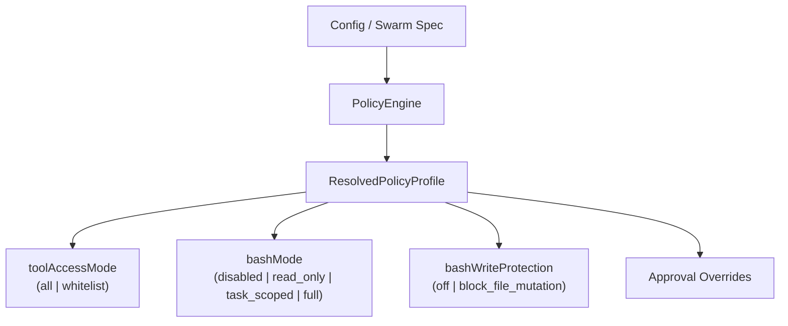
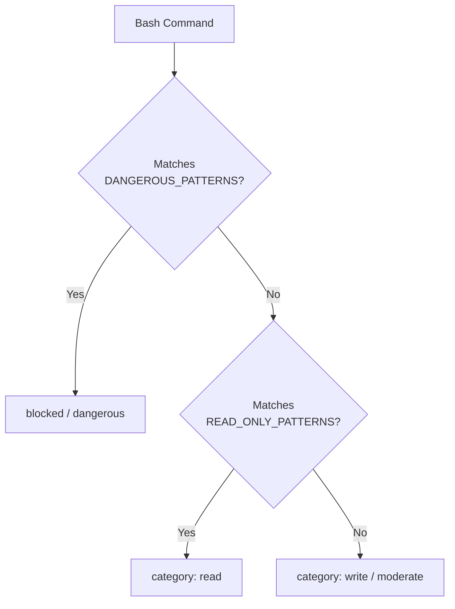

# Policy Engine

The policy engine sits above the permission model and provides **profile-based** tool and bash access control. While the permission model classifies individual commands, the policy engine decides which tools are available at all and what bash operations are permitted.

## Architecture



## Policy Profiles

A `PolicyProfile` controls four dimensions of tool access:

```typescript
interface PolicyProfile {
  toolAccessMode?: 'all' | 'whitelist';
  allowedTools?: string[];
  deniedTools?: string[];
  bashMode?: 'disabled' | 'read_only' | 'task_scoped' | 'full';
  bashWriteProtection?: 'off' | 'block_file_mutation';
  approvalOverrides?: Record<string, 'auto' | 'prompt' | 'block'>;
}
```

### Built-in Profiles

| Profile | Tool Access | Bash Mode | Write Protection | Use Case |
|---------|-------------|-----------|------------------|----------|
| `research-safe` | whitelist (read tools + bash) | `read_only` | `block_file_mutation` | Read-only research tasks |
| `code-strict-bash` | whitelist (code tools + bash) | `full` | `block_file_mutation` | Code editing with safe bash |
| `code-full` | all | `full` | `off` | Unrestricted access |
| `review-safe` | whitelist (read tools only) | `disabled` | `block_file_mutation` | Code review, no execution |

## Profile Resolution

The `resolvePolicyProfile()` function selects the effective profile through a priority chain:

1. **Explicit request** -- a profile name passed directly (e.g., via `--policy research-safe`)
2. **Worker capability** -- swarm workers can specify a profile in their spec
3. **Task type** -- the swarm task type maps to a default profile
4. **Default** -- `code-full` for standalone, `code-strict-bash` for swarm workers

The resolved profile includes metadata about the selection source and any legacy mapping warnings.

## Execution Policy Manager

The `ExecutionPolicyManager` in `src/integrations/safety/execution-policy.ts` adds **intent-aware** access control on top of profiles:

```typescript
type PolicyLevel = 'allow' | 'prompt' | 'forbidden';
type IntentType = 'deliberate' | 'accidental' | 'inferred';
```

Each tool can have conditional policies that depend on argument patterns or conversation context:

```typescript
interface PolicyCondition {
  argMatch?: Record<string, string | RegExp>;
  contextMatch?: (context: PolicyContext) => boolean;
  policy: PolicyLevel;
  reason?: string;
}
```

This enables rules like "allow `bash` for `npm test` but prompt for `npm install -g`".

## Bash Policy

The `evaluateBashPolicy()` function in `src/integrations/safety/bash-policy.ts` is the single source of truth for bash command classification:



The `BashPolicyDecision` returned contains:

| Field | Type | Description |
|-------|------|-------------|
| `allowed` | boolean | Whether execution proceeds |
| `isWrite` | boolean | Whether the command mutates state |
| `category` | `disabled \| read \| write \| blocked` | Classification bucket |
| `reason` | string? | Human-readable explanation |

### File Mutation Detection

The `FILE_MUTATION_PATTERNS` array catches indirect writes like heredocs (`<<`), redirections (`>`/`>>`), `tee`, `sed -i`, and `install` commands. When `bashWriteProtection` is `block_file_mutation`, these are blocked even in `full` bash mode.

## Source Files

| File | Purpose |
|------|---------|
| `src/integrations/safety/policy-engine.ts` | Profile definitions, resolution logic |
| `src/integrations/safety/execution-policy.ts` | Intent-aware policy manager |
| `src/integrations/safety/bash-policy.ts` | Bash classification, read-only and write patterns |
