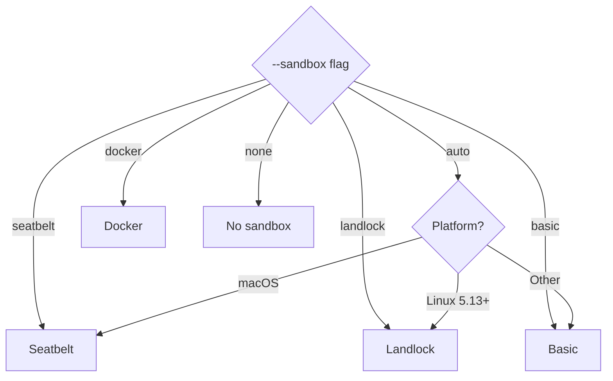

# Sandboxing

Attocode can isolate command execution inside platform-specific sandboxes. The sandbox layer enforces filesystem, network, and resource constraints that go beyond pattern-based danger classification.

## Sandbox Interface

Every sandbox implementation conforms to a common contract:

```typescript
interface Sandbox {
  execute(command: string, options?: Partial<SandboxOptions>): Promise<ExecResult>;
  isAvailable(): Promise<boolean>;
  getType(): SandboxMode;
  cleanup(): Promise<void>;
}
```

The `SandboxOptions` type controls the isolation boundary:

| Option | Type | Default | Description |
|--------|------|---------|-------------|
| `writablePaths` | `string[]` | `['.']` | Directories the sandbox can write to |
| `readablePaths` | `string[]` | `['/']` | Directories the sandbox can read from |
| `networkAllowed` | `boolean` | `false` | Whether outbound network is permitted |
| `timeout` | `number` | `30000` | Max execution time in ms |
| `maxMemoryMB` | `number` | -- | Memory cap |
| `maxCpuSeconds` | `number` | -- | CPU time cap |
| `allowedCommands` | `string[]` | -- | Command allowlist (basic mode) |
| `blockedCommands` | `string[]` | -- | Command blocklist (basic mode) |

## Sandbox Implementations

### Basic (`basic.ts`)

A portable fallback that validates commands before execution without true OS-level isolation. It enforces:

- A `DANGEROUS_PATTERNS` blocklist (fork bombs, `/dev/sd*` writes, `mkfs`, `curl|sh`, `sudo`, dangerous `chmod`, network exfiltration)
- Path allowlist checks
- Timeout enforcement via `spawn`

This is **not** a security boundary -- it is a best-effort validation layer for environments where proper sandboxing is unavailable.

### Seatbelt (`seatbelt.ts`) -- macOS

Uses the macOS `sandbox-exec` mechanism with a generated Seatbelt profile. The profile:

- Grants `file-read*` on configured readable paths
- Grants `file-write*` only on configured writable paths
- Controls `network*` based on `networkAllowed`
- Denies all other operations by default

Requires macOS; detected via `process.platform === 'darwin'`.

### Landlock (`landlock.ts`) -- Linux

Uses the Linux Landlock LSM (Linux Security Module) to restrict filesystem access at the kernel level. Landlock is available on Linux 5.13+ and provides:

- Per-path read/write/execute restrictions
- No root privileges required
- Inherited by child processes

### Docker (`docker.ts`)

Runs commands inside a Docker container for full isolation:

- Mounts writable paths as volumes
- Configurable Docker image (default: a lightweight Node.js image)
- Network can be disabled with `--network none`
- Automatic container cleanup after execution

## Sandbox Selection



The `auto` mode probes platform capabilities and selects the strongest available sandbox. The `SandboxManager` wraps the selected implementation and provides a unified API.

## Integration with Bash Tool

When a sandbox is configured, the bash tool delegates execution through the sandbox instead of spawning a direct child process. The bash policy layer still runs first -- a command blocked by policy never reaches the sandbox.

## Source Files

| File | Purpose |
|------|---------|
| `src/integrations/safety/sandbox/index.ts` | `Sandbox` interface, `SandboxOptions`, factory |
| `src/integrations/safety/sandbox/basic.ts` | Allowlist/blocklist validation |
| `src/integrations/safety/sandbox/seatbelt.ts` | macOS Seatbelt profile sandbox |
| `src/integrations/safety/sandbox/landlock.ts` | Linux Landlock LSM sandbox |
| `src/integrations/safety/sandbox/docker.ts` | Docker container sandbox |
