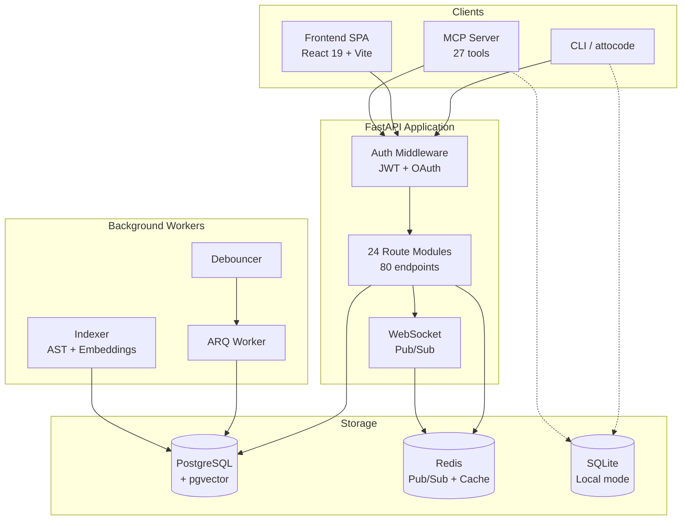
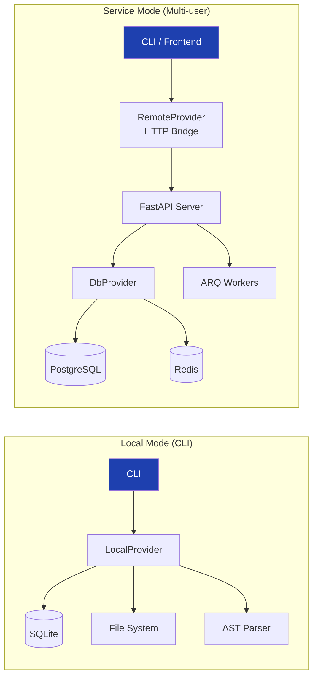
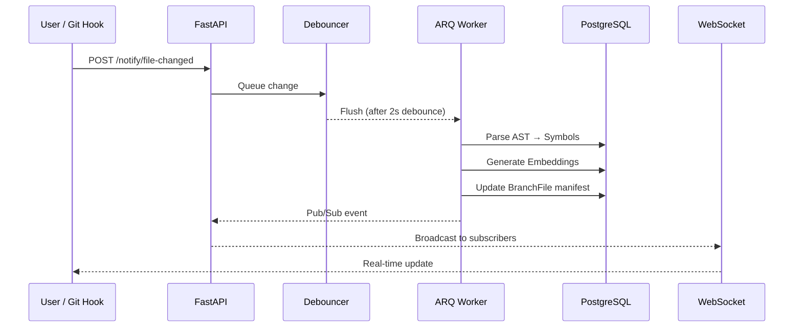
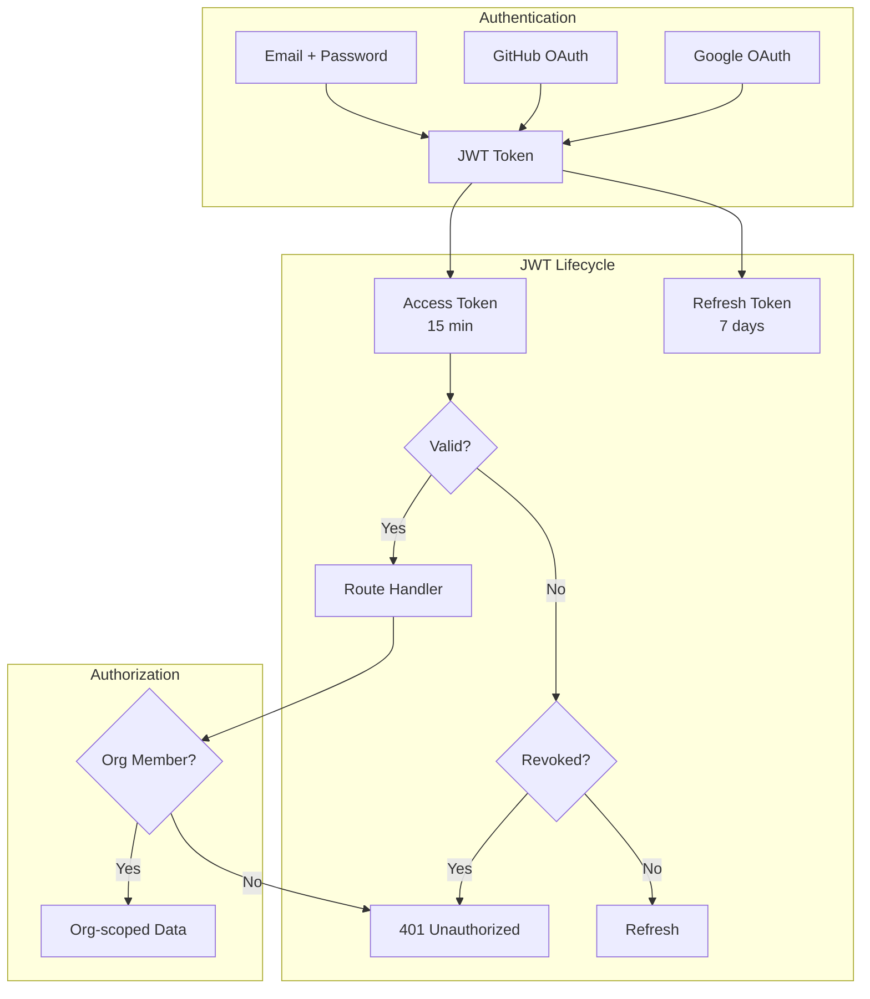
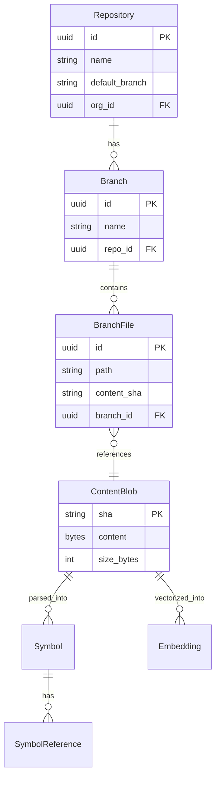

# Architecture v0.2 -- Service Mode

## System Architecture

```mermaid
graph TB
    subgraph Clients
        CLI[CLI / attocode]
        FE[Frontend SPA<br/>React 19 + Vite]
        MCP[MCP Server<br/>27 tools]
    end

    subgraph API["FastAPI Application"]
        AUTH[Auth Middleware<br/>JWT + OAuth]
        ROUTES[24 Route Modules<br/>80 endpoints]
        WS[WebSocket<br/>Pub/Sub]
    end

    subgraph Workers["Background Workers"]
        ARQ[ARQ Worker]
        IDX[Indexer<br/>AST + Embeddings]
        DEB[Debouncer]
    end

    subgraph Storage
        PG[(PostgreSQL<br/>+ pgvector)]
        RD[(Redis<br/>Pub/Sub + Cache)]
        SQ[(SQLite<br/>Local mode)]
    end

    CLI --> AUTH
    FE --> AUTH
    MCP --> AUTH
    AUTH --> ROUTES
    ROUTES --> PG
    ROUTES --> RD
    ROUTES --> WS
    WS --> RD
    ARQ --> PG
    IDX --> PG
    DEB --> ARQ
    CLI -.-> SQ
    MCP -.-> SQ
```

## Dual-Mode Architecture

```mermaid
graph LR
    subgraph "Local Mode (CLI)"
        LC[CLI] --> LP[LocalProvider]
        LP --> LS[(SQLite)]
        LP --> LF[File System]
        LP --> LA[AST Parser]
    end

    subgraph "Service Mode (Multi-user)"
        SC[CLI / Frontend] --> RP[RemoteProvider<br/>HTTP Bridge]
        RP --> API[FastAPI Server]
        API --> DP[DbProvider]
        DP --> SP[(PostgreSQL)]
        DP --> SR[(Redis)]
        API --> WK[ARQ Workers]
    end

    style LC fill:#1e40af,color:#fff
    style SC fill:#1e40af,color:#fff
```

## Data Flow

```mermaid
sequenceDiagram
    participant U as User / Git Hook
    participant API as FastAPI
    participant DEB as Debouncer
    participant W as ARQ Worker
    participant DB as PostgreSQL
    participant WS as WebSocket

    U->>API: POST /notify/file-changed
    API->>DEB: Queue change
    DEB-->>W: Flush (after 2s debounce)
    W->>DB: Parse AST → Symbols
    W->>DB: Generate Embeddings
    W->>DB: Update BranchFile manifest
    W-->>API: Pub/Sub event
    API-->>WS: Broadcast to subscribers
    WS-->>U: Real-time update
```

## Auth Flow

```mermaid
graph TB
    subgraph "Authentication"
        EP[Email + Password] --> JWT[JWT Token]
        GH[GitHub OAuth] --> JWT
        GO[Google OAuth] --> JWT
    end

    subgraph "JWT Lifecycle"
        JWT --> ACC[Access Token<br/>15 min]
        JWT --> REF[Refresh Token<br/>7 days]
        ACC --> VAL{Valid?}
        VAL -->|Yes| ROUTE[Route Handler]
        VAL -->|No| CHK{Revoked?}
        CHK -->|Yes| DENY[401 Unauthorized]
        CHK -->|No| RENEW[Refresh]
    end

    subgraph "Authorization"
        ROUTE --> ORG{Org Member?}
        ORG -->|Yes| DATA[Org-scoped Data]
        ORG -->|No| DENY
    end
```

## Branch Overlay Storage

```mermaid
erDiagram
    Repository ||--o{ Branch : has
    Branch ||--o{ BranchFile : contains
    BranchFile }o--|| ContentBlob : references
    ContentBlob ||--o{ Symbol : parsed_into
    ContentBlob ||--o{ Embedding : vectorized_into
    Symbol ||--o{ SymbolReference : has

    Repository {
        uuid id PK
        string name
        string default_branch
        uuid org_id FK
    }
    Branch {
        uuid id PK
        string name
        uuid repo_id FK
    }
    BranchFile {
        uuid id PK
        string path
        string content_sha
        uuid branch_id FK
    }
    ContentBlob {
        string sha PK
        bytes content
        int size_bytes
    }
```

## MCP Tool Architecture

```mermaid
graph TB
    subgraph "27 MCP Tools"
        B[bootstrap]
        RC[relevant_context]
        SS[semantic_search]
        SC[security_scan]
        SY[symbols]
        DG[dependency_graph]
        IA[impact_analysis]
        CR[cross_references]
        CV[conventions]
        HS[hotspots]
        CD[community_detection]
        FA[file_analysis]
        FR[find_related]
        GQ[graph_query]
        DP[dependencies]
        SM[search_symbols]
        PM[project_summary]
        RM[repo_map]
        RL[recall]
        RE[record_learning]
        LL[list_learnings]
        LF[learning_feedback]
        EC[explore_codebase]
        LD[lsp_definition]
        LH[lsp_hover]
        LR[lsp_references]
        LDG[lsp_diagnostics]
    end

    subgraph "Provider Layer"
        LP[LocalProvider<br/>SQLite + File I/O]
        DBP[DbProvider<br/>PostgreSQL]
        RMP[RemoteProvider<br/>HTTP to Server]
    end

    B & RC & SS & SC --> LP
    B & RC & SS & SC --> DBP
    B & RC & SS & SC --> RMP
```
