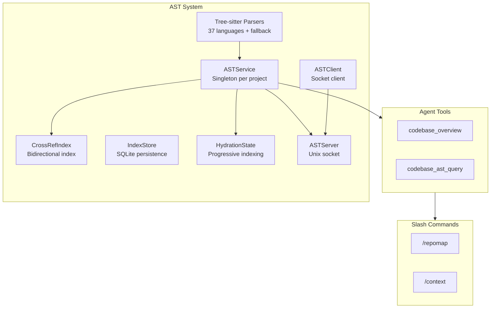
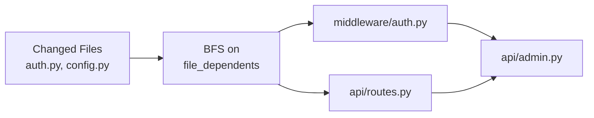

# AST & Code Intelligence

Attocode includes a built-in AST (Abstract Syntax Tree) analysis system that provides symbol indexing, cross-references, impact analysis, and conflict detection. This powers the `codebase_overview` and `codebase_ast_query` tools, the `/repomap` and `/context` slash commands, and the swarm's parallel task safety checks.

## Overview

The AST system provides:

- **Symbol indexing** --- Functions, classes, methods, imports, and variables across your codebase
- **Cross-references** --- Bidirectional mappings between definitions and their references
- **Impact analysis** --- BFS traversal of the dependency graph to find all files affected by a change
- **Conflict detection** --- Identifies overlapping file/symbol/dependency conflicts between parallel tasks
- **Incremental updates** --- Only re-parses files that have changed (mtime-based)
- **Progressive hydration** --- Adaptive tier-based initialization for large repos. Repos with >1K source files use skeleton init (top 200-500 files parsed in <2s), with remaining files hydrated in a background thread. On-demand parsing fills gaps when tools request data not yet indexed.



## Supported Languages (37 with tree-sitter configs)

### Tier 1: Full AST Support (9 languages)

| Language | Extensions | Details |
|----------|-----------|---------|
| Python | `.py`, `.pyi` | Params, decorators, visibility, generators, properties, abstract classes |
| JavaScript | `.js`, `.jsx`, `.mjs` | Functions, classes, methods, imports, decorators |
| TypeScript | `.ts`, `.tsx`, `.mts` | Same as JS plus type annotations |
| Go | `.go` | Functions, methods, types, interfaces, imports |
| Rust | `.rs` | Functions, structs, enums, traits, impl blocks, use declarations |
| Java | `.java` | Methods, constructors, classes, interfaces, enums |
| Ruby | `.rb` | Methods, classes, modules, require/require_relative |
| C | `.c`, `.h` | Functions, structs, enums, unions, #include |
| C++ | `.cpp`, `.hpp`, `.cc`, `.metal` | Functions, classes, structs, namespaces, #include. Metal files parsed via C++ grammar. |

### Tier 2: Good Support (16 languages)

| Language | Extensions | Details |
|----------|-----------|---------|
| C# | `.cs` | Methods, classes, structs, interfaces, using directives |
| PHP | `.php` | Functions, classes, interfaces, traits, namespace use |
| Swift | `.swift` | Functions, init, classes, structs, protocols, extensions |
| Kotlin | `.kt` | Functions, classes, objects, interfaces |
| Scala | `.scala` | Functions, classes, objects, traits |
| Lua | `.lua` | Function declarations (no native classes) |
| Elixir | `.ex`, `.exs` | def/defp/defmacro/defmodule via macro-call handler |
| Haskell | `.hs` | Functions, data types, newtypes, type classes |
| Bash | `.sh`, `.bash` | Function definitions |
| HCL | `.tf`, `.hcl` | Resource/data/module blocks |
| Zig | `.zig` | Functions, structs, enums, unions |

### Tier 3: New in v0.2.6 (11 languages)

| Language | Extensions | Details |
|----------|-----------|---------|
| Erlang | `.erl`, `.hrl` | Function clauses, module attributes |
| Clojure | `.clj`, `.cljs`, `.cljc` | defn/defmulti/defprotocol/defrecord via macro-call handler |
| Perl | `.pl`, `.pm` | Subroutines, package declarations, use/require |
| Crystal | `.cr` | Methods, classes, modules, structs, libs (no grammar available) |
| Dart | `.dart` | Functions, classes, enums, mixins, extensions |
| OCaml | `.ml`, `.mli` | Value definitions, let bindings, type/module/class definitions |
| F# | `.fs`, `.fsi` | Function/value definitions, type/module/namespace definitions |
| Julia | `.jl` | Functions, macros, structs, abstract types, modules |
| Nim | `.nim` | Procs, funcs, methods, templates, macros, type sections |
| R | `.R`, `.r` | Assignment-based function extraction, library/require imports |
| Objective-C | `.m`, `.mm` | Functions, class interfaces/implementations, protocols, methods |

All languages fall back to `tree-sitter-language-pack` when individual grammar packages aren't installed. Languages without tree-sitter support degrade to the generic extractor or `universal-ctags`.

### Language Aliases

Some file extensions are mapped to an existing language parser when the source language is syntactically close:

| Alias Extension | Parsed As | Rationale |
|----------------|-----------|-----------|
| `.metal` (Metal Shading Language) | C++ | MSL is C++14-based with GPU extensions |

Metal files get full C++ symbol extraction (functions, structs, enums, `#include`). Metal-specific constructs (`kernel`, `device`, `threadgroup`, `[[buffer(N)]]`) are parsed as C++ identifiers/attributes --- sufficient for symbol indexing and cross-references. See the [Metal Language Support guide](guides/metal-language-support.md) for details.

## The `codebase_overview` Tool

The agent uses `codebase_overview` for high-level codebase exploration. It has 3 modes:

| Mode | Token Budget | What It Shows |
|------|-------------|---------------|
| `summary` | ~4,000 | File tree with counts, entry points, languages |
| `symbols` (default) | ~12,000 | File tree + exported symbol names per file |
| `full` | Unlimited | Symbol details with params, return types, visibility |

### Parameters

| Parameter | Type | Default | Description |
|-----------|------|---------|-------------|
| `mode` | string | `"symbols"` | `summary`, `symbols`, or `full` |
| `directory` | string | `.` | Filter to a subtree |
| `symbol_type` | string | all | `function`, `class`, `interface`, `type`, `variable`, or `enum` |
| `max_tokens` | int | 10,000 | Cap output size |
| `force_refresh` | bool | false | Re-run file discovery |

### Example Usage

```
# Agent tool call
codebase_overview(mode="symbols", directory="src/auth/")
```

Output is token-aware --- files are dropped when the budget is exhausted, with a `... +N more files` suffix.

## The `codebase_ast_query` Tool

For deeper code intelligence queries, the agent uses `codebase_ast_query` with 8 actions:

| Action | Parameters | Description |
|--------|-----------|-------------|
| `symbols` | `file` | List all symbols in a file |
| `cross_refs` | `symbol` | Find all references/call sites for a symbol |
| `impact` | `files` (comma-separated) | Compute transitive impact set via BFS |
| `search` | `query` | Fuzzy symbol search across codebase |
| `file_tree` | --- | List all indexed files with symbol counts |
| `dependencies` | `file` | Files that a file imports from |
| `dependents` | `file` | Files that import a file |
| `conflicts` | `a_files`, `b_files` | Detect conflicts between two file sets |

### Example Queries

```
# Find all symbols in a file
codebase_ast_query(action="symbols", file="src/auth/login.py")
# Output: auth.login.LoginHandler class (src/auth/login.py:15-89)
#         auth.login.validate_token function (src/auth/login.py:92-110)

# Find all references to a function
codebase_ast_query(action="cross_refs", symbol="validate_token")
# Output: call in src/middleware/auth.py:34
#         import in src/api/routes.py:5

# Impact analysis: what files are affected by changing these?
codebase_ast_query(action="impact", files="src/auth/login.py,src/auth/config.py")
# Output: src/middleware/auth.py
#         src/api/routes.py
#         src/api/admin.py
```

## Cross-Reference Index

The `CrossRefIndex` maintains a bidirectional index with 5 maps:

```
definitions:       qualified_name → [SymbolLocation, ...]
references:        symbol_name → [SymbolRef, ...]
file_symbols:      file_path → {qualified_names...}
file_dependencies: file_path → {imported_files...}
file_dependents:   file_path → {files_that_import_it...}
```

Each `SymbolLocation` records the symbol's name, qualified name, kind (`function`/`class`/`method`), file path, and line range. Each `SymbolRef` records the reference kind (`call`/`import`/`attribute`), file path, and line number.

When a file is edited, `remove_file()` clears all its entries, then `_index_file()` re-adds the new definitions and references. This keeps the index consistent without a full rebuild.

## AST Service

The `ASTService` is a singleton per project (one instance per `root_dir`):

```python
service = ASTService.get_instance("/path/to/project")
```

### Lifecycle

1. **`initialize()`** --- Full scan: discover all files, parse ASTs, build cross-reference index
2. **`notify_file_changed(path)`** --- Incremental update for a single file (handles deletion too)
3. **`refresh()`** --- Detect changed files via mtime and update incrementally

### Key Methods

| Method | Returns | Description |
|--------|---------|-------------|
| `get_file_symbols(path)` | `list[SymbolLocation]` | All symbols in a file |
| `find_symbol(name)` | `list[SymbolLocation]` | Exact or suffix match |
| `get_callers(symbol)` | `list[SymbolRef]` | All call sites/references |
| `get_dependencies(path)` | `set[str]` | Files that `path` imports from |
| `get_dependents(path)` | `set[str]` | Files that import `path` |
| `get_impact(changed)` | `set[str]` | Transitive impact set via BFS |
| `detect_conflicts(a_files, b_files)` | `list[dict]` | Conflict detection for parallel tasks |
| `suggest_related_files(target)` | `list[str]` | Related files (1 hop on dependency graph) |

### Impact Analysis

Impact analysis uses BFS on the reverse dependency graph:



Starting from the changed files, it follows `file_dependents` edges transitively, returning every file that could be affected by the change.

## Client/Server Architecture

For swarm mode, the AST service runs as a Unix socket server so multiple worker agents can share a single index without re-parsing.

### Server

The `ASTServer` listens on `.agent/ast.sock` (or a custom path):

```python
server = ASTServer(ast_service, socket_path=".agent/ast.sock")
await server.start()  # Starts listening
# ... workers connect ...
await server.stop()   # Cleans up socket file
```

### Client

Workers connect via `ASTClient`:

```python
client = ASTClient(".agent/ast.sock", timeout=5.0)
symbols = await client.symbols("src/auth.py")
impact = await client.impact(["src/auth.py", "src/config.py"])
```

### Protocol

Newline-delimited JSON over Unix socket:

```json
// Request
{"method": "symbols", "params": {"file": "src/auth.py"}}

// Response (success)
{"ok": true, "result": [...]}

// Response (error)
{"ok": false, "error": "File not indexed"}
```

Supported methods: `symbols`, `cross_refs`, `impact`, `file_tree`, `search`, `dependencies`, `dependents`.

## Conflict Detection

The swarm uses `detect_conflicts()` to verify that parallel tasks won't step on each other:

```python
conflicts = ast_service.detect_conflicts(
    a_files=["src/auth.py", "src/config.py"],
    b_files=["src/api/routes.py", "src/auth.py"],
)
```

Three conflict kinds:

| Kind | Description | Example |
|------|-------------|---------|
| `direct` | Same file in both sets | Both tasks modify `src/auth.py` |
| `symbol` | Shared symbols across files | Task A modifies `validate_token` in `auth.py`, Task B calls it in `routes.py` |
| `dependency` | Import relationship between file sets | Task A modifies `config.py`, Task B imports from `config.py` |

## `/repomap` and `/context` Commands

### `/repomap`

```
/repomap             # Summary view (default)
/repomap symbols     # Show symbol index per file
/repomap deps        # Show dependency graph
/repomap analyze     # Full analysis with hub scoring
```

The `analyze` mode identifies central files based on incoming dependency edges (hub scoring), helping the agent understand which files are most connected.

### `/context`

```
/context             # Show current context blocks with priorities
```

Displays active context blocks (system prompt, goal recitation, failure evidence, file context) with their priority levels and estimated token counts.

## MCP Server for External Tools

The `attocode-code-intel` entry point exposes Attocode's AST and code intelligence system as an [MCP (Model Context Protocol)](https://modelcontextprotocol.io/) server. This lets any MCP-compatible AI coding assistant --- Claude Code, Cursor, Windsurf, Codex, etc. --- use Attocode's code understanding capabilities without running the full agent.

### Quick Install

```bash
# Install attocode first
uv tool install attocode
# or: pip install attocode

# Then install the MCP server into your tool of choice
attocode code-intel install claude           # Claude Code (project-level)
attocode code-intel install claude --global  # Claude Code (user-level)
attocode code-intel install cursor           # Cursor
attocode code-intel install windsurf         # Windsurf
attocode code-intel install vscode           # VS Code / GitHub Copilot
attocode code-intel install codex            # OpenAI Codex CLI
attocode code-intel install codex --global   # Codex (user-level)
attocode code-intel install claude-desktop   # Claude Desktop
attocode code-intel install cline            # Cline (VS Code extension)
attocode code-intel install zed              # Zed (project-level)
attocode code-intel install zed --global     # Zed (user-level)
attocode code-intel install intellij         # IntelliJ (prints manual steps)
attocode code-intel install opencode         # OpenCode (prints manual steps)
```

### Installation Targets

| Target | Command | Config File | Format |
|--------|---------|------------|--------|
| Claude Code | `install claude` | Via `claude mcp add` CLI | N/A (managed) |
| Cursor | `install cursor` | `.cursor/mcp.json` | JSON |
| Windsurf | `install windsurf` | `.windsurf/mcp.json` | JSON |
| VS Code | `install vscode` | `.vscode/mcp.json` | JSON |
| Codex | `install codex` | `.codex/config.toml` | TOML |
| Claude Desktop | `install claude-desktop` | `~/Library/.../claude_desktop_config.json` | JSON |
| Cline | `install cline` | VS Code globalStorage `cline_mcp_settings.json` | JSON |
| Zed | `install zed` | `.zed/settings.json` | JSON (`context_servers`) |
| IntelliJ | `install intellij` | N/A (manual setup) | --- |
| OpenCode | `install opencode` | N/A (manual setup) | --- |

All targets support `--project <path>` to specify the project directory (defaults to `.`). Claude Code, Codex, and Zed support `--global` for user-level installation.

For Codex, `install codex --global` now writes a repo-agnostic entry by default: it omits `--project` and starts the MCP server in `--local-only` mode so the active workspace is indexed locally instead of auto-loading any repo-level remote config. Use `--project <path>` with `--global` if you intentionally want to pin a single repository.

> **Note:** IntelliJ and OpenCode do not support file-based MCP configuration. Running `install intellij` or `install opencode` prints step-by-step manual setup instructions instead.

### Available Tools

The MCP server exposes 27 tools across 6 categories:

#### Orientation

| Tool | Parameters | Description |
|------|-----------|-------------|
| `bootstrap` | `task_hint`, `max_tokens` | All-in-one codebase orientation (summary + map + conventions + search) |
| `project_summary` | `max_tokens` | High-level project overview (languages, structure, entry points) |
| `repo_map` | `include_symbols`, `max_tokens` | Token-budgeted file tree with top-level symbols |
| `explore_codebase` | `path`, `max_items`, `importance_threshold` | Hierarchical drill-down navigation |
| `hotspots` | `top_n` | Risk/complexity analysis with percentile-ranked hotspots |
| `conventions` | `sample_size`, `path` | Code style and convention detection (naming, typing, patterns) |

#### Symbol Lookup

| Tool | Parameters | Description |
|------|-----------|-------------|
| `symbols` | `path` | List all symbols (functions, classes, methods) in a file |
| `search_symbols` | `name` | Fuzzy symbol search across the entire codebase |
| `cross_references` | `symbol_name` | Find where a symbol is defined and all its usage sites |
| `file_analysis` | `path` | Detailed single-file analysis: chunks, imports, exports |

#### Dependencies & Graph

| Tool | Parameters | Description |
|------|-----------|-------------|
| `dependencies` | `path` | Show what a file imports from and what imports it |
| `dependency_graph` | `start_file`, `depth` | Dependency graph radiating outward from a file |
| `graph_query` | `file`, `edge_type`, `direction`, `depth` | BFS traversal with typed edges and direction control |
| `find_related` | `file`, `top_k` | Find structurally similar files (Jaccard + 2-hop) |
| `community_detection` | `min_community_size`, `max_communities` | Connected-component clustering of the import graph |
| `impact_analysis` | `changed_files` | Transitive impact set via BFS on reverse dependency graph |
| `relevant_context` | `files`, `depth`, `max_tokens`, `include_symbols` | Subgraph capsule --- file + neighbors with symbols |

#### Search & Security

| Tool | Parameters | Description |
|------|-----------|-------------|
| `semantic_search` | `query`, `top_k`, `file_filter` | Natural language code search (vector + keyword RRF) |
| `security_scan` | `mode`, `path` | Secret detection, anti-patterns, dependency issues |

#### LSP

| Tool | Parameters | Description |
|------|-----------|-------------|
| `lsp_definition` | `file`, `line`, `col` | Type-resolved go-to-definition |
| `lsp_references` | `file`, `line`, `col`, `include_declaration` | All references with type awareness |
| `lsp_hover` | `file`, `line`, `col` | Type signature + documentation |
| `lsp_diagnostics` | `file` | Errors and warnings from language server |

#### Memory & Recall

| Tool | Parameters | Description |
|------|-----------|-------------|
| `recall` | `query`, `scope`, `max_results` | Retrieve relevant project learnings |
| `record_learning` | `type`, `description`, `details`, `scope`, `confidence` | Record patterns/conventions/gotchas |
| `learning_feedback` | `learning_id`, `helpful` | Mark learning as helpful/unhelpful |
| `list_learnings` | `status`, `type`, `scope` | Browse all stored learnings |

#### Index Maintenance

| Tool | Parameters | Description |
|------|-----------|-------------|
| `notify_file_changed` | `files` | Trigger index update for changed files |

### CLI Reference

```bash
# Install MCP server into a target
attocode code-intel install <target> [--project <path>] [--global]

# Remove MCP server from a target
attocode code-intel uninstall <target>

# Run the MCP server directly (stdio transport)
attocode code-intel serve [--project <path>]

# Check installation status across all targets
attocode code-intel status
```

### Checking Status

```bash
$ attocode code-intel status
attocode-code-intel status:

  Claude Code: installed
  Cursor: not installed
  Windsurf: not installed
  Codex: installed (user)

  Entry point: attocode-code-intel (on PATH)
```

### Direct Usage

If you want to run the server manually (e.g. for debugging or custom integrations):

```bash
# Via entry point
attocode-code-intel --project /path/to/repo

# Via Python module
python -m attocode.code_intel.server --project /path/to/repo
```

The server uses stdio transport and speaks the MCP protocol. Any MCP client can connect to it.

## HTTP API

The same 27 tools are also available as a REST API over HTTP, supporting multi-project management, bearer token authentication, and interactive Swagger/ReDoc docs.

```bash
# Start the HTTP server
attocode code-intel serve --transport http --project /path/to/repo

# Open http://localhost:8080/docs for Swagger UI
```

For the full endpoint reference, authentication setup, Docker deployment, and client examples, see the dedicated **[Code Intel HTTP API](code-intel-http-api.md)** page.

## Docker Deployment

A Docker setup is provided in `docker/code-intel/` for containerized deployment of the HTTP API:

```bash
cd docker/code-intel
PROJECT_DIR=/path/to/repo docker-compose up --build
```

Your source code is mounted read-only; cache databases persist in a named volume. See **[Code Intel HTTP API --- Docker Deployment](code-intel-http-api.md#docker-deployment)** for details.

## Related Pages

- [Code Intel HTTP API](code-intel-http-api.md) --- REST endpoints, auth, Docker, client examples
- [Context Engineering](context-engineering.md) --- How context blocks and code context work together
- [Architecture](ARCHITECTURE.md) --- Overall system design
- [Extending Attocode](extending.md) --- Adding custom tools
