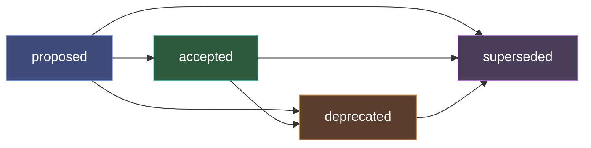

# Architecture Decision Records

Architecture Decision Records (ADRs) capture significant design choices that affect the codebase structure, technology selections, or cross-cutting concerns. The ADR system provides four MCP tools for recording, browsing, and managing the lifecycle of decisions.

ADRs are stored in a SQLite database at `.attocode/adrs.db` and persist across sessions.

## Tools

| Tool | Description |
|------|-------------|
| `record_adr` | Record a new architecture decision |
| `list_adrs` | List and filter existing ADRs |
| `get_adr` | Get full details of a specific ADR |
| `update_adr_status` | Update an ADR's status with lifecycle validation |

## Recording a Decision

Use `record_adr` when making significant design choices. Each ADR captures the context (why), decision (what), and consequences (trade-offs).

```
record_adr(
    title="Use SQLite for local storage",
    context="We need persistent storage for code-intel data in CLI mode. Options considered: SQLite, LevelDB, plain JSON files. SQLite offers ACID transactions, SQL queries, and zero-config deployment.",
    decision="Use SQLite with WAL mode for all local persistence (AST cache, embeddings, ADRs, learnings). One database per concern to avoid lock contention.",
    consequences="Adds ~1MB binary dependency. Limits concurrent write throughput to single-writer. WAL mode mitigates read contention. Migration story is straightforward with schema versioning.",
    related_files=["src/code_intel/storage/", "src/persistence/"],
    tags=["database", "architecture"]
)
```

Output:

```
Recorded ADR #1: Use SQLite for local storage
Status: proposed
Use `update_adr_status` to accept, deprecate, or supersede this decision.
```

### Fields

| Field | Required | Description |
|-------|----------|-------------|
| `title` | Yes | Short title for the decision |
| `context` | Yes | What is the issue or problem motivating this decision? |
| `decision` | Yes | What is the change being proposed or decided? |
| `consequences` | No | What are the trade-offs and implications? |
| `related_files` | No | List of file paths affected by this decision |
| `tags` | No | List of tags for categorization |

All new ADRs start with status `proposed`.

## Listing ADRs

Browse recorded ADRs with optional filtering:

```
list_adrs()
list_adrs(status="accepted")
list_adrs(tag="database")
list_adrs(search="storage")
```

Output:

```
## Architecture Decision Records (3 total)

| # | Title                              | Status   | Tags                  | Created    |
|---|------------------------------------|----------|-----------------------|------------|
| 3 | Migrate to pgvector for embeddings | proposed | database, embeddings  | 2026-03-20 |
| 2 | Use JWT for API authentication     | accepted | security, api         | 2026-03-15 |
| 1 | Use SQLite for local storage       | accepted | database, architecture| 2026-03-10 |
```

### Filter Parameters

| Parameter | Description |
|-----------|-------------|
| `status` | Filter by status: `proposed`, `accepted`, `deprecated`, `superseded` |
| `tag` | Filter by tag (matches any tag in the list) |
| `search` | Free text search across title, context, and decision |

## Getting ADR Details

Retrieve the full content of a specific ADR:

```
get_adr(number=1)
```

Output:

```markdown
# ADR #1: Use SQLite for local storage

**Status:** accepted
**Created:** 2026-03-10T14:30:00Z
**Updated:** 2026-03-12T09:15:00Z
**Tags:** database, architecture

## Context

We need persistent storage for code-intel data in CLI mode. Options
considered: SQLite, LevelDB, plain JSON files. SQLite offers ACID
transactions, SQL queries, and zero-config deployment.

## Decision

Use SQLite with WAL mode for all local persistence (AST cache, embeddings,
ADRs, learnings). One database per concern to avoid lock contention.

## Consequences

Adds ~1MB binary dependency. Limits concurrent write throughput to
single-writer. WAL mode mitigates read contention. Migration story is
straightforward with schema versioning.

## Related Files

- `src/code_intel/storage/`
- `src/persistence/`
```

## Updating Status

ADRs follow a defined lifecycle with validated transitions:



### Valid Transitions

| From | To |
|------|----|
| `proposed` | `accepted`, `deprecated`, `superseded` |
| `accepted` | `deprecated`, `superseded` |
| `deprecated` | `superseded` |
| `superseded` | (terminal --- no further transitions) |

### Examples

**Accept a decision:**

```
update_adr_status(number=1, status="accepted")
```

Output: `ADR #1 status updated to 'accepted'.`

**Supersede a decision** (requires pointing to the replacement ADR):

```
update_adr_status(number=1, status="superseded", superseded_by=3)
```

Output: `ADR #1 status updated to 'superseded'. Superseded by ADR #3.`

**Invalid transitions are rejected:**

```
update_adr_status(number=1, status="proposed")
# Error: Cannot transition ADR #1 from 'accepted' to 'proposed'. Allowed transitions: ['deprecated', 'superseded']

update_adr_status(number=2, status="superseded")
# Error: Must provide 'superseded_by' ADR number when setting status to 'superseded'
```

## Workflow Example

A typical ADR workflow during development:

```
# 1. Propose a decision while working on a feature
record_adr(
    title="Use WebSocket for real-time file events",
    context="The notify endpoint uses polling. We need real-time updates for the TUI dashboard and browser frontend.",
    decision="Add WebSocket endpoint at /ws/repos/{repo_id}/events with Redis pub/sub backend. Support reconnection via last_event_id.",
    consequences="Adds WebSocket dependency. Requires Redis for cross-process fan-out. Increases connection count per client.",
    tags=["api", "real-time"]
)

# 2. After team review, accept the decision
update_adr_status(number=4, status="accepted")

# 3. Months later, when replacing with SSE
record_adr(
    title="Replace WebSocket with Server-Sent Events for notifications",
    context="WebSocket connections are unreliable through corporate proxies. SSE is simpler, HTTP-native, and auto-reconnects.",
    decision="Replace /ws/ endpoint with SSE at /api/v2/events/stream. Keep Redis pub/sub backend. Use Last-Event-ID header for resume.",
    tags=["api", "real-time"]
)

# 4. Mark the old decision as superseded
update_adr_status(number=4, status="superseded", superseded_by=5)

# 5. Review history
list_adrs(tag="real-time")
```
