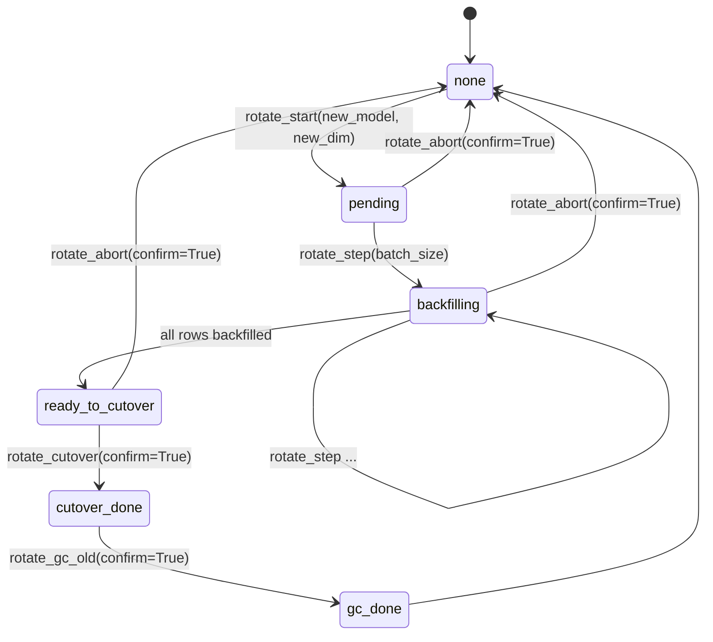

# Code-Intel Reproducibility & State Tracking

The Code-Intel subsystem persists a lot of state — symbol indexes, embedding
vectors, trigram shards, learnings, ADRs, frecency counters, query history —
and most of it gets rebuilt incrementally on every file change. That's great
for speed but terrible for reproducibility: two identical queries can return
different results if a background reindex fires in between, an embedding
model swap can silently wipe vectors, and there's no portable way to share
the state of `.attocode/` with a teammate.

This guide covers the **reproducibility & state-tracking** surface that
fixes those problems: retrieval pins, portable snapshots, named overlays,
embedding rotation, and the maintenance / GC / verify tools that sit
behind them.

!!! info "When to read this guide"
    - You want deterministic RAG across agent sessions.
    - You're switching embedding models and don't want to lose old vectors.
    - You're debugging why `semantic_search` returned different results for
      the same query an hour apart.
    - You want to snapshot `.attocode/` and hand the bundle to a teammate
      or restore it on a different machine.
    - You're rebuilding a broken cache and want to do it surgically instead
      of `rm -rf .attocode/`.

## Three interface layers

Every reproducibility feature is reachable from **three** places. You pick
the one that matches how you're already invoking code-intel.

| Layer | Who uses it | How to invoke |
|---|---|---|
| **stdio MCP tools** | Claude Code, Cursor, Windsurf, any MCP client | `mcp__attocode-code-intel__pin_current`, etc. |
| **HTTP API** | Service-mode deployments, CI, custom integrations | `POST /api/v1/orgs/{org_id}/repos/{repo_id}/snapshots` |
| **CLI subcommands** | Shell scripts, cron, operators | `attocode-code-intel gc`, `attocode-code-intel verify` |

The stdio layer is the most complete (every reproducibility tool is
exposed there). The HTTP layer ships a smaller subset focused on snapshots,
GC, and pin fields on search responses. The CLI layer covers just the three
ops commands (`gc`, `verify`, `reindex`) — pin/snapshot/overlay/rotate are
MCP-only for now.

Source registrations: `src/attocode/code_intel/server.py` lines 577–584
wire the new MCP tools into the stdio server. HTTP routes live under
`src/attocode/code_intel/api/routes/`. CLI dispatch is in
`src/attocode/code_intel/cli.py`.

---

## Retrieval pins

A **retrieval pin** is a content-addressed snapshot of every local store's
manifest hash (symbols, embeddings, learnings, ADRs, trigrams, etc.) at one
moment in time. You mint a pin, run a query, and later verify whether the
state has drifted. If it hasn't, re-running the query is guaranteed to
produce the same ranked results — that's the whole point.

Pins are deterministic. Two calls to `pin_current` on unchanged state yield
the **same** `pin_id`, so there's no churn from repeat pinning. The pin id
is derived from a SHA-256 of the manifest: `pin_<first 20 hex chars>`.

### Automatic footer on every ranked-result tool

You don't usually call `pin_current` yourself. Every ranked-result MCP tool
(`semantic_search`, `fast_search`, `regex_search`, `repo_map`,
`repo_map_ranked`, `symbols`, `search_symbols`, `cross_mode_search`,
`frecency_search`, `get_top_results_for_query`, …) automatically appends an
`index_pin` footer via the `@pin_stamped` decorator in
`src/attocode/code_intel/tools/pin_tools.py`:

```
<normal search result body>

---
index_pin: pin_1f9a2b3c4d5e6f708192
manifest_hash: 1f9a2b3c4d5e6f708192a3b4c5d6e7f809102132435465768796a7b8c9d0e1f2
```

Both the short `pin_id` and the full 64-char `manifest_hash` are printed so
you can hand-verify a pin without round-tripping through `pin_resolve`.

### The five explicit pin tools

| Tool | Signature | What it does |
|---|---|---|
| `pin_current` | `ttl_seconds: int = 86400` | Mint a fresh pin of the current state. Default TTL 24h; pass `0` to never expire. |
| `pin_resolve` | `pin_id: str` | Look up a previously-minted pin and return its full per-store hash manifest. |
| `pin_list` | — | List all active pins, most recent first. Expired pins are GC'd on read. |
| `pin_delete` | `pin_id: str` | Drop one pin. Idempotent. |
| `verify_pin` | `pin_id: str` | Compare a pin's recorded state to current state. Returns a drift report (pinned vs current hash per store). |

All five live in `src/attocode/code_intel/tools/pin_tools.py`. The pure
helpers (hashing, PinStore) live in
`src/attocode/code_intel/tools/pin_store.py`, which is intentionally
MCP-runtime-free so HTTP providers can use it without importing `mcp`.

### Where pins are persisted

`.attocode/cache/pins.db` — a small SQLite table keyed by `pin_id`, with
`manifest_hash`, `manifest_json`, `created_at`, `expires_at`. Populated
both by explicit `pin_current` calls and by every ranked-result tool via
`_stamp_pin`. Multi-project interpreters cache one `PinStore` instance per
absolute project directory, so a single HTTP server serving multiple
projects doesn't cross-contaminate pins.

### Common failure modes

- **"No pin with id pin_xxx"** — the pin was never persisted (expired, or a
  stale `pin_id` from a pre-Phase-3a fix code path). Mint a new one with
  `pin_current`.
- **Drift report on an untouched repo** — the auto-indexer wrote to a store
  after your pin was minted but before you called `verify_pin`. Either pin
  from a known-quiet state, or use the pin against a snapshot (below).
- **`pin_id` returned but `manifest_hash` is 64 zero chars** — the manifest
  computation swallowed an exception (usually a locked SQLite file). Check
  the attocode-code-intel logs and retry.

---

## Snapshots

A snapshot is a **single tarball** under `.attocode/snapshots/` that bundles
every SQLite store plus the trigram binary files into one portable file.
You can copy that file to another machine and restore it with one tool
call — the underlying indexes come back exactly as they were.

The archive format is `<name>.atsnap.tar.gz`. Inside:

```
manifest.json           # atto.snapshot.v1 format, SHA-256 per component
cache_manifest.json     # the project's current cache_manifest.json at snapshot time
stores/
  symbols.db            # live-consistent SQLite backup of .attocode/index/symbols.db
  embeddings.db         # ... of .attocode/vectors/embeddings.db
  kw_index.db           # ... of .attocode/index/kw_index.db
  memory.db             # ... of .attocode/cache/memory.db (learnings)
  adrs.db               # ... of .attocode/adrs.db
  frecency.db           # ... of .attocode/frecency/frecency.db
  query_history.db      # ... of .attocode/query_history/query_history.db
  trigrams.lookup       # raw binary files (no SQLite backup dance)
  trigrams.postings
  trigrams.db
```

SQLite stores are copied via the **live backup API** — safe to run while
the stores are open for reads and writes. Binary trigram files are copied
as-is. See `src/attocode/code_intel/tools/snapshot_tools.py` for the
capture logic (`_stage_snapshot`, `_SQLITE_STORES`, `_BINARY_FILES`).

### The five snapshot tools

| Tool | Signature | What it does |
|---|---|---|
| `snapshot_create` | `name: str = ""`, `include: str = ""` | Bundle current state into `.attocode/snapshots/<name>.atsnap.tar.gz`. Empty `name` = timestamp. `include` = comma-separated component names (e.g. `"symbols,embeddings,trigrams"`), empty = everything. |
| `snapshot_list` | — | List snapshots with size + mtime. |
| `snapshot_delete` | `name: str`, `confirm: bool = False` | Delete a snapshot. `confirm=False` = dry run preview. |
| `snapshot_restore` | `name: str`, `confirm: bool = False` | Restore a snapshot into `.attocode/`. Atomic `.attocode.staging/` → `rename` dance. Verifies component SHA-256 digests before applying. `confirm=False` = dry run preview. |
| `snapshot_diff` | `a: str`, `b: str` | Compare two snapshots at the component-digest level. Shows which stores changed. |

### Manifest format

The `manifest.json` at the archive root follows the `atto.snapshot.v1`
schema (see `MANIFEST_SCHEMA_VERSION` at the top of `snapshot_tools.py`):

```json
{
  "schema": "atto.snapshot.v1",
  "schema_version": 1,
  "name": "baseline",
  "created_at": "2026-04-11T00:35:17Z",
  "project_name": "first-principles-agent",
  "components": [
    {
      "name": "symbols",
      "archive_path": "stores/symbols.db",
      "digest": "sha256:1f9a...e1f2",
      "size_bytes": 32784384,
      "extra": {"schema_version": "2"}
    },
    ...
  ],
  "total_size_bytes": 78123456
}
```

Phase 3a's round-2 fix (Codex m2) made the manifest **portable**: it stores
only the project's basename in `project_name`, never the absolute path. This
means a snapshot from `/Users/alice/repo` can be safely shared with
`/home/bob/repo` without leaking workstation layout.

### Audit log

Every `create` / `restore` / `delete` event appends one JSONL line to
`.attocode/cache/snapshot_events.jsonl`. The log is best-effort — a broken
audit path never blocks a successful snapshot operation — but in practice
it gives you a clean "who snapshotted what, when" trail for local debugging.
The server side writes the equivalent rows to the `audit_events` table via
the HTTP API.

### Common failure modes

- **"nothing to snapshot (no components matched include=…)"** — your
  `include` filter didn't match any of the known component names. Check
  the source module for the exact names (`symbols`, `embeddings`,
  `kw_index`, `learnings`, `adrs`, `frecency`, `query_history`,
  `trigrams`).
- **Digest mismatch during restore** — the archive was corrupted in
  transit. Re-download and retry. Restore aborts before touching
  `.attocode/` so there's no partial state to clean up.
- **`snapshot_delete` with `confirm=False` returns a preview but doesn't
  delete** — that's the expected dry-run behavior. Pass `confirm=True` to
  actually delete.

---

## Named overlays

Overlays are the **live-mounted** cousin of snapshots. Where a snapshot is
a cold, portable archive, an overlay is a directory under
`.attocode/overlays/<name>/` that holds SQLite backups + trigram files, and
you can `overlay_activate` it to swap the live `.attocode/` state over to
that overlay.

Use case: you want to keep a "known-good baseline" of your indexes around
while you experiment. Or you're switching between feature branches that
have different symbol layouts and don't want to reindex on every switch.

### The five overlay tools

| Tool | Signature | What it does |
|---|---|---|
| `overlay_create` | `name: str`, `description: str = ""` | Capture current state into `.attocode/overlays/<name>/`. |
| `overlay_list` | — | List all overlays with creation time, description, and source hash. |
| `overlay_status` | — | Show which overlay is currently marked active (or "base" = live state). |
| `overlay_activate` | `name: str`, `save_current_as: str = ""`, `confirm: bool = False` | Swap `.attocode/` to use overlay `name`. If `save_current_as` is non-empty, the current state is first saved as that overlay, so the switch is reversible. `confirm=False` = dry run. |
| `overlay_delete` | `name: str`, `confirm: bool = False` | Remove a named overlay directory. |

Implementation: `src/attocode/code_intel/tools/overlay_tools.py`.

### Overlays vs snapshots — which to use

| | Overlays | Snapshots |
|---|---|---|
| **Format** | Directory under `.attocode/overlays/<name>/` | Single `.atsnap.tar.gz` file |
| **Portability** | Local machine only (could be copied with `rsync` but not designed for it) | Fully portable — copy the tarball anywhere |
| **Activation** | `overlay_activate` mounts it as the live state | `snapshot_restore` extracts it into `.attocode/` |
| **Ownership model** | In-place, no extraction step | Archive stays untouched after restore |
| **Use when** | You switch between known working sets in one machine | You share state with teammates or back up across machines |

In practice: use overlays during day-to-day branch switching on one machine,
use snapshots for portability and long-term archival.

---

## Clear / reset

The 8 `clear_*` tools let you wipe individual stores surgically instead of
nuking `.attocode/` whole. Every clear tool follows the same **confirm
pattern**: the default `confirm=False` shows a preview (row count, file
size) without touching anything. You have to pass `confirm=True` to
actually wipe.

| Tool | Signature | Clears |
|---|---|---|
| `clear_symbols` | `confirm: bool = False` | `.attocode/index/symbols.db` |
| `clear_embeddings` | `confirm: bool = False`, `model: str = ""` | `.attocode/vectors/embeddings.db`. With `model="bge"`, only rows for that model are deleted (the rest stay intact). |
| `clear_trigrams` | `confirm: bool = False` | The three trigram files under `.attocode/index/` |
| `clear_kw_index` | `confirm: bool = False` | `.attocode/index/kw_index.db` |
| `clear_learnings` | `confirm: bool = False`, `status_filter: str = "archived"` | `.attocode/cache/memory.db` — by default only `status='archived'` learnings. Pass `status_filter=""` to clear all. |
| `clear_adrs` | `confirm: bool = False`, `status_filter: str = "superseded"` | `.attocode/adrs.db` — by default only `status='superseded'` ADRs. |
| `clear_all` | `confirm: bool = False`, `except_stores: str = ""` | Fan-out to every clear_* tool. `except_stores="learnings,adrs"` preserves those. |
| `cas_clear` | `confirm: bool = False`, `artifact_types: str = ""` | Server-side CAS entries (used when attocode runs in service mode). |

All live in `src/attocode/code_intel/tools/maintenance_tools.py`.

**Why not just `rm -rf .attocode/`?** Three reasons:

1. You lose durable state — learnings, ADRs, query history, frecency
   counters — that took real work to build up. The `clear_*` tools let you
   wipe exactly the regenerable parts (symbols, embeddings, trigrams) and
   keep the durable ones.
2. You lose the in-flight state — if the MCP server was open, `rm -rf`
   corrupts its open SQLite handles. The clear tools run cleanly against a
   live server.
3. You skip the dry-run safety net — every clear tool previews what it
   would delete before `confirm=True` flips the switch.

---

## Status & verify

Three read-only tools tell you what `.attocode/` looks like without
shelling out to `find` + `sqlite3`:

| Tool | Signature | What it reports |
|---|---|---|
| `cache_status_all` | — | One row per store: path, size, schema version, row count, manifest hash. The single best "what do I have?" starting point. |
| `embeddings_status` | — | Detailed vector store status: model name/version/dimension, coverage, drift warnings, degraded-mode detection (e.g. provider dim ≠ stored dim). Use this to diagnose `semantic_search` silently returning stale results. |
| `verify_all_caches` | `deep: bool = False` | Walk every store and check schema version + basic sanity. With `deep=True`, also runs per-store integrity checks (SQLite `PRAGMA integrity_check`, trigram shard CRC). |
| `migrate_cache` | `dry_run: bool = True`, `resume: bool = True` | Backfill provenance columns on legacy rows and write/update `cache_manifest.json`. Idempotent, resumable. |

All in `src/attocode/code_intel/tools/maintenance_tools.py`.

**Dimension-mismatch degradation** is the sharpest edge the status tools
help you catch. Before Phase 1 shipped, swapping embedding models would
silently wipe the `vectors` column because `ensure_vector_column()` called
`UPDATE embeddings SET vector = NULL`. Now it raises
`EmbeddingDimensionMismatchError`, `embeddings_status` reports
`degraded_reason="dimension_mismatch"`, and `semantic_search` falls back to
BM25 keyword mode until you run `embeddings_rotate_*` (below) to migrate.

---

## GC & orphan scan

Garbage collection at the local level is different from server-side GC.
Locally, the only "unreferenced" entity that accumulates is the shared
content-addressable cache (CAS), which lives under
`~/.cache/attocode/cas/` and is shared across projects.

| Tool | Signature | What it does |
|---|---|---|
| `gc_preview` | `min_age_days: float = 7.0` | Preview CAS entries older than 7 days that are candidates for GC. Non-destructive. |
| `gc_run` | `min_age_days: float = 30.0`, `confirm: bool = False` | Actually delete orphaned CAS entries. `confirm=False` = dry run. |
| `orphan_scan` | `auto_archive: bool = False` | Find learnings / ADRs whose referenced blob/tree is no longer reachable (the file moved or was deleted). With `auto_archive=True`, orphaned learnings are set to `status='archived'` — **not** hard-deleted, so you can inspect them later. |

Age gates (`min_age_days`) prevent GC from clobbering recently-written
entries that a long-running session might still reference. The 7-day
preview default is friendly; the 30-day apply default is conservative.

### Server-side GC (HTTP only)

On the service side, GC is repo-scoped. See the **[HTTP API section](#http-api-equivalents)**
below for the `POST /api/v1/orgs/{org_id}/repos/{repo_id}/gc` endpoint.
The important invariant is that server GC **is repo-scoped** — a previous
bug let `DELETE`s from `gc_unreferenced` / `gc_orphaned` escape their repo
boundary because the queries were global. Phase 3a-fix Batch A gated every
delete on `branches.repo_id` via a JOIN through `branch_files`. See
`src/attocode/code_intel/storage/content_store.py::gc_unreferenced` and
`src/attocode/code_intel/storage/embedding_store.py::gc_orphaned`.

---

## Embedding rotation

Swapping embedding models (e.g. `all-MiniLM-L6-v2` → `bge-base-en-v1.5`)
used to be a hazard: different models produce different-dimension vectors,
and the old code would silently wipe the stored column. Phase 2b ships a
proper **state machine** so you can rotate in-place without data loss:



During rotation, a `vectors_rotating` staging table holds the new-model
vectors. The primary `vectors` table is **not touched** until cutover.
Writes to the primary table are refused with
`VectorStoreRotationActiveError` for the duration of the rotation, so a
mid-flight reindex can't race and leave half the corpus stranded.

### The six rotation tools

| Tool | Signature | What it does |
|---|---|---|
| `embeddings_rotate_start` | `new_model: str`, `new_version: str = ""`, `new_dim: int = 0` | Begin rotating to a new model. Loads the provider up-front to fail fast if it's not importable. `new_dim=0` queries the provider's `dimension()`. |
| `embeddings_rotate_status` | — | Report current rotation state or `none`. |
| `embeddings_rotate_step` | `batch_size: int = 32`, `max_batches: int = 1` | Process one or more backfill batches. Idempotent — resumable after interrupt. |
| `embeddings_rotate_cutover` | `confirm: bool = False` | Atomically swap `vectors` ↔ `vectors_rotating`. Requires state = `ready_to_cutover`. |
| `embeddings_rotate_gc_old` | `confirm: bool = False` | Drop the archived old-model vectors table and clear rotation state. |
| `embeddings_rotate_abort` | `confirm: bool = False` | Cancel a pre-cutover rotation. Deletes staging data only; the primary `vectors` table is untouched. |

All in `src/attocode/code_intel/tools/maintenance_tools.py`. The underlying
state machine lives in
`src/attocode/code_intel/integrations/context/embedding_rotation.py`.

### Cache invalidation across processes

When a rotation cutover completes in one process, other already-open
`VectorStore` instances need to know the schema changed. Phase 3a-fix Batch
B added a lightweight protocol: every `search()` call reads the
`_rotator_cache_ver` row from `store_metadata` and bumps its local
`_vec_cache_version` if the value has changed. Cheap one-row SELECT; no
polling loop.

### Common failure modes

- **"provider for 'xxx' not available"** — you haven't installed the extras
  for that embedding model. `uv sync --extra semantic-nomic` or similar.
- **"rotate_cutover: state is backfilling, not ready_to_cutover"** — more
  batches remain. Call `embeddings_rotate_step` until the state advances.
- **`VectorStoreRotationActiveError` during an unrelated indexing run** —
  expected behavior. Either wait for the rotation to finish or call
  `embeddings_rotate_abort` if you want to cancel.

---

## HTTP API equivalents

Phase 3a shipped the server-side half: snapshot CRUD, GC, and pin fields on
search responses. All routes follow the existing `/api/v1/orgs/{org_id}/...`
membership pattern.

### Snapshot routes

| Method | Path | Auth | Purpose |
|---|---|---|---|
| `POST` | `/api/v1/orgs/{org_id}/repos/{repo_id}/snapshots` | admin | Create a content-addressed snapshot record. Body: `name`, `description`, `branch`, `commit_oid`, `dry_run`. |
| `GET` | `/api/v1/orgs/{org_id}/repos/{repo_id}/snapshots` | member | List snapshots (paginated: `limit`, `offset`). |
| `GET` | `/api/v1/orgs/{org_id}/repos/{repo_id}/snapshots/{snapshot_id}` | member | Fetch one snapshot with its full component list. |
| `DELETE` | `/api/v1/orgs/{org_id}/repos/{repo_id}/snapshots/{snapshot_id}` | admin | Delete a snapshot record. |

Implementation: `src/attocode/code_intel/api/routes/snapshots.py`. Database
tables: `repo_snapshots`, `repo_snapshot_components` (migration 018).

**Phase 3a limitation:** these routes describe the state but do **not yet**
materialize a downloadable tarball of the underlying blobs. That's Phase 3b
(OCI push/pull). Today you snapshot on the client side via the stdio
`snapshot_create` tool and manage server-side manifest rows via these
endpoints — Phase 3b will stitch the two together.

### GC routes

| Method | Path | Auth | Purpose |
|---|---|---|---|
| `POST` | `/api/v1/orgs/{org_id}/repos/{repo_id}/gc` | admin (if `dry_run=false`), member (if `dry_run=true`) | Run GC for the repo. Body: `dry_run`, `types: list[str]` (empty = all), `min_age_minutes`, `embedding_min_age_minutes`. |
| `GET` | `/api/v1/orgs/{org_id}/repos/{repo_id}/gc/stats` | member | Count eligible entities per type without touching anything. |

Implementation: `src/attocode/code_intel/api/routes/gc.py`. Calls
`ContentStore.gc_unreferenced(repo_id=repo_id)` and
`EmbeddingStore.gc_orphaned(repo_id=repo_id)` — both repo-scoped after
Phase 3a-fix Batch A.

### Cross-org move

| Method | Path | Auth | Purpose |
|---|---|---|---|
| `PATCH` | `/api/v1/orgs/{org_id}/repos/{repo_id}` | admin on both orgs | Rename, retarget `clone_url`, or move a repo between orgs. |

Implementation: `src/attocode/code_intel/api/routes/orgs.py::patch_repo`.
Requires membership on both source and target orgs (the latter enforced by
Phase 3a-fix Batch F m4).

---

## Pin fields on search responses

Every response from the v2 search routes now includes two fields:

```json
{
  "query": "authentication middleware",
  "results": [...],
  "total": 12,
  "pin_id": "pin_1f9a2b3c4d5e6f708192",
  "manifest_hash": "1f9a2b3c4d5e6f708192a3b4c5d6e7f809102132435465768796a7b8c9d0e1f2"
}
```

The pin is computed against the **bound service's** project, not a global
`ATTOCODE_PROJECT_DIR` lookup — so an HTTP server using
`register_project` to serve multiple repos routes each response's pin into
the correct repo's `pins.db`. (That distinction matters: Codex round-4
flagged multi-project pin leakage before Phase 3a-fix round-4 plumbed
`self._svc.project_dir` through the provider.)

For the stdio-side equivalent, the format matches exactly:
`pin_<hex20>` + full 64-char `manifest_hash`. A client can carry the
`pin_id` from an HTTP search response into a follow-up stdio `verify_pin`
call, or vice versa, and it works — the on-disk `PinStore` schema is the
same.

Empty strings in either field mean "pin computation failed" (best-effort,
never blocks the actual search result). If you see empty fields
consistently, check `embeddings_status` / `cache_status_all` for a locked
or degraded store.

Implementation:

- `src/attocode/code_intel/api/routes/_pin_helper.py::build_retrieval_pin`
  — canonical server-side pin computation.
- `src/attocode/code_intel/api/providers/db_provider.py::DbSearchProvider.semantic_search`
  — wires the helper into DB-mode responses.
- `src/attocode/code_intel/api/providers/local_provider.py::LocalSearchProvider.semantic_search`
  — uses the MCP-free
  `attocode.code_intel.tools.pin_store.compute_and_persist_pin` so the
  provider never imports `mcp`.

---

## CLI commands

The three CLI subcommands are implemented in
`src/attocode/code_intel/cli.py`:

```
attocode-code-intel gc       [--project PATH] [--dry-run]
attocode-code-intel verify   [--project PATH] [--local|--remote]
attocode-code-intel reindex  [--project PATH]
```

- **`gc`** — In local mode, clears temp files under `.attocode/cache/`. In
  remote mode (if `.attocode/remote-config.toml` is present), enqueues two
  async jobs on the HTTP server: `gc_orphaned_embeddings` and
  `gc_unreferenced_content`. See `_cmd_gc` for the full flow.
- **`verify`** — Runs `cache_status_all` + `verify_all_caches` under the
  hood. Exits non-zero if any store is degraded. Good for CI smoke checks.
- **`reindex`** — Rebuilds AST + trigram indexes from source files. No
  remote equivalent in Phase 3a; use the HTTP `POST .../reindex` endpoint
  for service-mode reindex.

More detail in the [CLI commands guide](cli-commands.md).

---

## Walkthrough

For a copy-pasteable step-by-step procedure that exercises every tool on
this page against `tests/fixtures/sample_project/`, see
**[Reproducibility Walkthrough](reproducibility-walkthrough.md)**. That
guide takes you from bootstrap → pin → search → snapshot → edit → drift
verification → restore, proving each feature in under 10 minutes.
