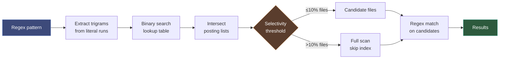

# Fast Search Guide

Fast search finds code using regex patterns accelerated by a trigram inverted index. Instead of scanning every file, it pre-filters candidates using an index of 3-character sequences, then runs the actual regex only on matching files. Typically 10-100x faster than brute-force grep on large codebases.

## How It Works



1. **Trigram extraction**: Parse the regex, extract literal character runs, decompose into overlapping 3-byte sequences, hash each with CRC32
2. **Index lookup**: Binary search the memory-mapped lookup table for each trigram hash
3. **Intersection**: Intersect posting lists to find files containing ALL required trigrams
4. **Selectivity check**: If candidates exceed the threshold (default 10% of indexed files), skip the index and scan everything instead
5. **Regex matching**: Run the full regex on candidate files, return matching lines

## Index Architecture

Two binary files plus a SQLite database:

| File | Contents | Access pattern |
|------|----------|----------------|
| `trigrams.lookup` | Sorted trigram hashes + posting offsets (16 bytes each) | Memory-mapped, binary search O(log N) |
| `trigrams.postings` | File-ID lists per trigram | Memory-mapped, direct offset read |
| `trigrams.db` | file_id → path mapping, content hashes, mtimes | SQLite (WAL mode) |

Writes are atomic (write to `.tmp`, then `os.replace`). Thread-safe via `threading.Lock`.

## Usage

### Basic search

```
fast_search(pattern="def process_.*event")
```

### With options

```
fast_search(
    pattern="class.*Controller",
    path="src/api",           # restrict to subdirectory
    max_results=100,          # default 50
    case_insensitive=True,    # default False
)
```

### Explain mode

Add `explain=True` to see search diagnostics:

```
fast_search(pattern="def process_.*event", explain=True)
```

Output includes a diagnostics section:

```
src/handlers/events.py:42: def process_user_event(self, ...):
(trigram filter: 3 candidates)

--- Search Diagnostics ---
Pattern:            def process_.*event
Trigrams:           ['def', 'ef ', 'f p', ' pr', 'pro', 'roc', 'oce', 'ces', 'ess', 'eve', 'ven', 'ent']
Posting sizes:      [1204, 892, 567, 43, 31, 28, 15, 22, 18, 12, 9, 156]
Candidates:         3 / 4521 files (0.07%)
Selectivity:        PASS (threshold: 10.0%)
Mode:               trigram-filtered
```

### Selectivity threshold

Control when the index is bypassed:

```
fast_search(
    pattern="import",
    selectivity_threshold=0.05,  # stricter: skip if >5% files match
)
```

The threshold only applies to codebases with 100+ indexed files. For small projects, the index is always used.

| Threshold | Behavior |
|-----------|----------|
| `0.10` (default) | Skip index if >10% of files match |
| `0.0` | Always skip index (full scan) |
| `1.0` | Never skip index |
| `0.05` | Stricter — only use index for very selective queries |

## When Trigram Search Falls Back

The index is skipped and a full scan is used when:

- **No extractable trigrams**: Patterns like `.*`, `\d+`, `[abc]+` have no literal character runs
- **Threshold exceeded**: Too many files contain the required trigrams (broad query)
- **Index not built**: Run `reindex` to build the trigram index
- **Index build failed**: Storage or permission errors during auto-build

The `explain` mode tells you exactly which case applies.

## Fast Search vs Semantic Search

| | Fast search | Semantic search |
|---|---|---|
| **Query type** | Regex patterns | Natural language |
| **Matching** | Exact character sequences | Meaning / intent |
| **Speed** | Instant (index lookup) | Slower (embedding + vector similarity) |
| **Setup** | Auto-built on first use | Requires embedding model |
| **Best for** | "Find this exact code pattern" | "Find code that does X" |

Use fast search when you know what the code looks like. Use semantic search when you know what the code does.

## Monitoring

Check index health via `explain=True` on any query, or inspect the index files directly:

```
.attocode/index/
├── trigrams.lookup      # Trigram hash → posting offset table
├── trigrams.postings    # File-ID posting lists
└── trigrams.db          # File path ↔ ID mapping (SQLite)
```

The index is rebuilt from scratch on `reindex`. File modifications invalidate the index until the next rebuild.
