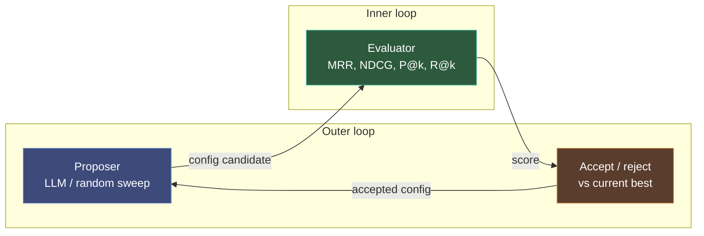

# Meta-Harness Optimization

Attocode includes an automated hyperparameter optimization framework for code-intel search scoring and context assembly, adapted from [Stanford IRIS Lab's meta-harness](https://arxiv.org/abs/2603.28052). The framework iterates on 50 tunable parameters via an LLM-driven outer loop and scores candidates against ground-truth benchmarks, producing configurations that measurably improve retrieval quality on real codebases.

**Validated result:** +25.5% overall MRR across 5 ground-truth repositories (4/5 repos improved, 0 significant regressions) when comparing the pre-optimization defaults to the shipped `best_config.yaml`.

## Bench Modes

The harness supports three bench modes selected via `--bench`:

- `--bench search` (default) — optimizes search scoring + MCP bench; the historical use case described in this guide.
- `--bench rule` — optimizes rule packs by tuning per-rule overrides (enabled, confidence, severity) and (stage 2) generating new rules from templates. Uses severity-weighted F1 macro-averaged across languages with a per-language floor predicate. See [Rule-Bench Corpus](rule-bench-corpus.md) for the corpus contract and how to add new community packs.
- `--bench composite` — runs both legs in parallel and folds them into one score (`0.3 * search + 0.5 * mcp + 0.2 * rule`). The per-language rule floor still applies, so a candidate that wins search but breaks Go rules is rejected.

Artifacts are prefixed by mode (`baseline.json` / `rule_baseline.json` / `composite_baseline.json`) so the modes coexist in the same results directory.

## Quick Start

```bash
# Evaluate current defaults against ground-truth queries (prints MRR/NDCG/P@10/R@20 per repo)
python -m eval.meta_harness baseline --search-repos attocode,fastapi,redis,gh-cli,pandas --no-split

# Run LLM-guided optimization loop (requires OPENROUTER_API_KEY or ANTHROPIC_API_KEY)
python -m eval.meta_harness --search-repos attocode,fastapi,redis --no-split \
    run --iterations 10 --propose-mode llm

# Apples-to-apples BEFORE vs AFTER comparison
python -m eval.meta_harness.experiment_search_quality

# Ablate a specific algorithmic signal
python -m eval.meta_harness.ablation --signals importance,frecency,rerank,dep_proximity

# Generate git-derived ground-truth from commit history
python -m eval.meta_harness.git_dataset /path/to/repo --limit 30 \
    --output eval/ground_truth/myrepo_git.yaml --repo-name myrepo

# Run a specific config file against the eval set
python -m eval.meta_harness --no-split evaluate eval/meta_harness/configs/best_config.yaml
```

## Architecture

The framework implements the two-loop pattern from the original meta-harness paper:



- **Inner loop** (`eval/meta_harness/evaluator.py`) applies a candidate `HarnessConfig` to a `CodeIntelService`, runs 30 ground-truth queries across 5 repos, and computes a composite score (40% search quality × 60% mcp_bench).
- **Outer loop** (`eval/meta_harness/meta_loop.py`) generates candidates, evaluates them, and keeps the current best. Each iteration produces 3 candidates by default.
- **Proposer** (`eval/meta_harness/proposer.py`) either perturbs the current best randomly (`sweep` mode) or asks Claude to analyze per-query failure breakdowns and propose targeted changes with hypotheses (`llm` mode via OpenRouter).
- **Accept/reject** — a candidate is accepted only if its composite score strictly exceeds the current best.

Each iteration writes a row to `.attocode/meta_harness/results/evolution_summary.jsonl` with the full candidate config, score delta, hypothesis, and per-category breakdown.

## Tunable Parameters

All parameters live in two dataclasses in `src/attocode/integrations/context/semantic_search.py`:

### `SearchScoringConfig`

| Category | Parameter | Default | Range | Meaning |
|----------|-----------|---------|-------|---------|
| BM25 | `bm25_k1` | 2.2 | 0.5–3.0 | Term frequency saturation |
| BM25 | `bm25_b` | 0.3 | 0.0–1.0 | Document length normalization (0 = disabled) |
| Name boost | `name_exact_boost` | 5.0 | 1.0–10.0 | Query term matches whole symbol name |
| Name boost | `name_substring_boost` | 3.0 | 1.0–5.0 | Query term is substring of symbol name |
| Name boost | `name_token_boost` | 2.2 | 1.0–3.0 | Query term matches tokenized name part |
| Type boost | `class_boost` | 1.8 | 1.0–3.0 | Class definitions |
| Type boost | `function_boost` | 1.4 | 1.0–2.0 | Function definitions |
| Type boost | `method_boost` | 1.3 | 1.0–2.0 | Method definitions |
| Path | `src_dir_boost` | 1.7 | 1.0–2.0 | File under `src`, `lib`, `pkg`, `core`, `internal`, `app`, `main` |
| Coverage | `multi_term_high_bonus` | 2.5 | 1.0–3.0 | Query term coverage ≥ `multi_term_high_threshold` |
| Coverage | `multi_term_med_bonus` | 1.8 | 1.0–2.0 | Query term coverage ≥ `multi_term_med_threshold` |
| Coverage | `multi_term_high_threshold` | 0.7 | 0.5–1.0 | Fraction of query tokens required for high bonus |
| Coverage | `multi_term_med_threshold` | 0.4 | 0.2–0.8 | Fraction of query tokens required for med bonus |
| Penalty | `non_code_penalty` | 0.3 | 0.05–1.0 | `.md`, `.txt`, `.json`, `.yaml`, `.toml`, etc. |
| Penalty | `config_penalty` | 0.15 | 0.01–1.0 | Stacks with `non_code_penalty` on config files |
| Penalty | `test_penalty` | 0.6 | 0.1–1.0 | Files matching test patterns |
| Phrase | `exact_phrase_bonus` | 3.0 | 1.0–3.0 | Multi-word query as substring of doc text |
| Dedup | `max_chunks_per_file` | 8 | 1–10 | Max results per file |
| Retrieval | `wide_k_multiplier` | 12 | 2–15 | Candidate width = `top_k × multiplier` |
| Retrieval | `wide_k_min` | 150 | 10–200 | Lower bound on candidate width |
| Retrieval | `rrf_k` | 60 | 10–200 | RRF constant (default, per-list values override) |

### Algorithmic signals

| Parameter | Default | Meaning |
|-----------|---------|---------|
| `importance_weight` | 0.5 | File importance boost: `score *= (1 + importance × weight)`. Uses PageRank + hub scores from `CodebaseContextManager`. Ablation: +0.4% MRR. |
| `frecency_weight` | 0.2 | Recently-accessed files boosted up to 30%. Depends on `FrecencyTracker` access data. Ablation: ~0% (no tracking data yet). |
| `rerank_confidence_threshold` | 0.0 | Lazy cross-encoder rerank when top fused score < threshold. **Disabled by default** — ablation showed −1.4% on code queries (the `ms-marco-MiniLM` model is trained on web/QA). |
| `dep_proximity_weight` | 0.3 | After fusion, boost results structurally close (imports/importers) to the top-N seeds. |
| `dep_proximity_seed_count` | 5 | Top-N seeds used for dependency-graph neighborhood discovery. |

### Adaptive fusion

| Parameter | Default | Meaning |
|-----------|---------|---------|
| `adaptive_fusion` | `true` | Enable cross-modal agreement-based per-list RRF k |
| `kw_dominance_threshold` | 1.5 | `kw_top_1 / kw_top_2` ratio for "dominant" classification |
| `rrf_k_keyword_high_conf` | 10 | Sharp k for keyword list when keyword is confident (lower = stronger weight) |
| `rrf_k_vector_low_conf` | 250 | Smooth k for vector list when keyword is confident (higher = weaker weight) |

### `ContextAssemblyConfig`

Controls `bootstrap()` and `relevant_context()` behavior in `src/attocode/code_intel/service.py`:

| Category | Parameter | Default | Meaning |
|----------|-----------|---------|---------|
| Size tiers | `small_repo_threshold` | 100 | Below this file count, use full `repo_map` |
| Size tiers | `large_repo_threshold` | 5000 | Above this file count, use hierarchical explorer |
| Budget (with hint) | `summary_ratio` | 0.38 | Fraction of token budget for project summary |
| Budget (with hint) | `structure_ratio` | 0.38 | Fraction for repo structure |
| Budget (with hint) | `conventions_ratio` | 0.12 | Fraction for code conventions analysis |
| Budget (with hint) | `search_ratio` | 0.12 | Fraction for task-specific semantic search |
| Budget (no hint) | `summary_ratio_no_hint` | 0.40 | |
| Budget (no hint) | `structure_ratio_no_hint` | 0.44 | |
| Budget (no hint) | `conventions_ratio_no_hint` | 0.16 | |
| Medium tier | `medium_structure_map_ratio` | 0.7 | Fraction of structure budget allocated to `repo_map` |
| Explorer | `explore_max_items` | 20 | Max top-level items for large-repo tier |
| Explorer | `explore_importance_threshold` | 0.3 | Minimum importance to include |
| Misc | `bootstrap_hotspots_n` | 10 | Number of hotspots shown |
| Misc | `conventions_sample_size` | 25 | Files analyzed for conventions |
| Misc | `bootstrap_search_top_k` | 5 | Results in task-hint search section |
| Neighborhood | `max_depth` | 2 | `relevant_context()` BFS cap |
| Neighborhood | `center_symbol_cap` | 8 | Symbols shown per center file |
| Neighborhood | `neighbor_symbol_cap` | 5 | Symbols shown per neighbor file |
| Preview | `param_preview_limit` | 4 | Params shown per function signature |
| Preview | `base_preview_limit` | 3 | Base classes shown per class |
| Preview | `method_preview_limit` | 4 | Methods shown per class |

Parameter ranges live in `eval/meta_harness/harness_config.py` as `PARAMETER_RANGES` and `CONTEXT_PARAMETER_RANGES`.

## Proposer Modes

### `sweep` (default)

Random Gaussian perturbation of 1–3 parameters per candidate. Deterministic with seed. No API key required. Low hit rate (~7%) but useful for baseline-free exploration.

```bash
python -m eval.meta_harness --search-repos attocode --no-split run \
    --iterations 5 --propose-mode sweep --candidates 3
```

### `llm`

Claude (via OpenRouter by default, falls back to Anthropic) analyzes:

- Current best config (diffed from defaults)
- Per-query MRR/NDCG + which files were missed
- Full history of accepted/rejected configs
- Parameter range constraints from `PARAMETER_RANGES`

Proposes 3 configs per iteration with explicit hypotheses. Hit rate runs 18–30% — substantially more efficient than random sweep.

Set either:

```bash
export OPENROUTER_API_KEY=sk-or-...
# or
export ANTHROPIC_API_KEY=sk-ant-...
```

The proposer reads `.claude/skills/meta-harness-code-intel/SKILL.md` for guidance on tradeoffs.

## Ground Truth Sources

### Hand-curated

YAML files in `eval/ground_truth/*.yaml` pair natural-language queries with relevant files. Example entry:

```yaml
repo: attocode
queries:
  - query: "token budget management and enforcement"
    relevant_files:
      - src/attocode/types/budget.py
      - src/attocode/integrations/budget/economics.py
      - src/attocode/integrations/budget/budget_pool.py
```

Currently shipped with 5 repos: `attocode`, `fastapi`, `gh-cli`, `pandas`, `redis`.

### Git-derived

`eval/meta_harness/git_dataset.py` mines commits for ground-truth queries:

- Commit message → natural-language query
- Source files changed in commit → relevant files
- Filters: merges, conventional-commit chore/revert/bump prefixes, commits touching >15 or <2 source files, messages shorter than 3 words

```bash
python -m eval.meta_harness.git_dataset /path/to/repo \
    --limit 30 --since "1 year ago" --min-files 2 --max-files 15 \
    --output eval/ground_truth/myrepo_git.yaml --repo-name myrepo
```

Requires full git history (run `git fetch --unshallow` on shallow clones first).

## Validated Results

Apples-to-apples comparison produced by `python -m eval.meta_harness.experiment_search_quality`:

| Repo | Before MRR | After MRR | ΔMRR | Relative |
|------|-----------|-----------|------|----------|
| attocode | 0.444 | **0.562** | +0.117 | +26% |
| fastapi | 0.217 | **0.267** | +0.050 | +23% |
| gh-cli | 0.167 | 0.135 | −0.031 | −19% |
| pandas | 0.229 | **0.325** | +0.096 | +42% |
| redis | 0.479 | **0.633** | +0.155 | +32% |
| **Overall (30 queries)** | **0.330** | **0.414** | **+0.084** | **+25.5%** |

**BEFORE** = original hardcoded defaults with `nl_mode="none"` (reconstructs pre-meta-harness state)
**AFTER** = current shipped defaults (matches `eval/meta_harness/configs/best_config.yaml`)

### Signal ablation

Running `python -m eval.meta_harness.ablation` disables one algorithmic signal at a time and measures the delta:

| Signal | Contribution | Decision |
|--------|--------------|----------|
| `importance_weight` | +0.4% | ✅ Kept at 0.5 |
| `dep_proximity_weight` | ~0% | Kept at 0.3 (benefit may emerge on larger eval set) |
| `frecency_weight` | 0% | Kept at 0.2 (no access-tracking data yet) |
| `rerank_confidence_threshold` | **−1.4%** | ❌ **Disabled** (0.0) |

The cross-encoder reranker (`cross-encoder/ms-marco-MiniLM-L-6-v2`) was trained on web/QA data, not code. Enable only if you substitute a code-tuned cross-encoder.

### Qualitative task comparison

`python -m eval.meta_harness.qualitative_tasks` runs 5 agent-style queries against BEFORE and AFTER, printing top-10 side-by-side:

| # | Query Type | Query | Verdict |
|---|-----------|-------|---------|
| 1 | Concept | "context overflow and auto compaction" | ⬆️ AFTER — pulls `agent/context.py` + `compaction.py` to top |
| 2 | Concept | "budget pool allocation and enforcement" | ⬆️ AFTER — cleaner top-2 |
| 3 | Task | "how to add custom middleware to FastAPI" | ⬆️ AFTER — cuts docs/test noise |
| 4 | Domain | "redis memory eviction under pressure" | ⬆️ AFTER — cuts `hiredis/adapters/*.h` |
| 5 | Structural | "MCP server tool registration and dispatch" | ⬆️ AFTER — pure MCP files |

Pattern: AFTER returns fewer total results per query, but each is higher-signal. BEFORE tends to pad with test files, docs, and loosely-adjacent headers.

## Configuration Artifacts

### Tracked in source tree

- `eval/meta_harness/configs/baseline_original.yaml` — pre-optimization defaults, used as the BEFORE baseline in experiments
- `eval/meta_harness/configs/best_config.yaml` — optimized defaults, matches shipped `SearchScoringConfig` / `ContextAssemblyConfig`

### Gitignored (ephemeral)

All per-run outputs land in `.attocode/meta_harness/results/`:

- `baseline.json` — most recent `baseline` CLI invocation
- `best_config.yaml` — most recent accepted candidate from an optimization run
- `evolution_summary.jsonl` — full per-candidate history
- `experiment_5repo.txt` / `experiment_5repo_raw.json` — `experiment_search_quality` output
- `ablation_*.json` — ablation results
- `qualitative_comparison.txt` — qualitative task side-by-side

Override the results directory:

```bash
export ATTOCODE_META_HARNESS_RESULTS=/custom/path
```

Path logic is centralized in `eval/meta_harness/paths.py`.

## Extending the Framework

### Add a new tunable parameter

1. Add the field to `SearchScoringConfig` (or `ContextAssemblyConfig`) in `src/attocode/integrations/context/semantic_search.py` with a default value and a comment explaining what it does.
2. Use it somewhere in the scoring or assembly code (read via `self.scoring_config.my_param` or `cc.my_param`).
3. Add a `(min, max)` entry to `PARAMETER_RANGES` (or `CONTEXT_PARAMETER_RANGES`) in `eval/meta_harness/harness_config.py`.
4. Mention it in the LLM proposer skill `.claude/skills/meta-harness-code-intel/SKILL.md` if it's meant for LLM-driven optimization.

### Add a new algorithmic signal

1. Implement the signal's effect on `score` inside `_keyword_search()` or as a post-fusion pass in `search()`.
2. Add a `*_weight` field to `SearchScoringConfig` (default 0 disables).
3. Gate application on `if cfg.my_signal_weight > 0:` so the signal can be ablated.
4. Run `python -m eval.meta_harness.ablation --signals my_signal` to measure contribution.

### Add a new evaluator

The evaluator implements `attoswarm.research.evaluator.Evaluator`. To add a new benchmark:

1. Wrap your benchmark in a class returning an `EvalResult` from `evaluate(working_dir)`.
2. Add it to the composite metric in `eval/meta_harness/evaluator.py` with an appropriate weight.

## Limitations & Future Work

- **Cross-encoder reranking disabled** — the default `ms-marco-MiniLM-L-6-v2` hurts code queries. A code-tuned cross-encoder (e.g. `voyage-code-2` rerank, or a fine-tuned model) would likely flip this signal positive.
- **gh-cli regression (−3pt MRR)** — the one repo that did not improve. Go codebases use shorter symbol names and different naming conventions than Python; the optimized boost profile doesn't fit. Per-language profiles or query-level routing would help.
- **Query classification not implemented** (Phase 3b) — routing symbol/concept/task/structural queries to different retrieval strategies is a natural next step.
- **No multi-repo training balance** — optimization ran on attocode+fastapi+redis, biasing defaults toward those shapes. Held-out gh-cli/pandas exposed the bias.
- **Frecency has zero contribution** — the tracker works but no long-running user has accumulated access data against the benchmark repos. Expect non-zero in production.
- **Eval coverage is narrow** — 30 queries × 5 repos is small. The git-derived dataset generator can expand this substantially; wire its output into the main evaluator to scale up.

See also: [Semantic Search](semantic-search.md), [Evaluation & Benchmarks](evaluation-and-benchmarks.md).
