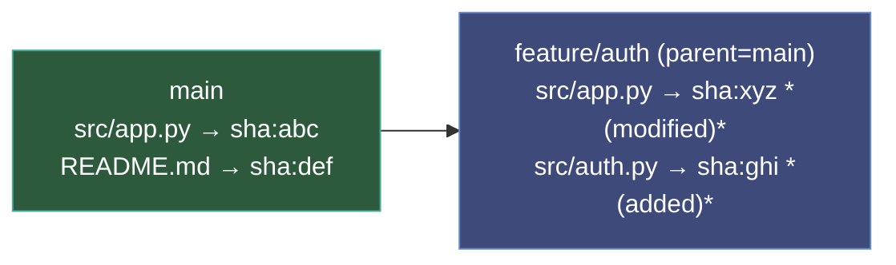
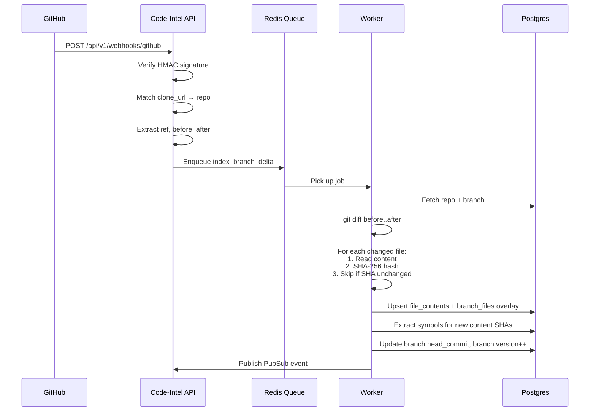

# Repositories & Branch Workflow

This guide explains how code-intel manages repositories, branches, and content — including the branch overlay system, webhook-driven indexing, and content deduplication.

## Adding a Repository

### Step 1: Create an Organization

```bash
curl -X POST http://localhost:8080/api/v1/orgs \
  -H "Authorization: Bearer $TOKEN" \
  -H "Content-Type: application/json" \
  -d '{"name": "My Team", "slug": "my-team"}'
```

### Step 2: Add a Repository

```bash
curl -X POST http://localhost:8080/api/v1/orgs/{org_id}/repos \
  -H "Authorization: Bearer $TOKEN" \
  -H "Content-Type: application/json" \
  -d '{
    "name": "my-repo",
    "clone_url": "https://github.com/user/repo.git",
    "default_branch": "main"
  }'
```

### Step 3: Trigger Initial Indexing

```bash
curl -X POST http://localhost:8080/api/v1/orgs/{org_id}/repos/{repo_id}/reindex \
  -H "Authorization: Bearer $TOKEN"
```

This enqueues a background job that:

1. Clones the repo **bare** (`pygit2.clone_repository(bare=True)`) to `{GIT_CLONE_DIR}/{repo_id}.git`
2. Walks the git tree for the default branch
3. Extracts symbols (functions, classes, imports) via tree-sitter
4. Stores file content keyed by SHA-256
5. Builds the dependency graph

## How Content Storage Works

### Content-Addressed Storage

File content is stored in the `file_contents` table, keyed by SHA-256 hash:

```
file_contents
├── sha256: "abc123..."  →  content of src/app.py (v1)
├── sha256: "def456..."  →  content of README.md
└── sha256: "xyz789..."  →  content of src/app.py (v2, after edit)
```

This means:

- **Same content = same SHA** — even across branches, repos, or time
- **Content is stored once** — 100 branches sharing `README.md` = 1 row in `file_contents`
- **Immutable** — SHA-256 keys are append-only, safe for concurrent writes

### Symbols and Embeddings

Both are keyed by `content_sha`:

- **Symbols**: Extracted once per content SHA. If 10 branches reference `sha:abc123`, symbols are extracted once and reused.
- **Embeddings**: Generated once per `(content_sha, embedding_model)`. Same deduplication benefit.

## Branch Overlay System

Branches don't store full file trees. Instead, each branch has an **overlay** — a sparse set of changes relative to its parent.

### How It Works

The `branch_files` table stores per-branch changes:

```
branch_files
├── (branch_id=main,   path="src/app.py")    → sha:abc, status=added
├── (branch_id=main,   path="README.md")     → sha:def, status=added
├── (branch_id=feat,   path="src/app.py")    → sha:xyz, status=modified
└── (branch_id=feat,   path="src/auth.py")   → sha:ghi, status=added
```

### Overlay Resolution

To get the full file manifest for a branch, the system walks the parent chain:



**Resolved manifest for `feature/auth`:**

| Path | SHA | Source |
|------|-----|--------|
| `src/app.py` | `sha:xyz` | Overlay (modified) |
| `README.md` | `sha:def` | Inherited from main |
| `src/auth.py` | `sha:ghi` | Overlay (added) |

The resolution algorithm:

1. Start with the target branch's overlay
2. Walk up to parent, apply parent's overlay (skip paths already seen)
3. Continue to grandparent, etc., until the root (default branch)
4. Deletions in any overlay remove the path from the manifest

### Version Counter

Each branch has a monotonic `version` counter incremented on every overlay write. This enables optimistic concurrency — if two writes target the same branch, the second detects a version mismatch and retries.

## Webhook-Driven Indexing

When someone pushes to a branch, the system can automatically re-index only the changed files.

### The Push Flow



### Delta Indexing Details

The `DeltaIndexer` processes a push:

1. **Git diff**: Compares `before..after` commits to get changed paths
2. **Content-hash gating**: Even if git reports "modified", if the SHA-256 is unchanged → skip (handles formatting-only changes in git)
3. **Overlay update**: Writes only the changed paths to `branch_files`
4. **Version bump**: Single atomic increment of `branch.version`
5. **PubSub**: Publishes event for real-time UI updates via WebSocket

### Setting Up Webhooks

**Via API:**

```bash
curl -X POST http://localhost:8080/api/v1/webhooks/config \
  -H "Authorization: Bearer $TOKEN" \
  -H "Content-Type: application/json" \
  -d '{
    "repo_id": "...",
    "provider": "github",
    "secret": "your-webhook-secret"
  }'
```

**Then in GitHub:**

1. Go to repo Settings → Webhooks → Add webhook
2. **Payload URL**: `https://your-server.com/api/v1/webhooks/github`
3. **Content type**: `application/json`
4. **Secret**: same as above
5. **Events**: Just the push event

## Concurrent Branch Workflows

Multiple users pushing to different branches work without contention:

- Each branch has an **independent overlay** — no shared mutable state between branches
- `FileContent` is **append-only** (SHAs are immutable) — safe for concurrent writes from different branches
- The **version counter** on `Branch` prevents stale writes to the *same* branch

**Example**: User A pushes to `main`, User B pushes to `feature/auth` — both index in parallel, both write to `file_contents` (potentially the same SHAs), each updates their own branch overlay.

## Branch Comparison

Compare what changed between two branches:

```bash
curl -X POST http://localhost:8080/api/v2/repos/{repo_id}/branches/compare \
  -H "Authorization: Bearer $TOKEN" \
  -H "Content-Type: application/json" \
  -d '{"base_branch": "main", "compare_branch": "feature/auth"}'
```

Response:

```json
{
  "added": ["src/auth.py", "tests/test_auth.py"],
  "modified": ["src/app.py"],
  "deleted": [],
  "stats": { "added": 2, "modified": 1, "deleted": 0 }
}
```

This resolves both branch manifests and diffs them — no git operations needed.

## Content Deduplication Savings

The content-addressed storage with branch overlays provides significant deduplication:

| Scenario | Naive storage | With deduplication |
|----------|--------------|-------------------|
| 10 branches, 90% shared files | 10x content | ~1.1x content |
| 5K files, 10 branches | 50K rows | ~5.5K rows in `file_contents` |
| Rename without content change | 2 content rows | 1 content row (same SHA) |
| Format-only change (same AST) | New content if bytes differ | New content only if SHA differs |

Symbols and embeddings are also deduplicated by `content_sha` — extracted/generated once, reused across all branches referencing that SHA.
