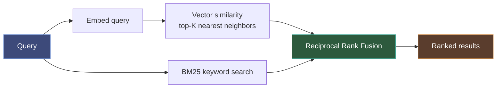
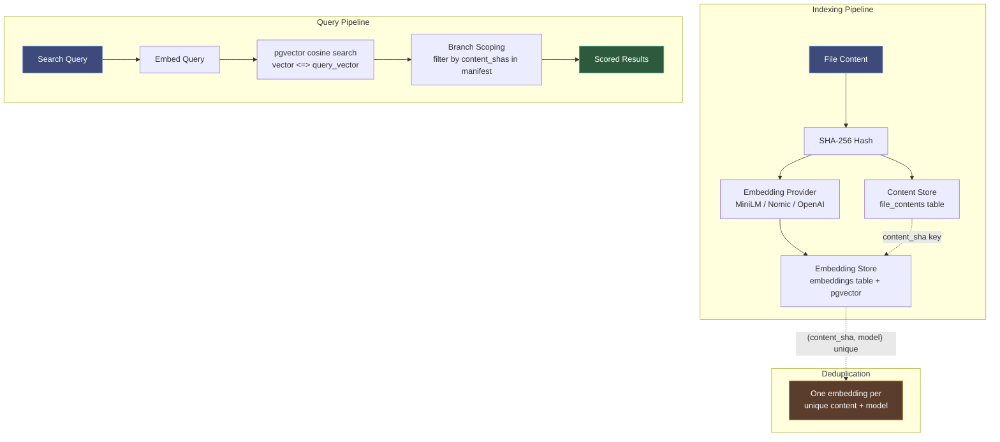

# Semantic Search Guide

Semantic search finds code by meaning, not just keywords. It uses embedding vectors to understand what code *does*, so searching for "authentication middleware" finds auth-related code even if those exact words don't appear.

## How It Works

Code-intel uses **two-stage retrieval** with **Reciprocal Rank Fusion (RRF)**:



1. **Vector search**: Embed the query, find nearest neighbors by cosine similarity
2. **BM25 search**: Traditional keyword matching on code text
3. **RRF merge**: Combine both rankings — files that appear in both get boosted

## Embedding Models

| Model | Dimension | Cost | Quality | Install |
|-------|-----------|------|---------|---------|
| `all-MiniLM-L6-v2` | 384 | Free (22MB local) | Good for code search | `uv sync --extra semantic` |
| `nomic-embed-text-v1.5` | 768 | Free (local, larger) | Better code understanding | `uv sync --extra semantic-nomic` |
| `text-embedding-3-small` | 1536 | $0.02/1M tokens | Best quality, API-dependent | Set `OPENAI_API_KEY` |

Set your model via environment variable:

```bash
# Auto-detect best available (default)
ATTOCODE_EMBEDDING_MODEL=

# Explicit choice
ATTOCODE_EMBEDDING_MODEL=all-MiniLM-L6-v2
ATTOCODE_EMBEDDING_MODEL=nomic-embed-text
ATTOCODE_EMBEDDING_MODEL=openai
```

## Search Modes

The `semantic_search` tool accepts an optional `mode` parameter:

| Mode | Behavior | Use When |
|------|----------|----------|
| `auto` (default) | Vector search if embeddings available, keyword fallback otherwise | Normal usage |
| `keyword` | BM25 keyword search only — skips embedding entirely | Speed-critical, large repos, or no embedding model |
| `vector` | Waits for embedding index to be ready (up to 60s), then uses vector search | Need highest quality results |

## Performance Optimizations (v0.2.15)

Three optimizations reduce search latency by 35% overall (4,182ms → 2,731ms avg across 20 repos).

### BM25 Keyword Index Cache

The BM25 inverted index is now cached to disk at `.attocode/index/kw_index.db` (SQLite). On first search, the index is built from source files and persisted; subsequent searches load from cache. The cache is incremental — only changed files are re-parsed on the next search.

- **Warm cache on cockroach (103K docs):** 2.5s load vs 20s full rebuild (8x speedup)
- Cache is invalidated per-file based on mtime, so edits are picked up automatically

### Trigram Pre-filtering for BM25

Before BM25 scoring, the existing trigram index is queried for each token in the search query. Files matching any token (UNION semantics) form the candidate set for BM25 scoring.

- Falls back to full corpus scan if the trigram index is not built or all query tokens are shorter than 3 characters
- Zero accuracy loss: BM25 IDF statistics are still computed over the full corpus, only the scoring pass is narrowed

### Numpy-Accelerated Vector Search

`VectorStore.search()` now uses numpy BLAS matrix multiplication for batch cosine similarity instead of a Python loop. An in-memory vector cache is maintained and auto-invalidated on upsert/delete operations. Top-k selection uses `np.argpartition` for O(N) performance instead of O(N log N) full sort.

- **183x faster** than pure Python at 10K vectors (245ms → 1.3ms)
- 100K vectors searched in ~15ms
- Falls back to a pure Python loop if numpy is not installed
- Server mode is unaffected (already uses pgvector HNSW)

## Search Scoring Configuration

All BM25 weights, boosts, penalties, fusion constants, and algorithmic-signal weights are exposed via the `SearchScoringConfig` dataclass (`src/attocode/integrations/context/semantic_search.py`). Defaults ship pre-tuned via the meta-harness optimization loop against a 5-repo ground-truth set; override at runtime via `CodeIntelService.set_scoring_config()`.

```python
from attocode.code_intel.service import CodeIntelService
from attocode.integrations.context.semantic_search import SearchScoringConfig

svc = CodeIntelService("/path/to/repo")
svc.set_scoring_config(SearchScoringConfig(
    bm25_k1=2.5,
    name_exact_boost=6.0,
    importance_weight=0.6,
    rrf_k=40,
))
```

The `ContextAssemblyConfig` dataclass similarly controls `bootstrap()` and `relevant_context()` — set via `svc.set_context_config()`.

See [Meta-Harness Optimization](meta-harness-optimization.md) for the full parameter reference, proposer loop, and automated tuning workflow.

### Parameter Summary (shipped defaults)

| Category | Parameter | Default | Purpose |
|----------|-----------|---------|---------|
| BM25 | `bm25_k1`, `bm25_b` | 2.2, 0.3 | Term saturation, length normalization |
| Name match | `name_exact_boost`, `name_substring_boost`, `name_token_boost` | 5.0, 3.0, 2.2 | Query term matches symbol name (exact / substring / tokenized) |
| Definition | `class_boost`, `function_boost`, `method_boost` | 1.8, 1.4, 1.3 | Rank classes > functions > methods |
| Path | `src_dir_boost` | 1.7 | Files under `src/`, `lib/`, `pkg/`, `core/`, etc. |
| Coverage | `multi_term_high_bonus` (thresh 0.7), `multi_term_med_bonus` (thresh 0.4) | 2.5, 1.8 | Multi-term query coverage bonuses |
| Penalty | `non_code_penalty`, `config_penalty`, `test_penalty` | 0.3, 0.15, 0.6 | Down-rank non-source files |
| Phrase | `exact_phrase_bonus` | 3.0 | Query as substring of doc text |
| Retrieval | `wide_k_multiplier`, `wide_k_min`, `rrf_k`, `max_chunks_per_file` | 12, 150, 60, 8 | Two-stage candidate width + fusion + dedup |

### Algorithmic Signals

| Signal | Weight param | Default | Ablation delta | Notes |
|--------|--------------|---------|----------------|-------|
| File importance | `importance_weight` | 0.5 | **+0.4%** | Uses PageRank + hub score from the dependency graph |
| Frecency | `frecency_weight` | 0.2 | ~0% | Depends on recent access data |
| Cross-encoder rerank | `rerank_confidence_threshold` | 0.0 (off) | **−1.4%** | Disabled by default; `ms-marco-MiniLM` was trained on web/QA, not code |
| Dependency proximity | `dep_proximity_weight` | 0.3 | ~0% | Boosts imports/importers of top-N seeds |

Run ablations yourself: `python -m eval.meta_harness.ablation --signals importance,frecency,rerank,dep_proximity`.

## Adaptive Fusion

Different codebases want different fusion behavior: Python repos (descriptive symbol names like `BudgetEnforcementMode`) are well-served by keyword-dominant fusion, while C/Go repos (terse names like `t_zset.c` for sorted-set implementation) need vector-dominant fusion. Adaptive fusion picks per query:

1. Compute keyword dominance: `kw_top_1 / kw_top_2` (scores post-normalization).
2. Check **cross-modal agreement**: does keyword's top file appear in vector's top-3?
3. When **both** `dominance ≥ kw_dominance_threshold` (default 1.5) **and** agreement holds → use sharp `rrf_k_keyword_high_conf=10` + smooth `rrf_k_vector_low_conf=250`. Keyword dominates the fused ranking.
4. Otherwise → use the balanced `rrf_k=60` for both lists.

Enabled by default (`adaptive_fusion: true`). Disable by setting `adaptive_fusion=False` on the config if you prefer static RRF. Measured impact: recovers 90%+ of the keyword-only ceiling on Python repos while preserving vector wins on C/Go repos.

Code: the adaptive branch lives inline in `SemanticSearchManager.search()` in `src/attocode/integrations/context/semantic_search.py` after the two-stage retrieval.

## Vector Store Backends

| | SQLite (CLI mode) | pgvector (service mode) |
|---|---|---|
| **Scale** | ~100K vectors (numpy batch search) | ~5M vectors (HNSW index) |
| **Query @ 5K** | <1ms | ~1ms |
| **Query @ 10K** | ~1.3ms (numpy) | ~1ms |
| **Query @ 100K** | ~15ms (numpy) | ~3ms |
| **Query @ 500K** | ~75ms (numpy), pure Python ~200ms | ~5ms |
| **Deployment** | Zero-config, embedded | Same Postgres (already required) |
| **Consistency** | ACID, in-process | ACID, same DB as app data |
| **Filtering** | Post-filter in Python | SQL WHERE clause |
| **Best for** | Single dev, CLI | OSS self-host, teams |

### Scale Reference

Each file produces ~3 embedding chunks (whole file + extracted functions/classes):

| Repo size | Files | Vectors | 10 branches* | Recommended backend |
|-----------|-------|---------|--------------|-------------------|
| Small (CLI tool) | ~100 | ~300 | ~330 | SQLite fine |
| Medium (web app) | ~5K | ~15K | ~16.5K | SQLite OK, pgvector better |
| Large (monorepo) | ~50K | ~150K | ~165K | pgvector needed |
| Linux kernel | ~75K | ~225K | ~250K | pgvector comfortable |

*Branch deduplication: branches sharing 90% files → ~10% extra vectors (content-SHA keying).

## CLI Mode

In CLI mode (no `DATABASE_URL`), semantic search uses SQLite with a flat vector store. Zero configuration needed:

```bash
uv sync --extra code-intel --extra semantic
attocode code-intel serve --transport http --project .

# Embeddings are generated automatically during indexing
# Search at http://localhost:8080/docs → POST /api/v1/search
```

## Service Mode (pgvector)

In service mode, embeddings are stored in Postgres using the [pgvector](https://github.com/pgvector/pgvector) extension with HNSW indexing for fast approximate nearest neighbor search.

### Setup

pgvector is already included in the Docker image (`pgvector/pgvector:pg16`). The extension is enabled by migration 007:

```bash
# Run migrations (enables pgvector extension)
alembic -c src/attocode/code_intel/migrations/alembic.ini upgrade head
```

The vector column on the `embeddings` table is created at runtime by the embedding worker, sized to match your configured model's dimension (384 for MiniLM, 768 for Nomic, 1536 for OpenAI).

### Triggering Embedding Generation

```bash
# Generate embeddings for a branch
curl -X POST http://localhost:8080/api/v2/repos/{repo_id}/embeddings/generate \
  -H "Authorization: Bearer $TOKEN" \
  -H "Content-Type: application/json" \
  -d '{"branch": "main"}'
```

The worker:

1. Resolves the branch manifest (all file content SHAs)
2. Checks which SHAs already have embeddings (`batch_has_embeddings`)
3. For each missing SHA: reads content, embeds it, stores the vector
4. Batches 32 files at a time for memory efficiency

### Checking Coverage

```bash
# Overall status
curl http://localhost:8080/api/v2/repos/{repo_id}/embeddings/status \
  -H "Authorization: Bearer $TOKEN"

# Per-file status (paginated)
curl "http://localhost:8080/api/v2/repos/{repo_id}/embeddings/files?limit=50" \
  -H "Authorization: Bearer $TOKEN"
```

Response:

```json
{
  "total_files": 1234,
  "embedded_files": 1100,
  "coverage_pct": 89.1,
  "model": "local:all-MiniLM-L6-v2"
}
```

### Searching

```bash
curl -X POST http://localhost:8080/api/v2/projects/{project_id}/search \
  -H "Authorization: Bearer $TOKEN" \
  -H "Content-Type: application/json" \
  -d '{"query": "how does authentication work", "top_k": 10}'
```

In service mode, this:

1. Embeds the query text using the configured provider
2. Runs pgvector cosine similarity search scoped to the branch's content SHAs
3. Returns scored results

## Architecture



### Key Design Decisions

- **Content-SHA keying**: Embeddings are keyed by `(content_sha, embedding_model, chunk_type)`. If the same file content appears in 10 branches, it's embedded once.
- **Runtime dimension**: The vector column dimension is set at runtime based on the configured model, not hardcoded in migrations. Changing models triggers re-embedding.
- **HNSW index**: Uses `vector_cosine_ops` with `m=16, ef_construction=64` — good balance of build time and query accuracy for up to ~5M vectors.
- **Branch scoping**: Similarity search filters by the branch's content SHAs (via `WHERE content_sha = ANY(:shas)`), so results always reflect the branch's file state.

## Monitoring

### Embedding Coverage Over Time

After triggering embedding generation, monitor progress:

```bash
# Poll until coverage reaches 100%
watch -n 5 'curl -s http://localhost:8080/api/v2/repos/{repo_id}/embeddings/status \
  -H "Authorization: Bearer $TOKEN" | python -m json.tool'
```

### Combined Indexing Status

```bash
curl http://localhost:8080/api/v2/repos/{repo_id}/indexing/status \
  -H "Authorization: Bearer $TOKEN"
```

Returns both indexing progress and embedding coverage in a single response.
