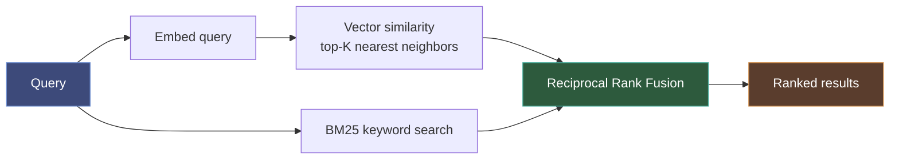
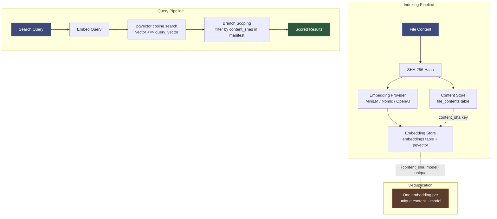

# Semantic Search Guide

Semantic search finds code by meaning, not just keywords. It uses embedding vectors to understand what code *does*, so searching for "authentication middleware" finds auth-related code even if those exact words don't appear.

## How It Works

Code-intel uses **two-stage retrieval** with **Reciprocal Rank Fusion (RRF)**:



1. **Vector search**: Embed the query, find nearest neighbors by cosine similarity
2. **BM25 search**: Traditional keyword matching on code text
3. **RRF merge**: Combine both rankings — files that appear in both get boosted

## Embedding Models

| Model | Dimension | Cost | Quality | Install |
|-------|-----------|------|---------|---------|
| `all-MiniLM-L6-v2` | 384 | Free (22MB local) | Good for code search | `uv sync --extra semantic` |
| `nomic-embed-text-v1.5` | 768 | Free (local, larger) | Better code understanding | `uv sync --extra semantic-nomic` |
| `text-embedding-3-small` | 1536 | $0.02/1M tokens | Best quality, API-dependent | Set `OPENAI_API_KEY` |

Set your model via environment variable:

```bash
# Auto-detect best available (default)
ATTOCODE_EMBEDDING_MODEL=

# Explicit choice
ATTOCODE_EMBEDDING_MODEL=all-MiniLM-L6-v2
ATTOCODE_EMBEDDING_MODEL=nomic-embed-text
ATTOCODE_EMBEDDING_MODEL=openai
```

## Search Modes

The `semantic_search` tool accepts an optional `mode` parameter:

| Mode | Behavior | Use When |
|------|----------|----------|
| `auto` (default) | Vector search if embeddings available, keyword fallback otherwise | Normal usage |
| `keyword` | BM25 keyword search only — skips embedding entirely | Speed-critical, large repos, or no embedding model |
| `vector` | Waits for embedding index to be ready (up to 60s), then uses vector search | Need highest quality results |

## Vector Store Backends

| | SQLite (CLI mode) | pgvector (service mode) |
|---|---|---|
| **Scale** | ~10K vectors (linear scan) | ~5M vectors (HNSW index) |
| **Query @ 5K** | ~2ms | ~1ms |
| **Query @ 500K** | ~200ms (unusable) | ~5ms |
| **Deployment** | Zero-config, embedded | Same Postgres (already required) |
| **Consistency** | ACID, in-process | ACID, same DB as app data |
| **Filtering** | Post-filter in Python | SQL WHERE clause |
| **Best for** | Single dev, CLI | OSS self-host, teams |

### Scale Reference

Each file produces ~3 embedding chunks (whole file + extracted functions/classes):

| Repo size | Files | Vectors | 10 branches* | Recommended backend |
|-----------|-------|---------|--------------|-------------------|
| Small (CLI tool) | ~100 | ~300 | ~330 | SQLite fine |
| Medium (web app) | ~5K | ~15K | ~16.5K | SQLite OK, pgvector better |
| Large (monorepo) | ~50K | ~150K | ~165K | pgvector needed |
| Linux kernel | ~75K | ~225K | ~250K | pgvector comfortable |

*Branch deduplication: branches sharing 90% files → ~10% extra vectors (content-SHA keying).

## CLI Mode

In CLI mode (no `DATABASE_URL`), semantic search uses SQLite with a flat vector store. Zero configuration needed:

```bash
uv sync --extra code-intel --extra semantic
attocode code-intel serve --transport http --project .

# Embeddings are generated automatically during indexing
# Search at http://localhost:8080/docs → POST /api/v1/search
```

## Service Mode (pgvector)

In service mode, embeddings are stored in Postgres using the [pgvector](https://github.com/pgvector/pgvector) extension with HNSW indexing for fast approximate nearest neighbor search.

### Setup

pgvector is already included in the Docker image (`pgvector/pgvector:pg16`). The extension is enabled by migration 007:

```bash
# Run migrations (enables pgvector extension)
alembic -c src/attocode/code_intel/migrations/alembic.ini upgrade head
```

The vector column on the `embeddings` table is created at runtime by the embedding worker, sized to match your configured model's dimension (384 for MiniLM, 768 for Nomic, 1536 for OpenAI).

### Triggering Embedding Generation

```bash
# Generate embeddings for a branch
curl -X POST http://localhost:8080/api/v2/repos/{repo_id}/embeddings/generate \
  -H "Authorization: Bearer $TOKEN" \
  -H "Content-Type: application/json" \
  -d '{"branch": "main"}'
```

The worker:

1. Resolves the branch manifest (all file content SHAs)
2. Checks which SHAs already have embeddings (`batch_has_embeddings`)
3. For each missing SHA: reads content, embeds it, stores the vector
4. Batches 32 files at a time for memory efficiency

### Checking Coverage

```bash
# Overall status
curl http://localhost:8080/api/v2/repos/{repo_id}/embeddings/status \
  -H "Authorization: Bearer $TOKEN"

# Per-file status (paginated)
curl "http://localhost:8080/api/v2/repos/{repo_id}/embeddings/files?limit=50" \
  -H "Authorization: Bearer $TOKEN"
```

Response:

```json
{
  "total_files": 1234,
  "embedded_files": 1100,
  "coverage_pct": 89.1,
  "model": "local:all-MiniLM-L6-v2"
}
```

### Searching

```bash
curl -X POST http://localhost:8080/api/v2/projects/{project_id}/search \
  -H "Authorization: Bearer $TOKEN" \
  -H "Content-Type: application/json" \
  -d '{"query": "how does authentication work", "top_k": 10}'
```

In service mode, this:

1. Embeds the query text using the configured provider
2. Runs pgvector cosine similarity search scoped to the branch's content SHAs
3. Returns scored results

## Architecture



### Key Design Decisions

- **Content-SHA keying**: Embeddings are keyed by `(content_sha, embedding_model, chunk_type)`. If the same file content appears in 10 branches, it's embedded once.
- **Runtime dimension**: The vector column dimension is set at runtime based on the configured model, not hardcoded in migrations. Changing models triggers re-embedding.
- **HNSW index**: Uses `vector_cosine_ops` with `m=16, ef_construction=64` — good balance of build time and query accuracy for up to ~5M vectors.
- **Branch scoping**: Similarity search filters by the branch's content SHAs (via `WHERE content_sha = ANY(:shas)`), so results always reflect the branch's file state.

## Monitoring

### Embedding Coverage Over Time

After triggering embedding generation, monitor progress:

```bash
# Poll until coverage reaches 100%
watch -n 5 'curl -s http://localhost:8080/api/v2/repos/{repo_id}/embeddings/status \
  -H "Authorization: Bearer $TOKEN" | python -m json.tool'
```

### Combined Indexing Status

```bash
curl http://localhost:8080/api/v2/repos/{repo_id}/indexing/status \
  -H "Authorization: Bearer $TOKEN"
```

Returns both indexing progress and embedding coverage in a single response.
